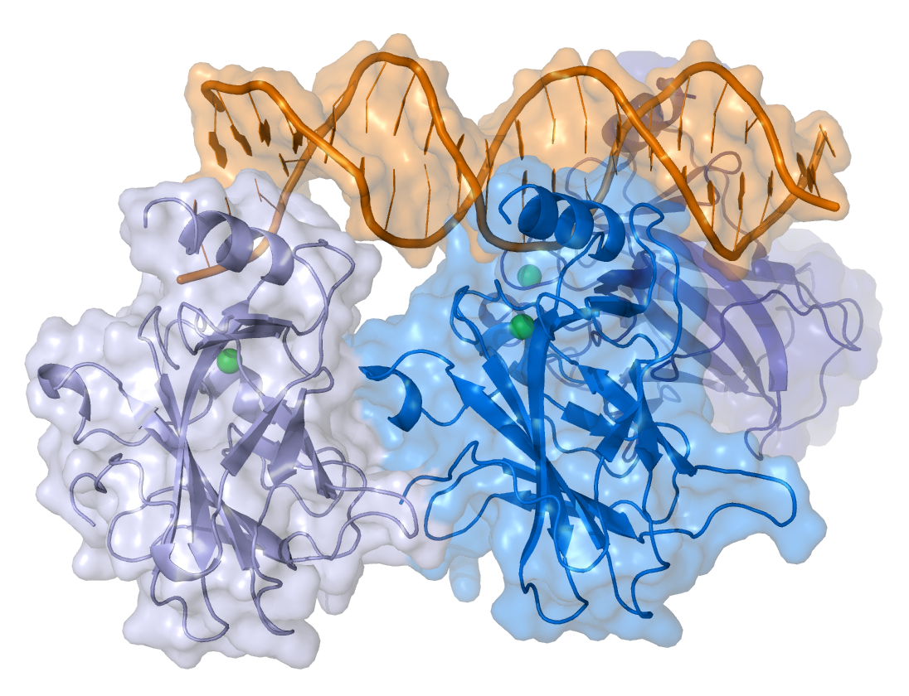
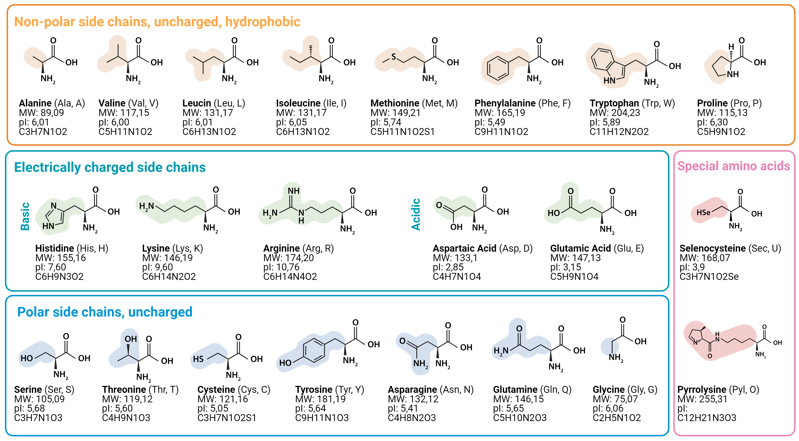
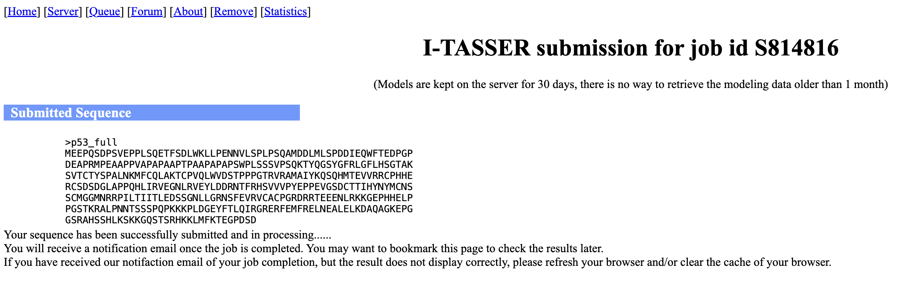
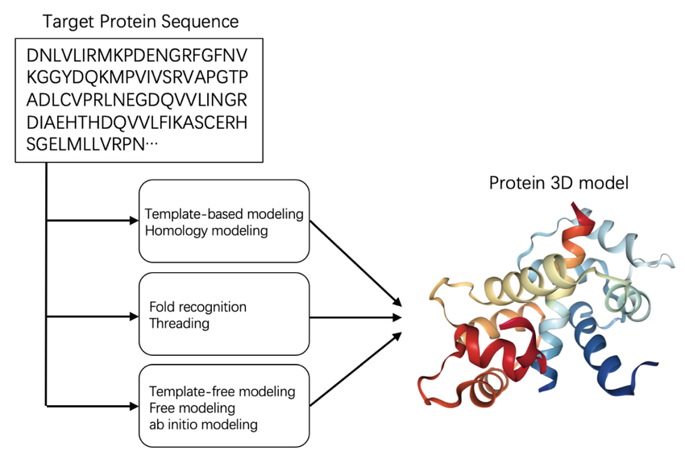
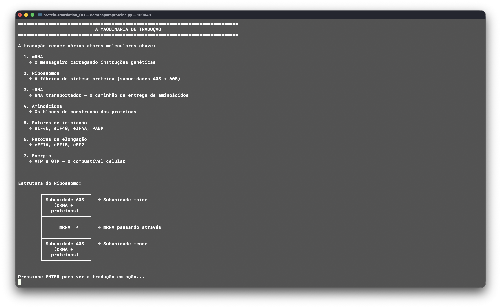

# Bits, Bytes e Biomoléculas - Exercícios Práticos

**Instrutor:** Madson Aragão (Estudante de PhD @ UFMG, MSc em Genética e Biologia Molecular @ UFPE)

**Monitor:** Saulo Penna (BSc em Biomedicina @ UFPE, Pesquisador no LGBV/UFPE)

**Evento:** XV Jornada PPGGBM - 19 de Novembro de 2025

**Contato:** madsondeluna@gmail.com; saulo.rmpenna@ufpe.br

**Portfólio:** <a href="https://madsondeluna.github.io/" target="_blank" rel="noopener noreferrer">https://madsondeluna.github.io/</a>

**Projetos:** <a href="https://github.com/madsondeluna" target="_blank" rel="noopener noreferrer">https://github.com/madsondeluna</a>

---

 **Proteína-Alvo:** p53 (*TP53*))

Este repositório contém o material prático do curso de Biologia Estrutural Computacional, utilizando a proteína supressora de tumor p53 como sistema modelo para explorar diferentes métodos de predição e análise estrutural.

<figure class="figure-center">
  
</figure>

Eestrutura tridimensional da p53, em complexo com uma estrtura de DNA. As subunidades da p53, mostradas em azul e roxo, são visualizadas usando uma combinação de representação "cartoon", que revela a estrutura secundária de hélices alfa e fitas beta, e uma "superfície" molecular translúcida, que indica o volume de e a forma da proteína. A p53 é mostrada interagindo diretamente com a dupla hélice do DNA, representada em laranja, através de seu domínio de ligação ao DNA (DBD). A presença de esferas (íons de zinco, em verde) destaca componentes cruciais para a estabilidade estrutural do DBD, formando os zinc fingers. Esta interação é fundamental para a função da p53, permitindo que ela se ligue a regiões específicas do genoma para regular a expressão de genes envolvidos no controle do ciclo celular, no reparo de danos ao DNA e na indução da apoptose, prevenindo assim a oncogênese e assim, mantendo a homestase celular.

---

# Sobre a Proteína p53

A **p53** (derivada do gene *TP53*) é um dos mais importantes supressores de tumor, frequentemente referida como **"a guardiã do genoma"**. Esta proteína é crucial para a regulação do ciclo celular e prevenção do câncer.

### Relevância Científica

- Mutada em **mais de 50% de todos os cânceres humanos**
- Proteína mais estudada na história da oncologia.
- Alvo ideal para comparar diferentes métodos de modelagem computacional.

<figure class="figure-center">
  
</figure>

> Fonte: Criado por Madson Aragão no VMD.

### Dados de Referência

| Informação | Valor/Link |
|------------|------------|
| **ID UniProt** | <a href="https://www.uniprot.org/uniprotkb/P04637/" target="_blank">P04637 (WT)</a> |
| **PDB Experimental** | <a href="https://www.rcsb.org/structure/1tup" target="_blank">1TUP (DNA Binding Domain)</a> |
| **Massa Molecular** | ~43.7 kDa (aparece como 53 kDa em SDS-PAGE) |
| **Domínios** | 7 domínios funcionais (TAD, AD2, PRD, DBD, NLS, OD, CTD) |


## Pré-requisitos

### Software Local
- **PyMOL** (Incentive PyMOL - Licença Educacional Gratuita).

### Software Online
Todos os demais passos utilizarão **servidores web** (não requerem instalação).

### Requisitos do Sistema
- Acesso à internet
- E-mail institucional (.edu ou similar) para licença acadêmica.
- Sistema operacional: Windows, macOS ou Linux

---

## Instalação do PyMOL

O PyMOL é o único software que precisará ser instalado localmente para este curso. Utilizaremos a versão **Incentive PyMOL**, gratuita para estudantes e educadores.

### A. Obtenção da Licença de Estudante (Gratuita)

1. Acesse o portal educacional da Schrödinger: <a href="https://pymol.org/edu/" target="_blank">https://pymol.org/edu/</a>.
2. Clique em **"Register for an Account"**
3. **IMPORTANTE:** Utilize seu **e-mail institucional** (ex: `seu.usuario@ufpe.br`).
   - A licença acadêmica está vinculada à verificação de um domínio educacional
4. Siga as instruções de verificação enviadas ao seu e-mail
5. Após aprovação, faça o download do arquivo de licença (`license.lic`).
6. Salve o arquivo em um local de fácil acesso (ex: Área de Trabalho).

### B. Download e Instalação

Na página de downloads da sua conta Schrödinger, baixe o instalador apropriado para seu sistema operacional pelo site <a href="https://pymol.org/edu/" target="_blank">https://pymol.org/edu/</a>


### C. Ativação da Licença

1. Inicie o PyMOL pela primeira vez.
2. O programa solicitará a ativação.
3. Escolha a opção **"I have a license file"**.
4. Navegue até o local do arquivo `license.lic` e selecione-o.
5. O PyMOL será ativado e estará pronto para uso.

---

# Módulos Práticos

### Módulo 1: Análise de Sequências e Propriedades

**Objetivos:**
- Navegar e extrair dados da p53 em bancos de dados estruturais.
- Utilizar ferramentas web para predição de características bioquímicas.

#### Bancos de Dados

| Recurso | URL | Descrição |
|---------|-----|-----------|
| **UniProt** | <a href="https://www.uniprot.org/" target="_blank">https://www.uniprot.org/</a> | Informações de sequência e anotações funcionais |
| **PDB** | <a href="https://www.rcsb.org/" target="_blank">https://www.rcsb.org/</a> | Estruturas tridimensionais experimentais |

---

#### Ferramentas de Predição

As ferramentas abaixo serão utilizadas para analisar propriedades físico-químicas e funcionais utilizando sequências FASTA de proteínas e peptídeos, é uma abordagem exploratória para entender melhor como o seu sistema é representado em termos de características bioquímicas e funcionais.

| Ferramenta | URL | Função |
|------------|-----|---------|
| **ProtParam** | <a href="https://web.expasy.org/protparam/" target="_blank">https://web.expasy.org/protparam/</a> | Parâmetros físico-químicos |
| **SignalP 6.0** | <a href="https://services.healthtech.dtu.dk/services/SignalP-6.0/" target="_blank">https://services.healthtech.dtu.dk/services/SignalP-6.0/</a> | Predição de peptídeos de sinal |
| **InterProScan** | <a href="https://www.ebi.ac.uk/interpro/search/sequence/" target="_blank">https://www.ebi.ac.uk/interpro/search/sequence/</a> | Identificação de domínios e famílias |
| **WoLFPSORT** | <a href="https://wolfpsort.hgc.jp/" target="_blank">https://wolfpsort.hgc.jp/</a> | Identificação de localização celular |

> Agora vamos discutir os resultados obtidos e suas implicações biológicas?

# Atividade 1

**Alinhamento 1TUP vs. Sequência Completa (WT):** Temos as sequências FASTA do domíde ligação ao DNA da p53 e sua sequenência completa (WT), e, juntos, executaremos o alinhamento múltiplo no <a href="https://www.ebi.ac.uk/jdispatcher/msa/clustalo" target="_blank" rel="noopener noreferrer">Clustal Omega</a>. Analise quais regiões se alinham diretamente, discuta as diferenças e vamos entender as implicações biológicas dessas variações. Ter apenas "uma parte" da proteína pode ser suficiente para algumas análises? Isso depende do contexto biológico? 

> Baixe aqui o arquivo multiFASTA com as 2 sequências: <a href="https://drive.google.com/file/d/1qILbrqhwLmvImiNK1Wg469DPcJgOx047/view?usp=sharing" target="_blank">multiFASTA_p53_1TUP_vs_WT.fasta</a>

> Sequências FASTA do domínio ligador de DNA da p53, cristalizado por X-ray (PDB ID: 1TUP):

```bash
>1TUP_3|Chains C[auth A] |PROTEIN (P53 TUMOR SUPPRESSOR )|Homo sapiens (9606)
SSSVPSQKTYQGSYGFRLGFLHSGTAKSVTCTYSPALNKMFCQLAKTCPVQLWVDSTPPP
GTRVRAMAIYKQSQHMTEVVRRCPHHERCSDSDGLAPPQHLIRVEGNLRVEYLDDRNTFR
HSVVVPYEPPEVGSDCTTIHYNYMCNSSCMGGMNRRPILTIITLEDSSGNLLGRNSFEVR
VCACPGRDRRTEEENLRKKGEPHHELPPGSTKRALPNNT
```

> Sequência completa da p53 (UNIPROT ID: P04637):

```bash
>sp|P04637|P53_HUMAN Cellular tumor antigen p53 OS=Homo sapiens OX=9606 GN=TP53
MEEPQSDPSVEPPLSQETFSDLWKLLPENNVLSPLPSQAMDDLMLSPDDIEQWFTEDPGP
DEAPRMPEAAPPVAPAPAAPTPAAPAPAPSWPLSSSVPSQKTYQGSYGFRLGFLHSGTAK
SVTCTYSPALNKMFCQLAKTCPVQLWVDSTPPPGTRVRAMAIYKQSQHMTEVVRRCPHHE
RCSDSDGLAPPQHLIRVEGNLRVEYLDDRNTFRHSVVVPYEPPEVGSDCTTIHYNYMCNS
SCMGGMNRRPILTIITLEDSSGNLLGRNSFEVRVCACPGRDRRTEEENLRKKGEPHHELP
PGSTKRALPNNTSSSPQPKKKPLDGEYFTLQIRGRERFEMFRELNEALELKDAQAGKEPG
GSRAHSSHLKSKKGQSTSRHKKLMFKTEGPDSD
```

### Perguntas:

- Em quais trechos o domínio 1TUP se alinha diretamente com a sequência completa e quais regiões ficam sem correspondência?
- Os limites N- e C-terminais do domínio cristalizado aparecem contíguos no alinhamento ou revelam lacunas/extensions relevantes para estabilidade?
- Há resíduos-chave do sítio de ligação ao DNA presentes apenas na sequência completa? O que isso implica para os modelos baseados no domínio?
- Considerando identidade e similaridade ponto a ponto, qual argumento favorece trabalhar com o domínio isolado ou com a proteína completa nas próximas etapas?

---

# Atividade 2 


> **Atividade (EXTRA):** Temos 5 sequências da p53 (1 referência *wild-type* e 4 variantes associadas a neoplasias) e, juntos, executaremos o alinhamento múltiplo no <a href="https://www.ebi.ac.uk/jdispatcher/msa/clustalo" target="_blank" rel="noopener noreferrer">Clustal Omega</a>. Analise quais substituições coincidem com domínios funcionais críticos, discuta como essas mudanças podem impactar estabilidade e interação com DNA e, por fim, decidam coletivamente qual variante seguirá para aprofundamento nas etapas práticas.

> Baixe aqui o arquivo multiFASTA com as 5 sequências: <a href="https://drive.google.com/file/d/1qpbnbvNjTRcvvG-UsXdiJYXvynkdvxYw/view?usp=sharing" target="_blank">multiFASTA_p53_variants.fasta</a>

## Wild-Type (Sequência Canônica - 393 aa)

```
>sp|P04637|P53_HUMAN_WT Cellular tumor antigen p53
MEEPQSDPSVEPPLSQETFSDLWKLLPENNVLSPLPSQAMDDLMLSPDDIEQWFTEDPGP
DEAPRMPEAAPPVAPAPAAPTPAAPAPAPSWPLSSSVPSQKTYQGSYGFRLGFLHSGTAK
SVTCTYSPALNKMFCQLAKTCPVQLWVDSTPPPGTRVRAMAIYKQSQHMTEVVRRCPHHE
RCSDSDGLAPPQHLIRVEGNLRVEYLDDRNTFRHSVVVPYEPPEVGSDCTTIHYNYMCNS
SCMGGMNRRPILTIITLEDSSGNLLGRNSFEVRVCACPGRDRRTEEENLRKKGEPHHELP
PGSTKRALPNNTSSSPQPKKKPLDGEYFTLQIRGRERFEMFRELNEALELKDAQAGKEPG
GSRAHSSHLKSKKGQSTSRHKKLMFKTEGPDSD
```

## Mutações Cancer-Associadas

### R175H (Hotspot - Contato com Zinco)

```
>sp|P04637|P53_HUMAN_R175H Cellular tumor antigen p53 (R175H mutation)
MEEPQSDPSVEPPLSQETFSDLWKLLPENNVLSPLPSQAMDDLMLSPDDIEQWFTEDPGP
DEAPRMPEAAPPVAPAPAAPTPAAPAPAPSWPLSSSVPSQKTYQGSYGFRLGFLHSGTAK
SVTCTYSPALNKMFCQLAKTCPVQLWVDSTPPPGTHVRAMAIYKQSQHMTEVVRRCPHHE
RCSDSDGLAPPQHLIRVEGNLRVEYLDDRNTFRHSVVVPYEPPEVGSDCTTIHYNYMCNS
SCMGGMNRRPILTIITLEDSSGNLLGRNSFEVRVCACPGRDRRTEEENLRKKGEPHHELP
PGSTKRALPNNTSSSPQPKKKPLDGEYFTLQIRGRERFEMFRELNEALELKDAQAGKEPG
GSRAHSSHLKSKKGQSTSRHKKLMFKTEGPDSD
```

**Mudança na posição 175: R → H** 

### R248Q (Hotspot - Contato Direto com DNA)

```
>sp|P04637|P53_HUMAN_R248Q Cellular tumor antigen p53 (R248Q mutation)
MEEPQSDPSVEPPLSQETFSDLWKLLPENNVLSPLPSQAMDDLMLSPDDIEQWFTEDPGP
DEAPRMPEAAPPVAPAPAAPTPAAPAPAPSWPLSSSVPSQKTYQGSYGFRLGFLHSGTAK
SVTCTYSPALNKMFCQLAKTCPVQLWVDSTPPPGTRVRAMAIYKQSQHMTEVVRRCPHHE
RCSDSDGLAPPQHLIRVEGNLRVEYLDDRNTFRHSVVVPYEPPEVGSDCTTIHYNYMCNS
SCMGGMNQRPILTIITLEDSSGNLLGRNSFEVRVCACPGRDRRTEEENLRKKGEPHHELP
PGSTKRALPNNTSSSPQPKKKPLDGEYFTLQIRGRERFEMFRELNEALELKDAQAGKEPG
GSRAHSSHLKSKKGQSTSRHKKLMFKTEGPDSD
```

**Mudança na posição 248: R → Q** 

### Y220C (Cavidade Hidrofóbica)

```
>sp|P04637|P53_HUMAN_Y220C Cellular tumor antigen p53 (Y220C mutation)
MEEPQSDPSVEPPLSQETFSDLWKLLPENNVLSPLPSQAMDDLMLSPDDIEQWFTEDPGP
DEAPRMPEAAPPVAPAPAAPTPAAPAPAPSWPLSSSVPSQKTYQGSYGFRLGFLHSGTAK
SVTCTYSPALNKMFCQLAKTCPVQLWVDSTPPPGTRVRAMAIYKQSQHMTEVVRRCPHHE
RCSDSDGLAPPQHLIRVEGNLRVECLDDRNTFRHSVVVPYEPPEVGSDCTTIHYNYMCNS
SCMGGMNRRPILTIITLEDSSGNLLGRNSFEVRVCACPGRDRRTEEENLRKKGEPHHELP
PGSTKRALPNNTSSSPQPKKKPLDGEYFTLQIRGRERFEMFRELNEALELKDAQAGKEPG
GSRAHSSHLKSKKGQSTSRHKKLMFKTEGPDSD
```

**Mudança na posição 220: Y → C** 

### R273H (Hotspot - Contato Direto com DNA)

```
>sp|P04637|P53_HUMAN_R273H Cellular tumor antigen p53 (R273H mutation)
MEEPQSDPSVEPPLSQETFSDLWKLLPENNVLSPLPSQAMDDLMLSPDDIEQWFTEDPGP
DEAPRMPEAAPPVAPAPAAPTPAAPAPAPSWPLSSSVPSQKTYQGSYGFRLGFLHSGTAK
SVTCTYSPALNKMFCQLAKTCPVQLWVDSTPPPGTRVRAMAIYKQSQHMTEVVRRCPHHE
RCSDSDGLAPPQHLIRVEGNLRVEYLDDRNTFRHSVVVPYEPPEVGSDCTTIHYNYMCNS
SCMGGMNRRPILTIITLEDSSGNLLGHNSFEVRVCACPGRDRRTEEENLRKKGEPHHELP
PGSTKRALPNNTSSSPQPKKKPLDGEYFTLQIRGRERFEMFRELNEALELKDAQAGKEPG
GSRAHSSHLKSKKGQSTSRHKKLMFKTEGPDSD
```

**Mudança na posição 273: R → H** 

---

**Não vale clicar nesse link antes de fazer o alinhamento proposto acima**, mas se você já fez, está mais que permitido: <a href="https://drive.google.com/file/d/1zSzitu4daGhJwSUpWxuzzTzBVwkqMo1h/view?usp=sharing" target="_blank">Alinhamento Clustal Omega - multiFASTA_p53_variants.fasta</a>, colorido por percentual de conservação. Podemos ver as mutações destacadas no alinhamento e nas suas a perda da identidade em relação à sequência *wild-type*. Além disso o alinhamento com também mostra um histograma de conservação na parte inferior, onde podemos observar que as posições das mutações são altamente conservadas na família das p53.

> O que vocês acharam desse alinhamento? Vamos discutir as possieveis implicações biológicas dessas mutações?

> Para relembrar, abaixo temos uma tambela com todos os aminoácidos e suas características físico-químicas, caso queiram consultar durante a análise das mutações.

<p align="justify">
  
</p>

> Fonte: JPT Peptide Technologies.

---

## Localização das Mutações no Domínio de Ligação ao DNA (aa 102-292)

| Mutação | Posição | Região | AA WT | AA Mut | Contexto |
|---------|---------|--------|-------|--------|----------|
| **R175H** | 175 | Loop L2 | R | H | `...GTR**V**RAM...` → `...GTH**V**RAM...` |
| **Y220C** | 220 | Loop L3 | Y | C | `...RVE**Y**LDD...` → `...RVE**C**LDD...` |
| **R248Q** | 248 | Loop L3 | R | Q | `...GMN**R**RPI...` → `...GMN**Q**RPI...` |
| **R273H** | 273 | Folha β | R | H | `...LLG**R**NSF...` → `...LLG**H**NSF...` |

Aqui trago um resumo das mutações mais comuns da p53 associadas ao câncer, localizadas no domínio de ligação ao DNA (DBD). Essas mutações são conhecidas por afetar a capacidade da p53 de se ligar ao DNA e exercer sua função supressora de tumor.

---

## Notas Importantes

1. **Todas as sequências têm exatamente 393 aminoácidos**
2. As mutações estão localizadas no **DNA-binding domain (DBD)** entre os resíduos 102-292
3. Estas são as mutações mais frequentes em cânceres humanos (hotspots)
4. A numeração segue a sequência canônica do UniProt P04637 (isoforma 1)

## Verificação das Mutações

Para confirmar as posições exatas:
- **R175H**: Resíduo 175 (Arginina → Histidina)
- **Y220C**: Resíduo 220 (Tirosina → Cisteína)  
- **R248Q**: Resíduo 248 (Arginina → Glutamina)
- **R273H**: Resíduo 273 (Arginina → Histidina)

### Perguntas:

- Em quais posições do alinhamento múltiplo surgem substituições e essas posições são conservadas na sequência *wild-type*?
- As mutações identificadas representam trocas conservativas ou drásticas em termos de propriedades físico-químicas (ex.: troca de polar para hidrofóbico)?
- Alguma das substituições cria ou elimina motivos funcionais conhecidos (ex.: sítios de fosforilação, ligações a DNA) sugeridos pelo alinhamento?
- Comparando as quatro variantes mutadas entre si, existe um padrão recorrente de substituições que aponte para um hotspot funcional?

---

# Módulo 2: Modelagem por Homologia e Threading

Sequência FASTA completa da p53 (UNIPROT ID: P04637), que utilizaremos nas atividades práticas de modelagem estrutural:

```bash
>sp|P04637|P53_HUMAN Cellular tumor antigen p53 OS=Homo sapiens OX=9606 GN=TP53
MEEPQSDPSVEPPLSQETFSDLWKLLPENNVLSPLPSQAMDDLMLSPDDIEQWFTEDPGP
DEAPRMPEAAPPVAPAPAAPTPAAPAPAPSWPLSSSVPSQKTYQGSYGFRLGFLHSGTAK
SVTCTYSPALNKMFCQLAKTCPVQLWVDSTPPPGTRVRAMAIYKQSQHMTEVVRRCPHHE
RCSDSDGLAPPQHLIRVEGNLRVEYLDDRNTFRHSVVVPYEPPEVGSDCTTIHYNYMCNS
SCMGGMNRRPILTIITLEDSSGNLLGRNSFEVRVCACPGRDRRTEEENLRKKGEPHHELP
PGSTKRALPNNTSSSPQPKKKPLDGEYFTLQIRGRERFEMFRELNEALELKDAQAGKEPG
GSRAHSSHLKSKKGQSTSRHKKLMFKTEGPDSD
```

---

**Objetivos:**
- Construir modelos da p53 utilizando diferentes abordagens.
- Analisar alinhamentos sequência-molde e métricas de confiança.

### Modelagem por Homologia

**Plataforma:** SWISS-MODEL  
**URL:** <a href="https://swissmodel.expasy.org/" target="_blank">https://swissmodel.expasy.org/</a>

**Análise:**
- Avaliar alinhamentos sequência-molde
- Examinar cobertura e identidade de sequência

### Modelagem por Threading/Ab Initio

**Plataforma:** I-TASSER  
**URL:** <a href="https://zhanggroup.org/I-TASSER/" target="_blank">https://zhanggroup.org/I-TASSER/</a>


<p align="justify">
  
</p>

> I-TASSER Server Interface. Fonte: <a href="https://zhanggroup.org/I-TASSER/" target="_blank">https://zhanggroup.org/I-TASSER/</a>.

O I-TASSER (Iterative Threading ASSEmbly Refinement) é um conjunto de métodos para predição de estrutura e função de proteínas. Ele utiliza uma abordagem hierárquica que combina métodos de *threading* e simulações *ab initio* de refinamento.

Devido ao alto custo computacional dos algoritmos e ao tempo de espera significativo em servidores públicos (decorrente de filas de processamento), a sequência da **p53 humana completa** (*full-length*) foi submetida previamente.

Os resultados completos da predição estão disponíveis no servidor do I-TASSER por 30 dias, sob o **Job ID: S814816**.

> Acessível em: https://aideepmed.com/I-TASSER/output/S814816/

Nesta seção, o foco não será a submissão ou a espera pelo processamento, mas sim a análise detalhada dos resultados gerados. Discutiremos o processo de construção da estrutura, a geração de múltiplos modelos (Top 5) e a interpretação das métricas de confiança, como o **C-score** (Confidence Score) e o **TM-score** (Template Modeling score), para avaliar a qualidade e a topologia de cada modelo predito.

<figure class="figure-center">
  
</figure>

> Uma ilustração do processo de comparação a cada passo que um fragmento (k=3 ou k=9) é extraído da sequência alvo e alinhado a uma estrutura de proteína conhecida. Fonte: Chen, J.; Siu, S.W.I. Machine Learning Approaches for Quality Assessment of Protein Structures. Biomolecules 2020, 10, 626. https://doi.org/10.3390/biom10040626

**Métricas:**
- **C-score:** Confiança da predição (-5 a 2, valores mais altos = melhor)
- **TM-score:** Similaridade estrutural

## Primeira Validação

# Perguntas:

- Qual seria o melhor modelo obtido entre SWISS-MODEL e I-TASSER? Justifique com base nas métricas apresentadas.
- O tipo de construção (homologia vs threading) influenciou a qualidade do modelo? Explique...
- Vamos revidar os métodos utilizados até aqui. Quais são as vantagens e limitações de cada abordagem?
- Ainda não alinhamos as estruturas obtidas até aqui, mas conseguem identificar diferenças visuais entre os modelos gerados?

> Nos próximos módulos, vamos avaliar se o dobramento por cada método foi feito da corretamente. Bem como alinhar estrturalmente os modelos obtidos, calculando RMSD para comparação detalhada.

# Módulo 2: E o *Ab Initio*?

> Bem, até agora, utilizamos métodos de modelagem baseados em homologia e threading. Mas e o *ab initio*? Existem pacotes que utilizam essa abordagem para prever estruturas de proteínas sem depender de modelos conhecidos. O  Rosetta é a refêrencia nessa área, e por anos, foi o padrão ouro para predição de estruturas de proteínas quando não havia modelos experimentais disponíveis. 

### Rosetta

| Recurso | URL | Descrição |
|---------|-----|-----------|
| **Rosetta** | <a href="https://www.rosettacommons.org/software/license-and-download" target="_blank">https://www.rosettacommons.org/software/license-and-download</a> | pacote de engenharia de proteínas e predição de estruturas |
| **Robetta** | <a href="http://robetta.bakerlab.org/" target="_blank">http://robetta.bakerlab.org/</a> | Servidor web para predição de estruturas com Rosetta |
| **PyRosetta** | <a href="https://www.pyrosetta.org/" target="_blank">https://www.pyrosetta.org/</a> | Interface Python para Rosetta |

> Disclaimer (Pessoal): Utilizei o *ab initio* do Rosetta de 2025 a 2019 durante meus mprojetos de engenhria de proteínas e predição estrutural. É uma ferramenta poderosa, mas o tempo de computação e a complexidade de configuração podem ser desafiadores para iniciantes. Por isso, optei por não incluir uma atividade prática com Rosetta neste curso introdutório. No entanto, encorajo os interessados a explorar essa ferramenta, para quem se interessar. 

O Rosetta funciona através de terminal, via CLI (Command Line Interface) e requer instalação local. Portanto, não é tão acessível quanto os servidores web que utilizamos até agora. E se utlizie de dois tipos de abordagens principais: Linha de comando, scripts em XML (linki para mosrar exemplo) e PyRosetta (interface Python).

Para os interesados, deixei disponível o tutrial comentando do Rosetta *ab initio* que utilizei: https://docs.rosettacommons.org/demos/latest/tutorials/denovo_structure_prediction/Denovo_structure_prediction

> Construir um Rosetta Script (XML) é uma tarefa que exige conhecimento prévio sobre a sintaxe e os módulos disponíveis na suíte Rosetta. Ele é o alicerce para definir como sua predição será conduzida, seja para modelagem de estruturas, docking molecular ou design de proteínas. Segue o protocolo de boas práticas para criar um script XML eficaz: https://docs.rosettacommons.org/docs/latest/scripting_documentation/RosettaScripts/RosettaScripts

Aqui temos um exemplo como é um script XML para predição *ab initio* com Rosetta, que eu usei há alguns anos atrás:

```xml
<ROSETTASCRIPTS>
    <!-- FUNÇÕES DE PONTUAÇÃO (SCOREFXNS) -->
    <!-- Define as funções de energia utilizadas durante a predição -->
    <SCOREFXNS>
        <!-- Score0-5: funções progressivamente mais detalhadas usadas no ab initio -->
        <ScoreFunction name="score0" weights="score0.wts"/>
        <ScoreFunction name="score1" weights="score1.wts"/>
        <ScoreFunction name="score2" weights="score2.wts"/>
        <ScoreFunction name="score3" weights="score3.wts"/>
        <ScoreFunction name="score5" weights="score5.wts"/>
        <!-- Função de energia completa para refinamento final -->
        <ScoreFunction name="fullatom" weights="ref2015.wts"/>
    </SCOREFXNS>

    <!-- SELETORES DE RESÍDUOS (RESIDUE_SELECTORS) -->
    <!-- Define quais resíduos serão manipulados -->
    <RESIDUE_SELECTORS>
        <!-- Seleciona toda a cadeia (1-100) para uma proteína de 100 aminoácidos -->
        <Index name="full_protein" resnums="1-100"/>
    </RESIDUE_SELECTORS>

    <!-- FÁBRICAS DE MAPAS DE MOVIMENTO (MOVE_MAP_FACTORIES) -->
    <!-- Controla quais graus de liberdade podem se mover durante a otimização -->
    <MOVE_MAP_FACTORIES>
        <!-- Permite movimento de backbone (bb) e ângulos laterais (chi) de todos os resíduos -->
        <MoveMapFactory name="movemap_full" bb="1" chi="1">
            <Backbone residue_selector="full_protein"/>
            <Chi residue_selector="full_protein"/>
        </MoveMapFactory>
    </MOVE_MAP_FACTORIES>

    <!-- MÉTRICAS SIMPLES (SIMPLE_METRICS) -->
    <!-- Ferramentas para análise e validação do modelo gerado -->
    <SIMPLE_METRICS>
        <!-- Tempo de execução do protocolo -->
        <TimingProfileMetric name="timing"/>
        <!-- RMSD do backbone em relação à estrutura nativa (se disponível) -->
        <RMSDMetric name="rmsd_backbone" rmsd_type="rmsd_protein_bb_heavy" 
                    residue_selector="full_protein" use_native="1"/>
        <!-- Sequência dos resíduos selecionados -->
        <SequenceMetric name="sequence" residue_selector="full_protein"/>
        <!-- Estrutura secundária predita (H=hélice, E=folha, L=loop) -->
        <SecondaryStructureMetric name="secondary_structure" residue_selector="full_protein"/>
        <!-- Energia total da estrutura -->
        <TotalEnergyMetric name="total_energy" scorefxn="fullatom"/>
    </SIMPLE_METRICS>

    <!-- MOVERS -->
    <!-- Operações que modificam a estrutura da proteína -->
    <MOVERS>
        <!-- PROTOCOLO AB INITIO CLÁSSICO -->
        <!-- Gera estrutura 3D a partir de fragmentos estruturais e otimização progressiva -->
        <!-- Requer arquivos de fragmentos (3-mer e 9-mer) gerados previamente -->
        <ClassicAbinitio name="abinitio" 
                        score_stage1="score0"
                        score_stage2="score1"
                        score_stage3a="score2"
                        score_stage3b="score5"
                        score_stage4="score3"
                        frag_small="/caminho/para/frags.200.3mers"
                        frag_large="/caminho/para/frags.200.9mers"
                        cycles="1000"
                        use_filters="true"
                        number_3mer_frags="200"
                        number_9mer_frags="25"/>

        <!-- REFINAMENTO EM FULLATOM -->
        <!-- Converte o modelo centroide para fullatom e refina a estrutura -->
        <FastRelax name="refine" 
                   scorefxn="fullatom" 
                   movemap_factory="movemap_full"
                   repeats="5"/>

        <!-- MINIMIZAÇÃO FINAL -->
        <!-- Otimização local para remover choques estéricos residuais -->
        <MinMover name="minimize" 
                  scorefxn="fullatom" 
                  movemap_factory="movemap_full" 
                  tolerance="0.01" 
                  max_iter="200"/>

        <!-- COLETA DE MÉTRICAS -->
        <!-- Executa as métricas definidas anteriormente -->
        <RunSimpleMetrics name="run_metrics_initial" 
                          metrics="sequence,secondary_structure" 
                          prefix="initial_"/>
        <RunSimpleMetrics name="run_metrics_final" 
                          metrics="rmsd_backbone,total_energy,timing,secondary_structure" 
                          prefix="final_"/>
    </MOVERS>

    <!-- PROTOCOLO DE EXECUÇÃO (PROTOCOLS) -->
    <!-- Ordem sequencial das operações -->
    <PROTOCOLS>
        <!-- 1. Coleta métricas iniciais -->
        <Add mover_name="run_metrics_initial"/>
        
        <!-- 2. Executa ab initio para gerar modelo inicial -->
        <Add mover_name="abinitio"/>
        
        <!-- 3. Refina o modelo em fullatom -->
        <Add mover_name="refine"/>
        
        <!-- 4. Minimização final -->
        <Add mover_name="minimize"/>
        
        <!-- 5. Coleta métricas finais para validação -->
        <Add mover_name="run_metrics_final"/>
    </PROTOCOLS>
</ROSETTASCRIPTS>
```

> Vamos discutir as vantagens e desvantagens do *ab initio* em comparação com os métodos que utilizamos até agora?

<figure class="figure-center">
  
</figure>

> Rosetta Commons. Fonte: https://www.rosettacommons.org/docs/latest/application_documentation/demos/denovo_structure_prediction


### Quantidade de Simulações Necessárias

É possível realizar execuções de enovelamento em domínios separados de até aproximadamente 200 aminoácidos de comprimento, mas é amplamente realatado na literatura que o protocolo ab initio do Rosetta é mais eficaz para proteínas menores, tipicamente abaixo de 100-150 resíduos.

Para proteínas de tamanho moderado **(50-100 resíduos)**, recomenda-se gerar entre **5.000 e 50.000** decoys para garantir amostragem suficiente do espaço conformacional. **A presença de um folding funnel característico, evidenciado pela convergência de estruturas de baixo RMSD e baixa energia (REU - Rosetta Energy Units)**, indica que o protocolo conseguiu identificar a região do estado nativo da proteína.

No gráfico à esquerda (**com formação de funil**), observa-se a **formação clara de um funil energético**: **as estruturas convergem para uma região de baixo RMSD (< 2 Å) e baixo score (~-195 REU)**, sugerindo que o algoritmo identificou corretamente o estado enovelado. **Este padrão é o resultado desejado e indica alta confiabilidade dos modelos de menor energia.**

Por outro lado, **o gráfico à direita (sem funil formado)** demonstra um **cenário problemático** onde **não há convergência aparente**. **As estruturas estão dispersas em uma ampla faixa de RMSD (0-6 Å) sem correlação clara com a energia**, indicando que **o protocolo falhou em identificar o estado nativo ou que a proteína não possui um único estado enovelado bem definido**.

### Critérios de Seleção do Modelo Final

Após a geração dos decoys, os modelos candidatos são selecionados com base em:

1. **Energia (REU)**: modelos no percentil inferior de energia (tipicamente top 1-5%)
2. **Clustering estrutural**: agrupamento por similaridade estrutural (RMSD) para identificar conformações consenso
3. **Presença do funil**: modelos na região de convergência energia-RMSD
4. **Validação estrutural**: análise de Ramachandran, Verify3D, ProSA-web

O modelo final geralmente corresponde ao centroide do maior cluster de baixa energia localizado no fundo do folding funnel.

---

# Módulo 3: Predição por Deep Learning (AF2, AF3 e ESM3)

Sequência FASTA completa da p53 (UNIPROT ID: P04637), que utilizaremos nas atividades práticas de modelagem estrutural:

```bash
>sp|P04637|P53_HUMAN Cellular tumor antigen p53 OS=Homo sapiens OX=9606 GN=TP53
MEEPQSDPSVEPPLSQETFSDLWKLLPENNVLSPLPSQAMDDLMLSPDDIEQWFTEDPGP
DEAPRMPEAAPPVAPAPAAPTPAAPAPAPSWPLSSSVPSQKTYQGSYGFRLGFLHSGTAK
SVTCTYSPALNKMFCQLAKTCPVQLWVDSTPPPGTRVRAMAIYKQSQHMTEVVRRCPHHE
RCSDSDGLAPPQHLIRVEGNLRVEYLDDRNTFRHSVVVPYEPPEVGSDCTTIHYNYMCNS
SCMGGMNRRPILTIITLEDSSGNLLGRNSFEVRVCACPGRDRRTEEENLRKKGEPHHELP
PGSTKRALPNNTSSSPQPKKKPLDGEYFTLQIRGRERFEMFRELNEALELKDAQAGKEPG
GSRAHSSHLKSKKGQSTSRHKKLMFKTEGPDSD
```

---

> Vamos discutir como esses modelos funcionam mais uma vez, focando em suas arquiteturas baseadas em aprendizado profundo?

**Objetivos:**
- Utilizar métodos de aprendizado profundo para predição estrutural.
- Interpretar métricas de confiança específicas (pLDDT, PAE).

> O **pLDDT (predicted Local Distance Difference Test)** é uma métrica de confiança por resíduo (0-100) que avalia a precisão da predição da estrutura *local* ao redor de cada aminoácido, sendo alta para regiões bem dobradas e baixa para regiões desordenadas.

> O **PAE (Predicted Aligned Error)** é uma métrica inter-resíduo (medida em Ångströms) que avalia a confiança na *orientação relativa* e global entre diferentes domínios ou pares de resíduos, indicando se a montagem 3D geral está correta.

> Em resumo, o pLDDT mede a confiança no dobramento *local* de um resíduo, enquanto o PAE mede a confiança na posição *global* desse resíduo em relação a todos os outros na estrutura.

### Plataformas de Deep Learning

| Método | URL | Descrição |
|--------|-----|-----------|
| **AlphaFold2 / ColabFold** | <a href="https://colab.research.google.com/github/sokrypton/ColabFold/blob/main/AlphaFold2.ipynb" target="_blank">AlphaFold2 Notebook</a> | Baseado em AlphaFold2 (Google Colab) |
| **AlphaFold 3 Server** | <a href="https://alphafoldserver.com/" target="_blank">https://alphafoldserver.com/</a> | Versão mais recente do AlphaFold |
| **ESM3** | <a href="https://forge.evolutionaryscale.ai/" target="_blank">https://forge.evolutionaryscale.ai/</a> | Baseado em Modelo de Linguagem de Proteína e Dados Evolutivos  |

### Métricas de Confiança

- **pLDDT** (predicted Local Distance Difference Test): 0-100, >90 = alta confiança
- **PAE** (Predicted Aligned Error): Confiança na posição relativa entre resíduos

### Perguntas:

- Como os valores de pLDDT distribuídos ao longo da cadeia ajudam a distinguir regiões estruturadas de segmentos desordenados na p53 predita?
- Ao comparar os mapas de PAE dos diferentes servidores, quais domínios apresentam maior incerteza relativa e como isso impacta a confiança global do modelo?
- Quais diferenças você espera observar entre as predições de AF2/ColabFold, AF3 e ESM3 em termos de conformação global e métricas de confiança?
- Se você tivesse de priorizar um único modelo para a próxima etapa de análise comparativa, quais critérios baseados nas saídas desses métodos sustentariam sua escolha?

---

# Módulo 4: Análise Comparativa, Validação e Visualização

* Agora que temos os modelos gerados por homologia, threading e deep learning. Vamos baixar um modelos experimental, obtido por cristalografia de x-ray, da p53 para comparar os modelos teóricos. Lembrando que a extrutura experimental sempre será o nosso padrão-ouro de comparação.

**Baixe aqui o arquivo PDB da estrutura cristalina da p53 (PDB ID: 1TUP) para utilizar como referência na comparação dos modelos preditos:** <a href="https://drive.google.com/file/d/1p0liOriRtvaYrY2CvTDCWpMGHIO1zfoq/view?usp=sharing" target="_blank">1TUP_cleaned.pdb</a>.

> Sugiro fortemente que utilize este arquivo para evitar problemas de formatação ou erros por conta de heteroátomos.

> Opicional: Baixar a estrutura experimental da p53 (PDB ID: 1TUP) do RCSB PDB para servir como referência na comparação dos modelos preditos. No entanto, além da proteína, o arquivo possuí íons, águas e ligantes. Link: <a href="https://www.rcsb.org/structure/1tup" target="_blank">https://www.rcsb.org/structure/1tup</a>

**Objetivos:**
- Comparar todos os modelos gerados.
- Realizar análise estrutural comparativa no PyMOL.
- Quantificar diferenças estruturais via RMSD.

**Servidores de Validação de Dobramento e Termodinâmica**

| Servidor | URL | Métrica Avaliada |
|----------|-----|------------------|
| **MolProbity (SAVES)** | <a href="https://saves.mbi.ucla.edu/" target="_blank">https://saves.mbi.ucla.edu/</a> | Gráfico de Ramachandran, geometria |
| **QMEAN** | <a href="https://swissmodel.expasy.org/qmean/" target="_blank">https://swissmodel.expasy.org/qmean/</a> | Qualidade global |
| **ProSA-web** | <a href="https://prosa.services.came.sbg.ac.at/prosa.php" target="_blank">https://prosa.services.came.sbg.ac.at/prosa.php</a> | Z-score (energia do enovelamento) |

### Análise Estrutural no PyMOL

**Modelos para Comparação:**
- SWISS-MODEL (Homologia)
- I-TASSER (Threading)
- AlphaFold 2 (ColabFold)
- AlphaFold 3 Server
- ESM3
- **1TUP** (Estrutura experimental de referência - X-ray).

---

1. **Carregar estruturas**
  
- Abra o PyMOL e carregue todos os modelos preditos e a estrutura experimental fornecida.

2. **Cálculo de RMSD**
- Quantificar divergência estrutural de cada modelo vs. 1TUP.
- Registrar valores de RMSD para comparação e discutir o que seria um valor aceitável de RMSD para modelos preditos.

1. **Inspeção visual**
- Identificar regiões de convergência (alta similaridade).
- Identificar regiões de divergência (loops, cadeias laterais).
- Destacar sítios ativos e domínio de ligação ao DNA.

1. **Geração de figuras**
- Criar representações ilustrativas das diferenças/similaridades.
- Destacar regiões de interesse estrutural.

### Perguntas:

- Quais modelos apresentam RMSD mais baixo em relação à estrutura experimental e o que isso revela sobre a qualidade geral de cada predição?
- Ao inspecionar as sobreposições no PyMOL, quais regiões da p53 mantêm conformação consistente entre todos os modelos e quais divergem com mais intensidade?
- Como as métricas de validação (MolProbity, QMEAN, ProSA-web) complementam os resultados de RMSD para justificar a seleção de um modelo confiável?
- De que modo as figuras geradas podem comunicar melhor as diferenças funcionais potenciais entre os modelos analisados?

---

# Referências Teórico (Atividades Práticas)

### Bases de Dados
- <a href="https://www.uniprot.org/" target="_blank" rel="noopener noreferrer">UniProt</a>
- <a href="https://www.rcsb.org/" target="_blank" rel="noopener noreferrer">RCSB PDB</a>

### Ferramentas de Predição
- <a href="https://web.expasy.org/protparam/" target="_blank" rel="noopener noreferrer">ExPASy ProtParam</a>
- <a href="https://services.healthtech.dtu.dk/service.php?SignalP-6.0" target="_blank" rel="noopener noreferrer">SignalP 6.0</a>
- <a href="https://www.ebi.ac.uk/interpro/search/sequence/" target="_blank" rel="noopener noreferrer">InterProScan</a>
- <a href="https://prosite.expasy.org/" target="_blank" rel="noopener noreferrer">PROSITE</a>

### Modelagem Estrutural
- <a href="https://swissmodel.expasy.org/" target="_blank" rel="noopener noreferrer">SWISS-MODEL</a>
- <a href="https://zhanggroup.org/I-TASSER/" target="_blank" rel="noopener noreferrer">I-TASSER</a>
- <a href="https://colabfold.com/" target="_blank" rel="noopener noreferrer">AlphaFold 2 (ColabFold)</a>
- <a href="https://alphafoldserver.com/" target="_blank" rel="noopener noreferrer">AlphaFold 3 Server</a>
- <a href="https://esm.metademolab.com/esm3" target="_blank" rel="noopener noreferrer">ESM3</a>

### Validação
- <a href="http://molprobity.biochem.duke.edu/" target="_blank" rel="noopener noreferrer">MolProbity</a> / <a href="https://saves.mbi.ucla.edu/" target="_blank" rel="noopener noreferrer">SAVES</a>
- <a href="https://swissmodel.expasy.org/qmean/" target="_blank" rel="noopener noreferrer">QMEAN</a>
- <a href="https://prosa.services.came.sbg.ac.at/prosa.php" target="_blank" rel="noopener noreferrer">ProSA-web</a>

### Visualização
- <a href="https://pymol.org/2/" target="_blank" rel="noopener noreferrer">PyMOL (Schrödinger)</a>

---

# Licença

Uso extriitamente educacional e acadêmico. Proibida a utilização comercial sem autorização prévia dos autores.
Para qualquer outro tipo de uso, entre em contato com os autores pelos e-mails fornecidos acima.

---

# Recursos Úteis

<a href="https://github.com/madsondeluna/bits_bytes_biomolecules" target="_blank">Repositório do Curso</a>
<a href="https://madsondeluna.github.io/bits_bytes_biomolecules/" target="_blank">Página Web do Curso</a>


---

<br>

> Ninhuma dúvida é boba... Qualquer dúvida ou sugestão, sinta-se à vontade para entrar em contato conosco pelos e-mails fornecidos acima. Bom desemprenho e aproveitem os exercícios!

<br>

---

# Extra: Ferramenta Educacional CLI - Tradução de Proteínas

Esta seção apresenta um **script educacional interativo** que demonstra, passo a passo, o processo de **tradução de proteínas** via linha de comando (CLI). Esta ferramenta foi desenvolvida para complementar o aprendizado sobre o **Dogma Central da Biologia Molecular**, oferecendo uma visualização didática e interativa de como o mRNA é convertido em proteínas.

## Sobre o Script

<figure class="figure-center">
  
</figure>

> Exemplo de execução do script educacional de tradução de proteínas mostrando a fase de iniciação, com animações ASCII representando o ribossomo, mRNA e os fatores de iniciação (eIF4E, eIF4G, PABP). O script utiliza arte ASCII e efeitos de digitação para demonstrar interativamente cada etapa do processo de tradução proteica.

O script utiliza **animações em terminal** e **arte ASCII** para ilustrar:
- O **Dogma Central** (DNA → RNA → Proteína)
- A **maquinaria de tradução** (ribossomos, tRNA, mRNA)
- As **três fases da tradução**: Iniciação, Elongação e Terminação
- O **dobramento proteico** e modificações pós-traducionais
- **Relevância clínica** e aplicações terapêuticas

## Script Disponível

**Ferramenta de Tradução de Proteínas** 

- [Baixar domrnaparaproteina.py](https://raw.githubusercontent.com/madsondeluna/bits_bytes_biomolecules/main/protein-translation_CLI/domrnaparaproteina.py)
- [Ver código no repositório](protein-translation_CLI/domrnaparaproteina.py)

### Como Baixar

Você pode baixar o script de **três formas**:

#### Opção 1: Download Direto
- Clique no link "Baixar domrnaparaproteina.py" acima
- O arquivo será baixado automaticamente
- Salve em uma pasta de fácil acesso

#### Opção 2: Clonar o Repositório Completo
```bash
git clone https://github.com/madsondeluna/bits_bytes_biomolecules.git
cd bits_bytes_biomolecules/protein-translation_CLI
```

#### Opção 3: Download via Terminal (Linux/macOS)

```bash
curl -O https://raw.githubusercontent.com/madsondeluna/bits_bytes_biomolecules/main/protein-translation_CLI/domrnaparaproteina.py
chmod +x domrnaparaproteina.py
```

## Como Executar

### Pré-requisitos
- **Python 3.6+** instalado no sistema
- Terminal compatível (Linux, macOS, Windows Terminal, ou PowerShell)

### Instruções de Execução

#### 1. Via Terminal (qualquer sistema operacional)

```bash
cd protein-translation_CLI
python3 domrnaparaproteina.py
```

#### 2. Execução Direta (Linux/macOS)

O script possui permissão de execução. Você pode executá-lo diretamente:

```bash
./protein-translation_CLI/domrnaparaproteina.py
```

#### 3. No Windows (PowerShell ou CMD)

```powershell
cd protein-translation_CLI
python domrnaparaproteina.py
```

## Conteúdo Abordado

Os scripts cobrem os seguintes tópicos de forma interativa:

1. **Introdução ao Dogma Central**
   - Fluxo de informação: DNA → RNA → Proteína

2. **Maquinaria Molecular da Tradução**
   - Ribossomos (subunidades 40S e 60S)
   - tRNA e aminoácidos
   - Fatores de iniciação e elongação

3. **Fase de Iniciação**
   - Reconhecimento do cap 5' por eIF4E
   - Recrutamento da subunidade 40S
   - Identificação do códon de início (AUG)

4. **Fase de Elongação**
   - Entrada do aminoacil-tRNA no sítio A
   - Formação da ligação peptídica
   - Translocação do ribossomo

5. **Fase de Terminação**
   - Reconhecimento de códons de parada (UAA, UAG, UGA)
   - Fatores de liberação (eRF1/eRF3)
   - Desmontagem do ribossomo

6. **Dobramento Proteico**
   - Estrutura 3D funcional
   - Chaperonas moleculares
   - Modificações pós-traducionais

7. **Relevância Clínica**
   - Doenças neurodegenerativas (Alzheimer, Parkinson)
   - Câncer e desregulação da tradução
   - Estratégias terapêuticas (inibidores de mTOR, eIF4E)

8. **Técnicas de Pesquisa**
   - Ribosome profiling (Ribo-seq)
   - Proteômica por espectrometria de massa
   - Abordagens de célula única

## Características Técnicas

- **Animações suaves** com efeito de digitação
- **Arte ASCII** para representar moléculas e processos
- **Interatividade**: pressione ENTER para avançar entre as etapas
- **Código limpo e bem documentado** para uso educacional
- **Interrupção segura**: use `Ctrl+C` para sair a qualquer momento

## Uso Educacional Recomendado

Esses scripts são ideais para:
- **Aulas introdutórias** sobre biologia molecular
- **Revisão visual** de conceitos de tradução proteica
- **Complemento** aos exercícios práticos de modelagem
- **Demonstrações interativas** em sala de aula ou workshops

## Autoria

**Desenvolvido por:** Madson Aragão @ UFMG
**Baseado em:** Jia et al. (2024) - *Signal Transduction and Targeted Therapy*
DOI: 10.1038/s41392-024-01749-9

---

**Dica:** Execute os scripts em **tela cheia** para uma melhor experiência visual!

---

## Encontrou um erro ou ambiguidade?

Se você identificou algum **erro conceitual**, **ambiguidade científica** ou **imprecisão** neste material, ficarei **muito feliz** em corrigir e saber que pessoas atentas estão lendo e contribuindo para a qualidade deste conteúdo.

### Como reportar um problema:

1. Acesse o repositório oficial do curso: <a href="https://github.com/madsondeluna/bits_bytes_biomolecules" target="_blank">https://github.com/madsondeluna/bits_bytes_biomolecules</a>

2. Clique na aba **"Issues"** (no topo da página do repositório)

3. Clique no botão verde **"New issue"** (Nova issue)

4. Preencha o formulário com as seguintes informações:
   - **Título**: Descreva brevemente o problema (ex: "Erro conceitual na seção de Elongação")
   - **Descrição**: Explique detalhadamente:
     - Onde está o erro (arquivo e seção)
     - Qual é o problema identificado
     - Sugestão de correção (se possível)
     - Referências bibliográficas que sustentam a correção (opcional, mas muito apreciado)

5. Clique em **"Submit new issue"** para enviar

Suas contribuições são extremamente valiosas para manter este material atualizado e cientificamente preciso. Obrigado por dedicar seu tempo para melhorar este recurso educacional!

<br>
