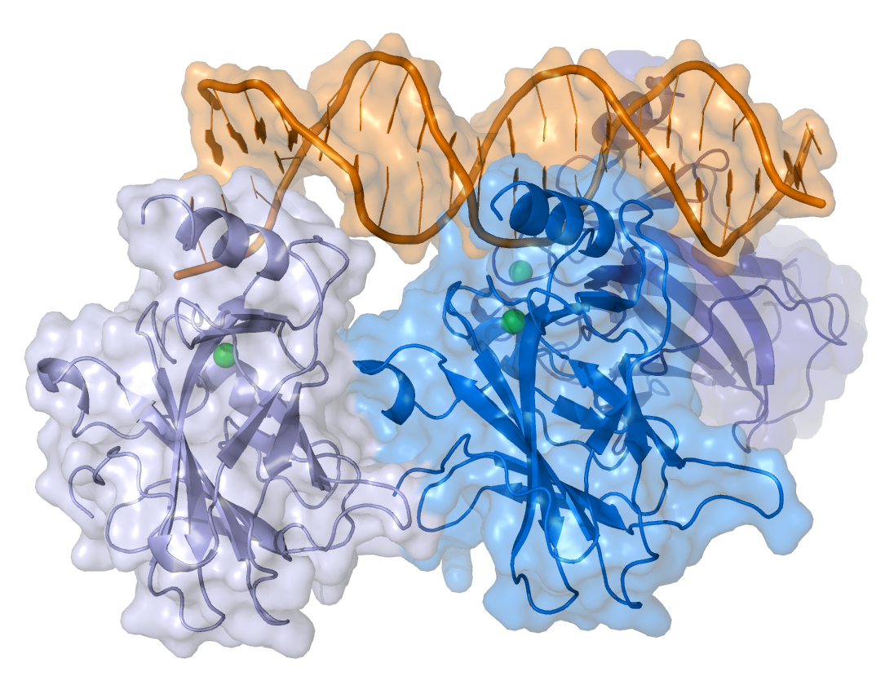
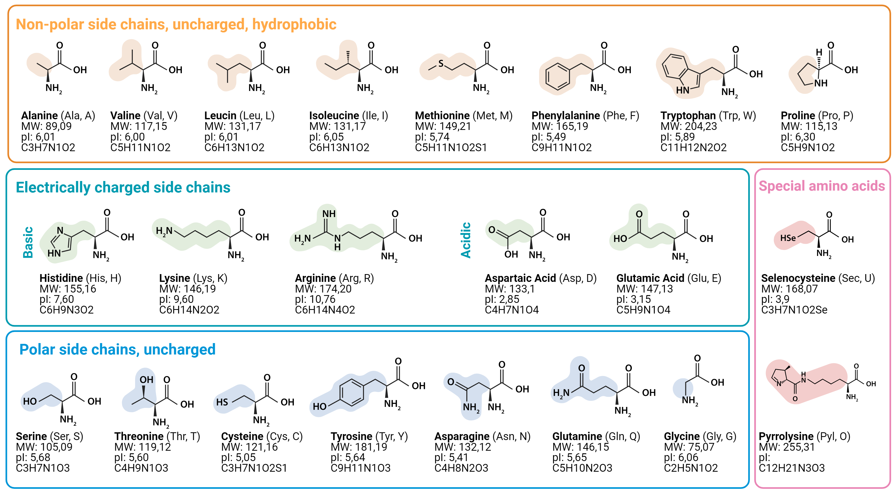
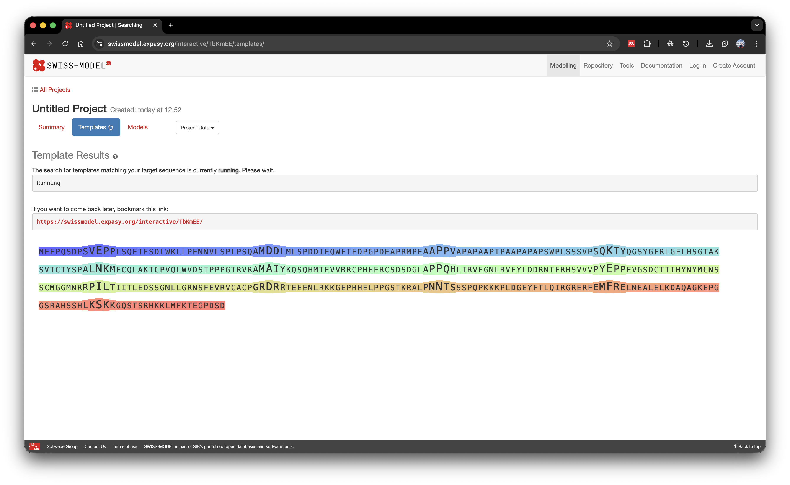
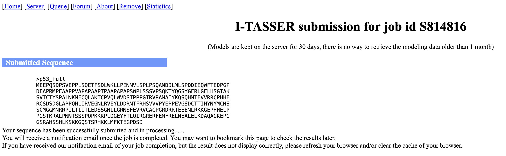
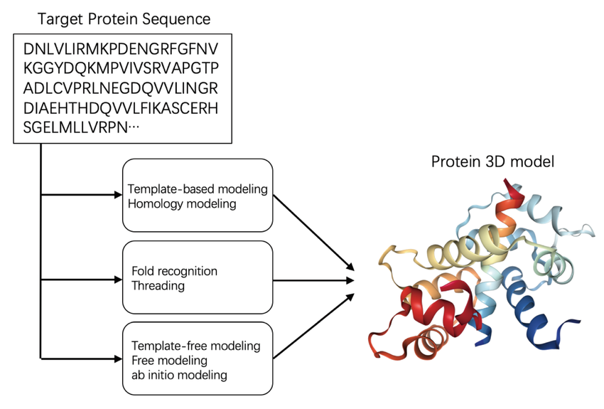
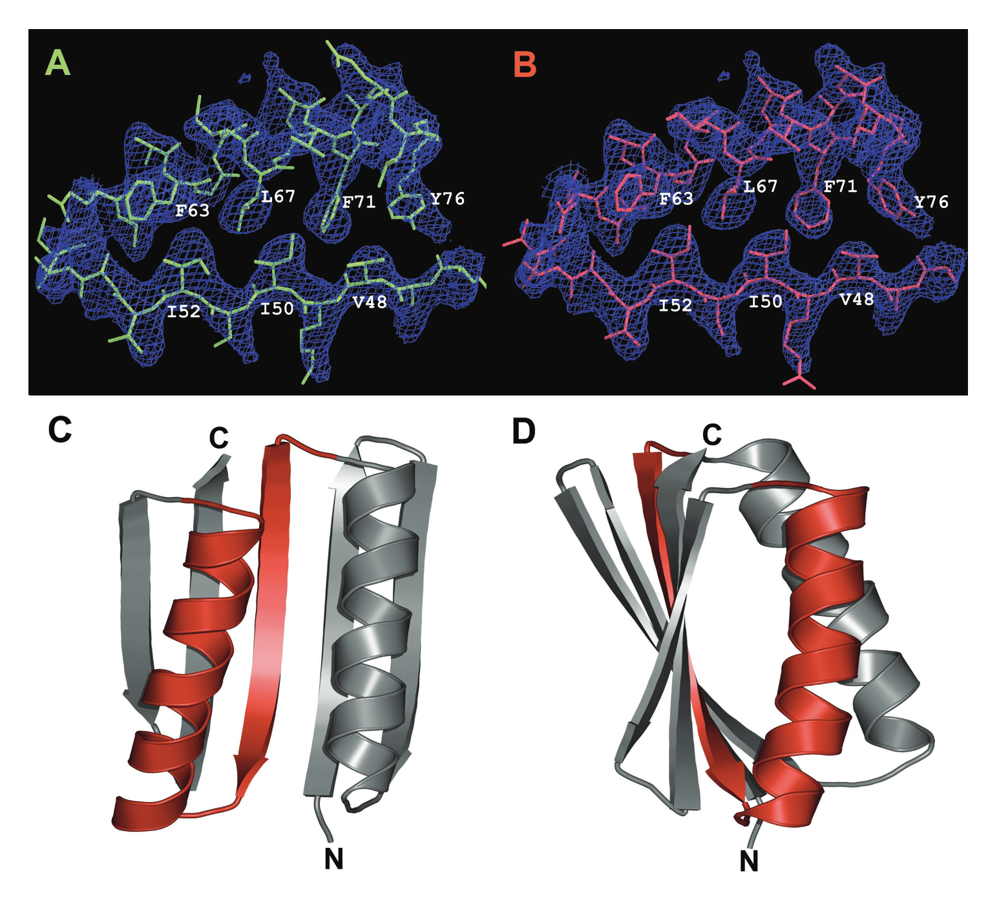
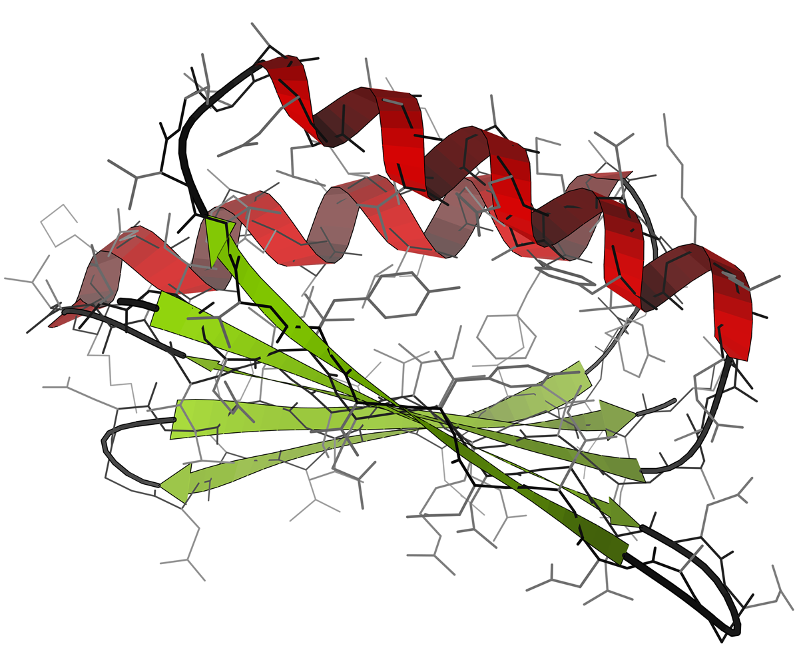
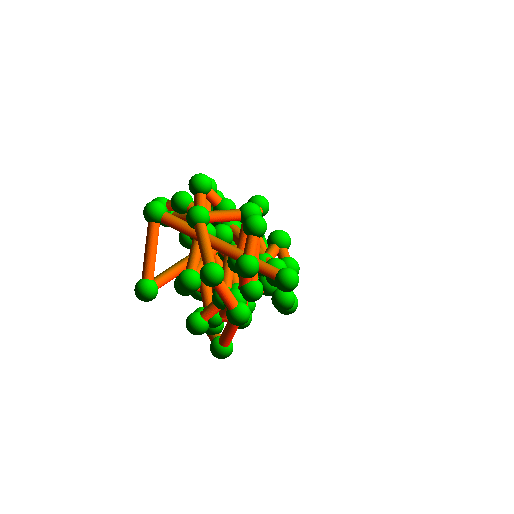
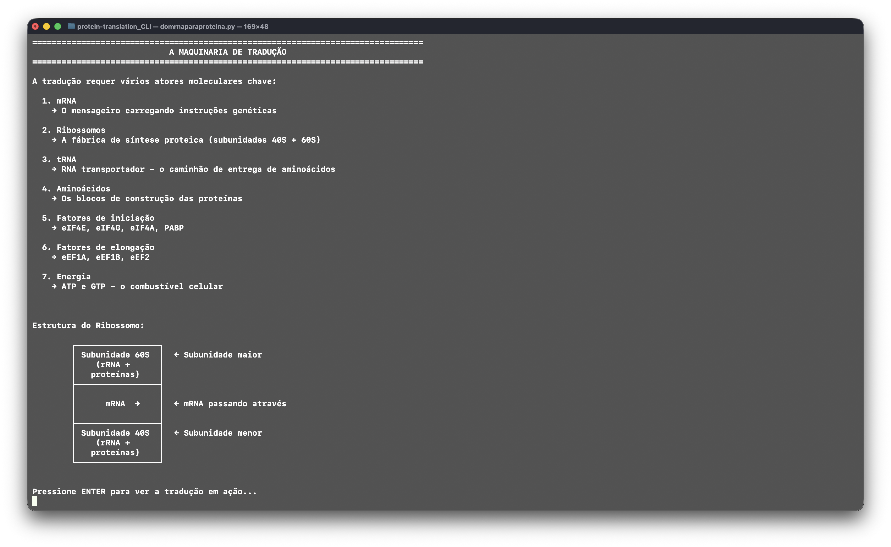

# Exercícios Práticos

**Instrutor I:** Madson A. de Luna Aragão 

**Instrutor II:** André S. Lira de Lucena

**Evento:** Curso de Férias em Bioinformática - 02 à 06 de março de 2026

**Contato:** madsondeluna@gmail.com; andresllucena@gmail.com

**Outros Projetos:** <a href="https://github.com/madsondeluna" target="_blank" rel="noopener noreferrer">https://github.com/madsondeluna</a>

**Slides das aulas:**

<a href="aulas/aula_dia1.pdf" target="_blank" rel="noopener noreferrer"></a>

<a href="aulas/aula_dia2.pdf" target="_blank" rel="noopener noreferrer"></a>

---
# Momento I

## Ferramentas de Predição

As ferramentas abaixo serão utilizadas para analisar propriedades físico-químicas e funcionais utilizando sequências FASTA de proteínas e peptídeos, é uma abordagem exploratória para entender melhor como o seu sistema é representado em termos de características bioquímicas e funcionais.

| Ferramenta | URL | Descrição |
|------------|-----|-----------|
| **ProtParam** | <a href="https://web.expasy.org/protparam/" target="_blank">https://web.expasy.org/protparam/</a> | Parâmetros físico-químicos |
| **SignalP 6.0** | <a href="https://services.healthtech.dtu.dk/services/SignalP-6.0/" target="_blank">https://services.healthtech.dtu.dk/services/SignalP-6.0/</a> | Predição de peptídeos de sinal |
| **CD-Search** | <a href="https://www.ncbi.nlm.nih.gov/Structure/bwrpsb/bwrpsb.cgi" target="_blank">https://www.ncbi.nlm.nih.gov/Structure/bwrpsb/bwrpsb.cgi</a> | Identificação de peptídeos de sinal e caracterização de domínios conservados via busca em bases como CDD, Pfam e TIGRFAM |
| **InterProScan** | <a href="https://www.ebi.ac.uk/interpro/search/sequence/" target="_blank">https://www.ebi.ac.uk/interpro/search/sequence/</a> | Identificação integrada de domínios e famílias proteicas; engloba o Pfam e outras bases como PANTHER, HAMAP, PRINTS, ProSite e SFLD |
| **WoLFPSORT** | <a href="https://wolfpsort.hgc.jp/" target="_blank">https://wolfpsort.hgc.jp/</a> | Identificação de localização celular |

> Agora vamos discutir os resultados obtidos e suas implicações biológicas?

---

# Atividade 1: Caracterização de Proteínas a partir da Sequência Primária

**Objetivo:** Utilizar as ferramentas de predição apresentadas para caracterizar cinco proteínas humanas com propriedades bem documentadas, comparar os resultados obtidos entre elas e discutir as implicações biológicas de cada *feature* identificada. Esta atividade é o ponto de partida do nosso fluxo de trabalho: toda modelagem estrutural confiável começa com a compreensão profunda da sequência primária.

**Proteínas selecionadas:** as cinco proteínas abaixo foram escolhidas por representarem contextos biológicos distintos, diferentes localizações subcelulares, presença ou ausência de peptídeo de sinal, variação de pI, tamanho e repertório de domínios, permitindo interpretar e comparar resultados de forma rica e contextualizada.

| # | Proteína | Gene | UniProt | Características esperadas |
|:-:|:---------|:-----|:-------:|:--------------------------|
| 1 | Albumina sérica humana | *ALB* | <a href="https://www.uniprot.org/uniprotkb/P02768" target="_blank">P02768</a> | Peptídeo sinal + propeptídeo, proteína secretada, pI ácido (~4,9), estável, sem TM, transportadora |
| 2 | Antígeno tumoral p53 | *TP53* | <a href="https://www.uniprot.org/uniprotkb/P04637" target="_blank">P04637</a> | Sem peptídeo sinal, localização nuclear (NLS), pI ~6,3, instável (*in vivo*), domínios TAD/DBD/OD/CTD |
| 3 | Pré-pró-insulina | *INS* | <a href="https://www.uniprot.org/uniprotkb/P01308" target="_blank">P01308</a> | Peptídeo sinal + propeptídeo (C-peptídeo), pequena hormona secretada, rica em Cys (pontes S-S) |
| 4 | Subunidade alfa-1 da hemoglobina | *HBA1* | <a href="https://www.uniprot.org/uniprotkb/P69905" target="_blank">P69905</a> | Sem peptídeo sinal, citoplasmática (eritrócito), pI básico (~8,7), domínio globina, carreadora de O₂ |
| 5 | Lisozima C | *LYZ* | <a href="https://www.uniprot.org/uniprotkb/P00698" target="_blank">P00698</a> | Peptídeo sinal, secretada (saliva, lágrimas, leite), pI básico (~9,3), enzima (glicosídeo hidrolase), rica em Cys |

---

## Sequências FASTA (incluindo peptídeo de sinal quando presente)

> **Importante:** As sequências abaixo correspondem às proteínas completas, incluindo o peptídeo de sinal e propeptídeos onde existem. Essa é a sequência que será reconhecida pelas ferramentas SignalP, CD-Search e InterProScan.

### Proteína 1 - Albumina sérica humana (P02768 · 609 aa)
> Peptídeo sinal: resíduos 1–18 · Propeptídeo: resíduos 19–24 · Proteína madura: resíduos 25–609

```
>sp|P02768|ALBU_HUMAN Albumin OS=Homo sapiens OX=9606 GN=ALB PE=1 SV=2
MKWVTFISLLFLFSSAYSRGVFRRDTHKSEIAHRFKDLGEENFKALVLIAFAQYLQQCP
FEDHVKLVNEVTEFAKTCVADESAENCDKSLHTLFGDKLCTVATLRETYGEMADCCAKQ
EPERNECFLQHKDDNPNLPRLVRPEVDVMCTAFHDNEETFLKKYLYEIARRHPYFYAPE
LLFFAKRYKAAFTECCQAADKAACLLPKLDELRDEGKASSAKQRLKCASLQKFGERAFKA
WAVARLSQRFPKAEFAEVSKLVTDLTKVHTECCHGDLLECADDRADLAKYICENQDSISS
KLKECCEKPLLEKSHCIAEVENDEMPADLPSLAADFVESKDVCKNYAEAKDVFLGMFLYE
YARRHPDYSVVLLLRLAKTYETTLEKCCAADDPHECYAKVFDEFKPLVEEPQNLIKQNCE
LFEQLGEYKFQNALLVRYTKKVPQVSTPTLVEVSRNLGKVGSKCCKHPEAKRMPCAEDYL
SVVLNQLCVLHEKTPVSEKVTKCCTESLVNRRPCFSALEVDETYVPKEFNAETFTFHADI
CTLPDTEKQIKKQTALVELVKHKPKATAEQLKTVMENFVAFVDKCCAADDKEACFAVEGP
KLVVSTQTALA
```

### Proteína 2 - Antígeno tumoral p53 (P04637 · 393 aa)
> Sem peptídeo de sinal. Proteína nuclear; NLS localizado na região C-terminal do DBD.

```
>sp|P04637|P53_HUMAN Cellular tumor antigen p53 OS=Homo sapiens OX=9606 GN=TP53 PE=1 SV=4
MEEPQSDPSVEPPLSQETFSDLWKLLPENNVLSPLPSQAMDDLMLSPDDIEQWFTEDPGP
DEAPRMPEAAPPVAPAPAAPTPAAPAPAPSWPLSSSVPSQKTYQGSYGFRLGFLHSGTAK
SVTCTYSPALNKMFCQLAKTCPVQLWVDSTPPPGTRVRAMAIYKQSQHMTEVVRRCPHHE
RCSDSDGLAPPQHLIRVEGNLRVEYLDDRNTFRHSVVVPYEPPEVGSDCTTIHYNYMCNS
SCMGGMNRRPILTIITLEDSSGNLLGRNSFEVRVCACPGRDRRTEEENLRKKGEPHHELP
GSRAHSSHLKSKKGQSTSRHKKLMFKTEGPDSD
```

### Proteína 3 - Pré-pró-insulina (P01308 · 110 aa)
> Peptídeo sinal: resíduos 1–24 · Cadeia B: 25–54 · C-peptídeo: 57–87 · Cadeia A: 90–110

```
>sp|P01308|INS_HUMAN Insulin OS=Homo sapiens OX=9606 GN=INS PE=1 SV=1
MALWMRLLPLLALLALWGPDPAAAFVNQHLCGSHLVEALYLVCGERGFFYTPKTRREAED
LQVGQVELGGGPGAGSLQPLALEGSLQKRGIVEQCCTSICSLYQLENYCN
```

### Proteína 4 - Subunidade alfa-1 da hemoglobina (P69905 · 142 aa)
> Sem peptídeo de sinal. Proteína citoplasmática (eritrócitos); sem passagem transmembrana.

```
>sp|P69905|HBA_HUMAN Hemoglobin subunit alpha OS=Homo sapiens OX=9606 GN=HBA1 PE=1 SV=2
MVLSPADKTNVKAAWGKVGAHAGEYGAEALERMFLSFPTTKTYFPHFDLSHGSAQVKGHG
KKVADALTNAVAHVDDMPNALSALSDLHAHKLRVDPVNFKLLSHCLLVTLAAHLPAEFTP
AVHASLDKFLASVSTVLTSKYR
```

### Proteína 5 - Lisozima C (P00698 · 148 aa)
> Peptídeo sinal: resíduos 1–18 · Proteína madura: resíduos 19–148 · Enzima antimicrobiana secretada.

```
>sp|P00698|LYC_HUMAN Lysozyme C OS=Homo sapiens OX=9606 GN=LYZ PE=1 SV=1
MKALIVLGLVLLSVTVQGKVFERCELTRTLKRLGMDGYRGISLANWMCLAKWMSGYNTRA
TNYNADGRSTDYGIFQINSRYWCNDGKTPGAVNACHLSCSALLQDNIADAVACAKRVVRDP
QGIRAWVAWRNRFCQNRDVRQYVQGCGV
```

---

## Passo a Passo - Ferramentas de Predição

Para **cada uma das 5 proteínas**, repita o roteiro abaixo. Registre os resultados na tabela ao final desta seção antes de responder às perguntas.

### Passo 1 - ProtParam (Propriedades físico-químicas)

1. Acesse <a href="https://web.expasy.org/protparam/" target="_blank">https://web.expasy.org/protparam/</a>.
2. Cole a sequência de aminoácidos (apenas a sequência, sem o cabeçalho FASTA) na caixa de texto e clique em **"Compute parameters"**.
3. Registre os seguintes valores:
   - **Número de aminoácidos** (confira se bate com o tamanho esperado)
   - **Massa molecular** (em Da)
   - **pI teórico**
   - **Índice de instabilidade** (< 40 = estável; > 40 = instável)
   - **Índice GRAVY** (negativo = hidrofílica; positivo = hidrofóbica)
   - **Coeficiente de extinção molar** a 280 nm

> **Dica:** Para a albumina e a pré-pró-insulina, rode o ProtParam com a sequência completa (incluindo peptídeo sinal). Anote se há diferença relevante no pI ao comparar precursor e proteína madura.

---

### Passo 2 - SignalP 6.0 (Peptídeo de sinal)

1. Acesse <a href="https://services.healthtech.dtu.dk/services/SignalP-6.0/" target="_blank">https://services.healthtech.dtu.dk/services/SignalP-6.0/</a>.
2. Cole a sequência FASTA completa (incluindo cabeçalho `>`) na caixa de texto.
3. Selecione o organismo: **Eukarya**.
4. Clique em **"Submit"** e aguarde o resultado.
5. Registre:
   - **Tipo predito** (SP = peptídeo sinal clássico, OTHER = ausente, LIPO, TAT etc.)
   - **Probabilidade máxima de SP** (se aplicável)
   - **Posição do sítio de clivagem (CS)**, o primeiro resíduo da proteína madura

> **Atenção:** Para proteínas sem peptídeo de sinal (p53 e hemoglobina), o resultado esperado é tipo **OTHER** com probabilidade baixa de SP. Um resultado inesperado merece discussão.

---

### Passo 3 - CD-Search/NCBI (Domínios conservados)

1. Acesse <a href="https://www.ncbi.nlm.nih.gov/Structure/bwrpsb/bwrpsb.cgi" target="_blank">https://www.ncbi.nlm.nih.gov/Structure/bwrpsb/bwrpsb.cgi</a>.
2. Cole a sequência FASTA completa na caixa de texto.
3. Em **"Database"**, selecione **CDD v3** (padrão, inclui entradas do Pfam, TIGRFAM e SMART).
4. Clique em **"Submit"** e aguarde.
5. Na aba de resultados, observe o **mapa gráfico de domínios** e a tabela de *hits*. Registre:
   - Nome e ID de cada domínio identificado (*Specific hits* prioritariamente)
   - Posição de início e fim de cada domínio na sequência
   - E-value de cada hit
   - Presença de regiões de baixa complexidade (Low-complexity regions)

---

### Passo 4 - InterProScan (Integração multi-banco)

1. Acesse <a href="https://www.ebi.ac.uk/interpro/search/sequence/" target="_blank">https://www.ebi.ac.uk/interpro/search/sequence/</a>.
2. Cole a sequência FASTA completa na caixa de texto e clique em **"Search"**.
3. Aguarde o processamento (pode levar 1–3 minutos).
4. Explore o **mapa de domínios** interativo e a lista de entradas identificadas. Registre:
   - Bancos de dados que identificaram domínios (Pfam, PANTHER, HAMAP etc.)
   - Nome dos domínios e seus intervalos na sequência
   - **GO terms** associados (Função Molecular, Processo Biológico, Componente Celular)
   - Compare com o resultado do CD-Search: há domínios detectados em um servidor mas não no outro?

---

### Passo 5 - WoLFPSORT (Localização subcelular)

1. Acesse <a href="https://wolfpsort.hgc.jp/" target="_blank">https://wolfpsort.hgc.jp/</a>.
2. Cole a sequência de aminoácidos (apenas a sequência) na caixa.
3. Selecione **"animal"** como tipo de organismo e clique em **"predict!"**.
4. Registre:
   - Localização subcelular predita com maior escore
   - Escores das localizações alternativas
   - Compare com a localização anotada no UniProt: o resultado é consistente?

---

## Tabela de Registro de Resultados

Preencha a tabela abaixo ao longo da atividade:

| Proteína | Massa (kDa) | pI | Instabilidade | GRAVY | Peptídeo sinal? | CS (posição) | Domínios principais (CD-Search) | GO: Componente celular (InterPro) | Localização (WoLFPSORT) |
|:---------|:-----------:|:--:|:-------------:|:-----:|:---------------:|:------------:|:--------------------------------|:----------------------------------|:-----------------------:|
| Albumina (P02768) | | | | | | | | | |
| p53 (P04637) | | | | | | | | | |
| Insulina (P01308) | | | | | | | | | |
| Hemoglobina α (P69905) | | | | | | | | | |
| Lisozima C (P00698) | | | | | | | | | |

---

## Perguntas para Discussão

1. **Peptídeo de sinal e destino celular.** O SignalP classificou cada proteína como **SP** (peptídeo de sinal clássico) ou **OTHER**? Monte uma tabela com os resultados das 5 proteínas e identifique quais são secretadas e quais permanecem intracelulares. Para as proteínas sem peptídeo de sinal, p53 e hemoglobina α, como cada uma é direcionada ao seu compartimento correto (núcleo vs. citoplasma)?

2. **Ponto isoelétrico e função biológica.** Compare os valores de pI obtidos pelo ProtParam para as 5 proteínas. Albumina (~4,9), p53 (~6,3), hemoglobina α (~8,7) e lisozima (~9,3) operam no mesmo ambiente fisiológico (pH ≈ 7,4), mas com cargas líquidas diferentes. Como o pI de cada proteína se relaciona com sua função ou com os parceiros moleculares com que ela interage?

3. **Índice GRAVY e solubilidade.** Registre o índice GRAVY para as 5 proteínas. Proteínas solúveis tendem a ter GRAVY negativo, enquanto proteínas de membrana tendem a valores positivos. Os resultados obtidos são consistentes com as localizações subcelulares preditas pelo WoLFPSORT? Alguma proteína destoa do padrão esperado?

4. **Estabilidade e meia-vida *in vivo*.** O índice de instabilidade do ProtParam distingue proteínas estáveis (< 40) de instáveis (> 40). Compare os valores das 5 proteínas. A p53 apresenta valor elevado, biologicamente, por que faz sentido que um supressor de tumor seja uma proteína de curta duração? Qual das 5 proteínas é a mais estável segundo esse índice?

5. **Domínios conservados: CD-Search vs. InterProScan.** Para cada proteína, quantos domínios foram reportados por cada ferramenta? Monte uma tabela comparativa indicando o domínio principal identificado e as bases de dados que o capturaram (Pfam, PANTHER, CDD, PRINTS etc.). Para quais proteínas as duas ferramentas apresentaram maior concordância e para quais divergiram mais? O que pode explicar essas diferenças?

6. **Localização subcelular predita vs. experimental.** O WoLFPSORT prediz a localização de cada proteína. Compare as predições com a localização experimental descrita no UniProt. Quantas e quais predições estão corretas? Para os casos incorretos ou ambíguos, qual característica de sequência pode ter induzido o erro?

7. **Processamento proteolítico e modelagem estrutural.** Albumina, pré-pró-insulina e lisozima passam por clivagem proteolítica após a tradução. Para cada uma, identifique: (a) o sítio de clivagem predito pelo SignalP, (b) o tamanho da proteína madura resultante e (c) se o SignalP identificou corretamente o sítio em relação à anotação UniProt. Se você fosse modelar estruturalmente essas proteínas, usaria a sequência completa ou apenas a cadeia madura? Justifique.

8. **Domínio funcional e estrutura experimental.** O InterProScan identifica o domínio de ligação ao DNA (DBD) da p53 entre quais resíduos? Compare esses limites com a região cristalizada no PDB (entrada **1TUP**, resíduos 94–292). Da mesma forma, o CD-Search ou InterProScan fazem referência ao bolsão de ligação ao heme na hemoglobina α? O que essa comparação entre predição *in silico* e estrutura experimental revela sobre a utilidade e as limitações dessas ferramentas?

---

## Respostas - Perguntas para Discussão

### Resposta 1 - Peptídeo de sinal e destino celular

O SignalP 6.0 classifica as cinco proteínas da seguinte forma:

| Proteína | Resultado SignalP | Probabilidade SP | Posição CS | Destino |
|:---------|:-----------------:|:----------------:|:----------:|:--------|
| Albumina (P02768) | **SP** | > 0,99 | 18–19 | Secretada (plasma) |
| p53 (P04637) | **OTHER** | < 0,01 | — | Intracelular (núcleo) |
| Pré-pró-insulina (P01308) | **SP** | > 0,99 | 24–25 | Secretada (circulação) |
| Hemoglobina α (P69905) | **OTHER** | < 0,02 | — | Intracelular (citoplasma) |
| Lisozima C (P00698) | **SP** | > 0,99 | 18–19 | Secretada (saliva, lágrimas, leite) |

**Albumina, pré-pró-insulina e lisozima C** possuem peptídeo de sinal N-terminal clássico, são co-traduzionalmente translocadas para o retículo endoplasmático rugoso (RER) e seguem a via secretória convencional (RER → Golgi → vesículas de secreção → meio extracelular).

**p53** é direcionada ao núcleo por mecanismo completamente distinto: possui sequências de localização nuclear (NLS) na região C-terminal do domínio de ligação ao DNA (resíduos ~305–322), reconhecidas pelas importinas α/β, que a transportam ativamente pelo poro nuclear. A ausência de peptídeo de sinal é esperada e biologicamente coerente, pois a p53 atua como fator de transcrição no interior do núcleo.

**Hemoglobina α** não possui nem peptídeo de sinal nem NLS: é sintetizada por ribossomos citoplasmáticos livres e permanece no citoplasma dos eritrócitos. Seu direcionamento é, portanto, passivo, a ausência de qualquer sinal de tráfego a retém no compartimento onde foi produzida.

---

### Resposta 2 - Ponto isoelétrico e função biológica

Valores de pI obtidos pelo ProtParam para as sequências completas (precursores):

| Proteína | pI calculado | Carga líquida em pH 7,4 | Relação com a função |
|:---------|:------------:|:-----------------------:|:---------------------|
| Albumina (P02768) | ~5,92 (precursor) / **~4,9** (madura) | Negativa | Proteína mais abundante do plasma; carga negativa repele a filtração glomerular (rim) e favorece a ligação de ligandos catiônicos (Ca²⁺, drogas básicas) |
| p53 (P04637) | **~6,33** | Ligeiramente negativa | Opera no núcleo (DNA carregado negativamente); pI próximo à neutralidade permite interações tanto com DNA quanto com proteínas reguladoras (MDM2, CBP/p300) |
| Pré-pró-insulina (P01308) | **~6,77** (precursor) / ~5,3 (madura) | Neutra/levemente negativa | A insulina madura (~5,3) é estável nas vesículas de secreção em pH levemente ácido; ao atingir o sangue (pH 7,4) adquire carga negativa leve que facilita dissociação do hexâmero de zinco |
| Hemoglobina α (P69905) | **~8,72** | Positiva | pI básico favorece interação com a hemoglobina β (pI ~6,8) para formação do heterotetrâmero α₂β₂ via complementaridade eletrostática; carga positiva também contribui para retenção no citoplasma dos eritrócitos |
| Lisozima C (P00698) | **~9,28** (precursor) / ~11,4 (madura) | Fortemente positiva | Superfície catiônica é funcional: promove atração eletrostática com a membrana bacteriana carregada negativamente (lipopolissacarídeos, peptidoglicano), potencializando a atividade antimicrobiana |

Em pH fisiológico (7,4), proteínas com pI < 7,4 apresentam carga líquida negativa, e aquelas com pI > 7,4, carga positiva. O pI não é apenas uma propriedade físico-química: ele molda onde e com quem cada proteína interage no ambiente celular e extracelular.

---

### Resposta 3 - Índice GRAVY e solubilidade

| Proteína | GRAVY (aprox.) | Classificação | Consistência com localização |
|:---------|:--------------:|:-------------:|:----------------------------|
| Albumina (P02768) | **−0,424** | Hidrofílica | Proteína secretada/plasmática, altamente solúvel |
| p53 (P04637) | **−0,559** | Muito hidrofílica | Proteína nuclear solúvel; GRAVY muito negativo coerente com ausência de hélices transmembrana |
| Pré-pró-insulina (P01308) | **−0,196** | Levemente hidrofílica | Secretada; valor menos negativo reflete o caráter anfifílico, as cadeias A e B possuem superfície hidrofóbica que participa do empilhamento do hexâmero de zinco |
| Hemoglobina α (P69905) | **−0,017** | Quase neutra | Atenção: valor próximo de zero pode sugerir caráter anfifílico; contudo, a globina é solúvel no citoplasma, a cavidade hidrofóbica central que acomoda o grupo heme é compensada pela superfície hidrofílica exposta ao solvente |
| Lisozima C (P00698) | **−0,443** | Hidrofílica | Secretada e solúvel em fluidos biológicos |

Todas as cinco proteínas apresentam GRAVY negativo, consistente com proteínas globulares solúveis. Nenhuma destoa radicalmente do padrão esperado. A hemoglobina α é o caso mais próximo da frontier entre hidrofílica e anfifílica (GRAVY ≈ −0,02), o que reflete a bolsa hidrofóbica de ligação ao heme, mas ainda assim está corretamente predita pelo WoLFPSORT como citoplasmática, e não como proteína de membrana.

---

### Resposta 4 - Estabilidade e meia-vida *in vivo*

| Proteína | Índice de instabilidade | Classificação |
|:---------|:-----------------------:|:-------------:|
| Albumina (P02768) | **~33,0** | Estável (< 40) |
| p53 (P04637) | **~64,6** | Instável (> 40) |
| Pré-pró-insulina (P01308) | **~38,0** | Estável (< 40, limítrofe) |
| Hemoglobina α (P69905) | **~23,4** | Estável, **mais estável das 5** |
| Lisozima C (P00698) | **~29,1** | Estável (< 40) |

**A hemoglobina α é a proteína mais estável** do conjunto (índice ~23,4), o que faz sentido biológico: eritrócitos não possuem núcleo nem maquinaria de síntese proteica ativa após maturação, portanto a hemoglobina deve ser suficientemente estável para durar os ~120 dias de vida do eritrócito.

**Por que faz sentido biológico a p53 ser instável?** A p53 é um supressor de tumor cuja atividade deve ser rigidamente controlada no tempo. Em células normais, ela é mantida em níveis basais baixíssimos pelo ciclo de ubiquitinação mediado pela ligase MDM2 e degradação pelo proteassoma 26S (meia-vida de apenas 5–30 minutos). Essa instabilidade é programada: permite que a célula responda em minutos a danos ao DNA (acúmulo rápido de p53 por inibição da degradação), e retorne ao estado basal rapidamente após o reparo. Uma p53 estável e constitutivamente ativa seria incompatível com a viabilidade celular, pois induziria apoptose ou parada permanente do ciclo celular. O alto índice de instabilidade calculado pelo ProtParam é, portanto, um reflexo de sua curta meia-vida *in vivo* regulada pelo proteassoma.

---

### Resposta 5 - Domínios conservados: CD-Search vs. InterProScan

| Proteína | Domínio principal | CD-Search (CDD/Pfam) | InterProScan (bancos adicionais) | Concordância |
|:---------|:------------------|:--------------------:|:--------------------------------:|:------------:|
| Albumina | Serum albumin / Albumin domain (3×) | Pfam PF00273 | Pfam, PANTHER, PRINTS | **Alta** |
| p53 | P53 DBD + TAD + OD | cd08367, PF00870 | Pfam, PANTHER, PRINTS, ProSiteProfiles | **Alta** |
| Pré-pró-insulina | Insulin/IGF/Relaxin B-chain | PF00049 | Pfam, PANTHER, PRINTS | **Alta** |
| Hemoglobina α | Globin | PF00042, cd08925 | Pfam, PANTHER, HAMAP, PRINTS | **Alta** |
| Lisozima C | Lysozyme C | PF00062 | Pfam, PANTHER, PRINTS, ProSiteProfiles | **Alta** |

De modo geral, as duas ferramentas apresentaram **alta concordância** para todas as proteínas do conjunto, identificando os mesmos domínios estruturais/funcionais core. A principal diferença é o **número de bancos de dados** consultados: o InterProScan integra PANTHER, HAMAP, PRINTS, ProSite, SFLD e outros além do Pfam, enquanto o CD-Search foca na CDD (que já incorpora Pfam, TIGRFAM e SMART). O InterProScan tende a reportar **mais entradas** por proteína (especialmente GO terms associados), mas o domínio funcional principal é capturado por ambos. Divergências ocorrem principalmente em **domínios de baixa complexidade, regiões desordenadas e pequenos motivos lineares** (ex.: NLS da p53 é melhor capturado por ProSite no InterProScan do que pelo CD-Search).

---

### Resposta 6 - Localização subcelular predita vs. experimental

| Proteína | Localização UniProt (experimental) | WoLFPSORT (predita) | Correto? |
|:---------|:-----------------------------------:|:-------------------:|:--------:|
| Albumina (P02768) | Secretada / extracelular (plasma) | Extracelular / secreted | Sim |
| p53 (P04637) | Nuclear | Nuclear | Sim |
| Pré-pró-insulina (P01308) | Secretada / extracelular (circulação) | Extracelular / secreted | Sim |
| Hemoglobina α (P69905) | Citoplasmática (eritrócito) | Citoplasmática | Sim |
| Lisozima C (P00698) | Secretada / extracelular | Extracelular / secreted | Sim |

Neste conjunto, o WoLFPSORT prediz **todas as 5 localizações corretamente**, refletindo que as proteínas escolhidas possuem sinais de tráfego canônicos bem reconhecíveis (peptídeo de sinal para as secretadas, NLS para a p53, ausência de qualquer sinal para a hemoglobina α citoplasmática). Em casos reais de falha do WoLFPSORT, as causas mais comuns são: (a) proteínas com localização dual (ex.: proteínas nucleocitoplasmáticas que têm NLS e NES), (b) proteínas com peptídeo de sinal não-clássico, (c) proteínas de membrana com topologia complexa, ou (d) proteínas cuja localização depende de modificações pós-traducionais não codificadas na sequência primária.

---

### Resposta 7 - Processamento proteolítico e modelagem estrutural

| Proteína | Sítio de clivagem SignalP (CS) | Anotação UniProt | Concordância | Tamanho proteína madura |
|:---------|:------------------------------:|:----------------:|:------------:|:-----------------------:|
| Albumina (P02768) | Posição 18↓19 (sinal) | SP: 1–18; Propeptídeo: 19–24; Madura: 25–609 | Sim; propeptídeo requer processamento adicional no Golgi | **585 aa** |
| Pré-pró-insulina (P01308) | Posição 24↓25 | SP: 1–24; Cadeia B: 25–54; C-peptídeo: 57–87; Cadeia A: 90–110 | Sim | **51 aa** (cadeias A+B ligadas por pontes S-S, C-peptídeo removido) |
| Lisozima C (P00698) | Posição 18↓19 | SP: 1–18; Madura: 19–148 | Sim | **130 aa** |

**Para modelagem estrutural, recomenda-se usar apenas a sequência da proteína madura:**

- **Albumina:** modelar os resíduos 25–609. O peptídeo de sinal (1–18) e o propeptídeo (19–24) são clivados antes da forma circulante. Incluir essas regiões introduziria segmentos ausentes na estrutura biológicamente relevante.
- **Pré-pró-insulina:** modelar as cadeias A (resíduos 90–110 no precursor) e B (25–54) unidas por pontes dissulfeto. O C-peptídeo de conexão (57–87) é removido enzimaticamente no Golgi; sua inclusão produziria um modelo irrelevante para a insulina funcional circulante.
- **Lisozima C:** modelar os resíduos 19–148 (130 aa). O peptídeo de sinal é clivado co-traduzionalmente no RER.

A justificativa geral é que os modelos estruturais existentes no PDB e os moldes usados por ferramentas como SWISS-MODEL e AlphaFold correspondem às formas maduras; usar a sequência completa do precursor criaria regiões sem molde estrutural ou com conformação biologicamente inexistente.

---

### Resposta 8 - Domínio funcional e estrutura experimental

**DBD da p53 - InterProScan vs. PDB:**

O InterProScan (via Pfam PF00870 e entradas PANTHER/PRINTS) delimita o domínio de ligação ao DNA da p53 aproximadamente entre os **resíduos 94–292** (Pfam) ou **102–292** (alguns perfis PANTHER). Esse intervalo é altamente consistente com a região cristalizada na estrutura **1TUP** (resíduos 94–292 da sequência canônica), demonstrando que as ferramentas de predição de domínios capturam corretamente os limites do DBD. As pequenas variações (±5–10 resíduos) nos limites N-terminais entre diferentes bancos refletem incertezas nos perfis de HMM nas bordas dos domínios, onde a conservação evolutiva decresce.

**Bolsão de ligação ao heme na hemoglobina α:**

O CD-Search e o InterProScan identificam o domínio **Globin** (Pfam PF00042; CDD cd08925) nos resíduos ~5–141 da hemoglobina α, que compreende toda a estrutura de barril de hélices α responsável por acomodar o grupo heme. Contudo, as ferramentas **não identificam explicitamente o bolsão de ligação ao heme como um subdomínio separado**, essa característica estrutural só é precisamente definida pela análise da estrutura tridimensional experimental (PDB 1HHO / 2HHB), onde a His87 (heme proximal) e a His58 (distal) são identificadas como resíduos-chave do sítio de ligação ao ferro.

**O que isso revela sobre utilidade e limitações das ferramentas:**

| Aspecto | Ferramentas *in silico* | Estrutura experimental |
|:--------|:------------------------|:-----------------------|
| Identificação de domínios globais | Excelente (baseada em perfis conservados) | Padrão-ouro |
| Delimitação precisa de sítios ativos | Limitada, identifica o domínio, não o resíduo catalítico | Precisa ao nível atômico |
| Análise de bolsões de ligação a cofatores | Inferida pelo domínio, não mapeada diretamente | Diretamente visível |
| Custo/rapidez | Imediata, sem custo | Meses/anos de trabalho experimental |

A conclusão central é que as ferramentas de predição de domínios são excelentes para **triagem inicial e anotação funcional global**, mas **não substituem a estrutura experimental** quando se necessita de informação ao nível de resíduos individuais, especialmente para design de inibidores, engenharia de proteínas ou interpretação mecanística detalhada.

---

# Momento II

**Proteína-Alvo:** p53 (*TP53*)

Este repositório contém o material prático do curso de Biologia Estrutural Computacional, utilizando a proteína supressora de tumor p53 como sistema modelo para explorar diferentes métodos de predição e análise estrutural.

<figure class="figure-center">
  
</figure>

Estrutura tridimensional da p53, em complexo com uma estrutura de DNA. As subunidades da p53, mostradas em azul e roxo, são visualizadas usando uma combinação de representação "cartoon", que revela a estrutura secundária de hélices alfa e fitas beta, e uma "superfície" molecular translúcida, que indica o volume de e a forma da proteína. A p53 é mostrada interagindo diretamente com a dupla hélice do DNA, representada em laranja, através de seu domínio de ligação ao DNA (DBD). A presença de esferas (íons de zinco, em verde) destaca componentes cruciais para a estabilidade estrutural do DBD, formando os zinc fingers. Esta interação é fundamental para a função da p53, permitindo que ela se ligue a regiões específicas do genoma para regular a expressão de genes envolvidos no controle do ciclo celular, no reparo de danos ao DNA e na indução da apoptose, prevenindo assim a oncogênese e assim, mantendo a homeostase celular.

---

# Sobre a Proteína p53

A **p53** (derivada do gene *TP53*) é um dos mais importantes supressores de tumor, frequentemente referida como **"a guardiã do genoma"**. Esta proteína é crucial para a regulação do ciclo celular e prevenção do câncer.

## Relevância Científica

- Mutada em **mais de 50% de todos os cânceres humanos**
- Proteína mais estudada na história da oncologia.
- Alvo ideal para comparar diferentes métodos de modelagem computacional.

<figure class="figure-center">
  
</figure>

> Fonte: Criado por Madson Aragão no VMD.

## Dados de Referência

| Informação | Valor/Link |
|------------|------------|
| **ID UniProt** | <a href="https://www.uniprot.org/uniprotkb/P04637/" target="_blank">P04637 (WT)</a> |
| **PDB Experimental** | <a href="https://www.rcsb.org/structure/1tup" target="_blank">1TUP (DNA Binding Domain)</a> |
| **Massa Molecular** | ~43.7 kDa (aparece como 53 kDa em SDS-PAGE) |
| **Domínios** | 7 domínios funcionais (TAD, AD2, PRD, DBD, NLS, OD, CTD) |


## Pré-requisitos

### Software Local
- **PyMOL** (Incentive PyMOL - Licença Educacional Gratuita).

### Software Online
Todos os demais passos utilizarão **servidores web** (não requerem instalação).

### Requisitos do Sistema
- Acesso à internet
- E-mail institucional (.edu ou similar) para licença acadêmica.
- Sistema operacional: Windows, macOS ou Linux

---

# Instalação do PyMOL

O PyMOL é o único software que precisará ser instalado localmente para este curso. Utilizaremos a versão **Incentive PyMOL**, gratuita para estudantes e educadores.

## A. Obtenção da Licença de Estudante (Gratuita)

1. Acesse o portal educacional da Schrödinger: <a href="https://pymol.org/edu/" target="_blank">https://pymol.org/edu/</a>.
2. Clique em **"Register for an Account"**
3. **IMPORTANTE:** Utilize seu **e-mail institucional** (ex: `seu.usuario@ufpe.br`).
   - A licença acadêmica está vinculada à verificação de um domínio educacional
4. Siga as instruções de verificação enviadas ao seu e-mail
5. Após aprovação, faça o download do arquivo de licença (`license.lic`).
6. Salve o arquivo em um local de fácil acesso (ex: Área de Trabalho).

## B. Download e Instalação

Na página de downloads da sua conta Schrödinger, baixe o instalador apropriado para seu sistema operacional pelo site <a href="https://pymol.org/edu/" target="_blank">https://pymol.org/edu/</a>


## C. Ativação da Licença

1. Inicie o PyMOL pela primeira vez.
2. O programa solicitará a ativação.
3. Escolha a opção **"I have a license file"**.
4. Navegue até o local do arquivo `license.lic` e selecione-o.
5. O PyMOL será ativado e estará pronto para uso.

---

# Módulo 1: Análise de Sequências e Propriedades

**Objetivos:**
- Navegar e extrair dados da p53 em bancos de dados estruturais.
- Utilizar ferramentas web para predição de características bioquímicas.

## Bancos de Dados

| Recurso | URL | Descrição |
|---------|-----|-----------|
| **UniProt** | <a href="https://www.uniprot.org/" target="_blank">https://www.uniprot.org/</a> | Informações de sequência e anotações funcionais |
| **PDB** | <a href="https://www.rcsb.org/" target="_blank">https://www.rcsb.org/</a> | Estruturas tridimensionais experimentais |

---

# Atividade 2: Modelagem Tridimensional 

## Alinhamento 1TUP vs. Sequência Completa

**Alinhamento 1TUP vs. Sequência Completa (WT):** Temos as sequências FASTA do domínio de ligação ao DNA da p53 e sua sequência completa (WT), e, juntos, executaremos o alinhamento múltiplo no <a href="https://www.ebi.ac.uk/jdispatcher/msa/clustalo" target="_blank" rel="noopener noreferrer">Clustal Omega</a>. Analise quais regiões se alinham diretamente, discuta as diferenças e vamos entender as implicações biológicas dessas variações. Ter apenas "uma parte" da proteína pode ser suficiente para algumas análises? Isso depende do contexto biológico?

> Sequências FASTA do domínio ligador de DNA da p53, cristalizado por X-ray (PDB ID: 1TUP):

```bash
>1TUP_3|Chains C[auth A] |PROTEIN (P53 TUMOR SUPPRESSOR )|Homo sapiens (9606)
SSSVPSQKTYQGSYGFRLGFLHSGTAKSVTCTYSPALNKMFCQLAKTCPVQLWVDSTPPP
GTRVRAMAIYKQSQHMTEVVRRCPHHERCSDSDGLAPPQHLIRVEGNLRVEYLDDRNTFR
HSVVVPYEPPEVGSDCTTIHYNYMCNSSCMGGMNRRPILTIITLEDSSGNLLGRNSFEVR
VCACPGRDRRTEEENLRKKGEPHHELPPGSTKRALPNNT
```

> Sequência completa da p53 (UNIPROT ID: P04637):

```bash
>sp|P04637|P53_HUMAN Cellular tumor antigen p53 OS=Homo sapiens OX=9606 GN=TP53
MEEPQSDPSVEPPLSQETFSDLWKLLPENNVLSPLPSQAMDDLMLSPDDIEQWFTEDPGP
DEAPRMPEAAPPVAPAPAAPTPAAPAPAPSWPLSSSVPSQKTYQGSYGFRLGFLHSGTAK
SVTCTYSPALNKMFCQLAKTCPVQLWVDSTPPPGTRVRAMAIYKQSQHMTEVVRRCPHHE
RCSDSDGLAPPQHLIRVEGNLRVEYLDDRNTFRHSVVVPYEPPEVGSDCTTIHYNYMCNS
GSRAHSSHLKSKKGQSTSRHKKLMFKTEGPDSD
```

## Perguntas:

- Em quais trechos o domínio 1TUP se alinha diretamente com a sequência completa e quais regiões ficam sem correspondência?
- Os limites N- e C-terminais do domínio cristalizado aparecem contíguos no alinhamento ou revelam lacunas/extensions relevantes para estabilidade?
- Há resíduos-chave do sítio de ligação ao DNA presentes apenas na sequência completa? O que isso implica para os modelos baseados no domínio?
---

# Atividade 3: Análise de Mutações Oncogênicas

> **Atividade (EXTRA):** Temos 5 sequências da p53 (1 referência *wild-type* e 4 variantes associadas a neoplasias) e, juntos, executaremos o alinhamento múltiplo no <a href="https://www.ebi.ac.uk/jdispatcher/msa/clustalo" target="_blank" rel="noopener noreferrer">Clustal Omega</a>. Analise quais substituições coincidem com domínios funcionais críticos, discuta como essas mudanças podem impactar estabilidade e interação com DNA e, por fim, decidam coletivamente qual variante seguirá para aprofundamento nas etapas práticas.

> Baixe aqui o arquivo multiFASTA com as 5 sequências: <a href="https://drive.google.com/file/d/1qpbnbvNjTRcvvG-UsXdiJYXvynkdvxYw/view?usp=sharing" target="_blank">multiFASTA_p53_variants.fasta</a>

## Sequências para Análise

### Wild-Type (Sequência Canônica - 393 aa)

```
>sp|P04637|P53_HUMAN_WT Cellular tumor antigen p53
MEEPQSDPSVEPPLSQETFSDLWKLLPENNVLSPLPSQAMDDLMLSPDDIEQWFTEDPGP
DEAPRMPEAAPPVAPAPAAPTPAAPAPAPSWPLSSSVPSQKTYQGSYGFRLGFLHSGTAK
SVTCTYSPALNKMFCQLAKTCPVQLWVDSTPPPGTRVRAMAIYKQSQHMTEVVRRCPHHE
RCSDSDGLAPPQHLIRVEGNLRVEYLDDRNTFRHSVVVPYEPPEVGSDCTTIHYNYMCNS
SCMGGMNRRPILTIITLEDSSGNLLGRNSFEVRVCACPGRDRRTEEENLRKKGEPHHELP
GSRAHSSHLKSKKGQSTSRHKKLMFKTEGPDSD
```

## Mutações Cancer-Associadas

### R175H (Hotspot - Contato com Zinco)

```
>sp|P04637|P53_HUMAN_R175H Cellular tumor antigen p53 (R175H mutation)
MEEPQSDPSVEPPLSQETFSDLWKLLPENNVLSPLPSQAMDDLMLSPDDIEQWFTEDPGP
DEAPRMPEAAPPVAPAPAAPTPAAPAPAPSWPLSSSVPSQKTYQGSYGFRLGFLHSGTAK
SVTCTYSPALNKMFCQLAKTCPVQLWVDSTPPPGTHVRAMAIYKQSQHMTEVVRRCPHHE
RCSDSDGLAPPQHLIRVEGNLRVEYLDDRNTFRHSVVVPYEPPEVGSDCTTIHYNYMCNS
SCMGGMNRRPILTIITLEDSSGNLLGRNSFEVRVCACPGRDRRTEEENLRKKGEPHHELP
PGSTKRALPNNTSSSPQPKKKPLDGEYFTLQIRGRERFEMFRELNEALELKDAQAGKEPG
GSRAHSSHLKSKKGQSTSRHKKLMFKTEGPDSD
```
**Mudança na posição 175: R → H**

### R248Q (Hotspot - Contato Direto com DNA)

```
>sp|P04637|P53_HUMAN_R248Q Cellular tumor antigen p53 (R248Q mutation)
MEEPQSDPSVEPPLSQETFSDLWKLLPENNVLSPLPSQAMDDLMLSPDDIEQWFTEDPGP
DEAPRMPEAAPPVAPAPAAPTPAAPAPAPSWPLSSSVPSQKTYQGSYGFRLGFLHSGTAK
SVTCTYSPALNKMFCQLAKTCPVQLWVDSTPPPGTRVRAMAIYKQSQHMTEVVRRCPHHE
RCSDSDGLAPPQHLIRVEGNLRVEYLDDRNTFRHSVVVPYEPPEVGSDCTTIHYNYMCNS
SCMGGMNQRPILTIITLEDSSGNLLGRNSFEVRVCACPGRDRRTEEENLRKKGEPHHELP
PGSTKRALPNNTSSSPQPKKKPLDGEYFTLQIRGRERFEMFRELNEALELKDAQAGKEPG
GSRAHSSHLKSKKGQSTSRHKKLMFKTEGPDSD
```
**Mudança na posição 248: R → Q**

### Y220C (Cavidade Hidrofóbica)

```
>sp|P04637|P53_HUMAN_Y220C Cellular tumor antigen p53 (Y220C mutation)
MEEPQSDPSVEPPLSQETFSDLWKLLPENNVLSPLPSQAMDDLMLSPDDIEQWFTEDPGP
DEAPRMPEAAPPVAPAPAAPTPAAPAPAPSWPLSSSVPSQKTYQGSYGFRLGFLHSGTAK
SVTCTYSPALNKMFCQLAKTCPVQLWVDSTPPPGTRVRAMAIYKQSQHMTEVVRRCPHHE
RCSDSDGLAPPQHLIRVEGNLRVECLDDRNTFRHSVVVPYEPPEVGSDCTTIHYNYMCNS
SCMGGMNRRPILTIITLEDSSGNLLGRNSFEVRVCACPGRDRRTEEENLRKKGEPHHELP
PGSTKRALPNNTSSSPQPKKKPLDGEYFTLQIRGRERFEMFRELNEALELKDAQAGKEPG
GSRAHSSHLKSKKGQSTSRHKKLMFKTEGPDSD
```

**Mudança na posição 220: Y → C**

### R273H (Hotspot - Contato Direto com DNA)

```
>sp|P04637|P53_HUMAN_R273H Cellular tumor antigen p53 (R273H mutation)
MEEPQSDPSVEPPLSQETFSDLWKLLPENNVLSPLPSQAMDDLMLSPDDIEQWFTEDPGP
DEAPRMPEAAPPVAPAPAAPTPAAPAPAPSWPLSSSVPSQKTYQGSYGFRLGFLHSGTAK
SVTCTYSPALNKMFCQLAKTCPVQLWVDSTPPPGTRVRAMAIYKQSQHMTEVVRRCPHHE
RCSDSDGLAPPQHLIRVEGNLRVEYLDDRNTFRHSVVVPYEPPEVGSDCTTIHYNYMCNS
SCMGGMNRRPILTIITLEDSSGNLLGHNSFEVRVCACPGRDRRTEEENLRKKGEPHHELP
PGSTKRALPNNTSSSPQPKKKPLDGEYFTLQIRGRERFEMFRELNEALELKDAQAGKEPG
GSRAHSSHLKSKKGQSTSRHKKLMFKTEGPDSD
```

**Mudança na posição 273: R → H**

---

**Não vale clicar nesse link antes de fazer o alinhamento proposto acima**, mas se você já fez, está mais que permitido: <a href="https://drive.google.com/file/d/1zSzitu4daGhJwSUpWxuzzTzBVwkqMo1h/view?usp=sharing" target="_blank">Alinhamento Clustal Omega - multiFASTA_p53_variants.fasta</a>, colorido por percentual de conservação. Podemos ver as mutações destacadas no alinhamento e nas suas a perda da identidade em relação à sequência *wild-type*. Além disso o alinhamento com também mostra um histograma de conservação na parte inferior, onde podemos observar que as posições das mutações são altamente conservadas na família das p53.

> O que vocês acharam desse alinhamento? Vamos discutir as possíveis implicações biológicas dessas mutações?

> Para relembrar, abaixo temos uma tabela com todos os aminoácidos e suas características físico-químicas, caso queiram consultar durante a análise das mutações.

<p align="justify">
  
</p>

> Fonte: JPT Peptide Technologies.

---

## Localização das Mutações no Domínio de Ligação ao DNA (aa 102-292)

| Mutação | Posição | Região | AA WT | AA Mut | Contexto | Caráter WT | Caráter Mut | Carga WT | Carga Mut | Volume WT | Volume Mut |
|---------|---------|--------|-------|--------|----------|------------|-------------|----------|-----------|-----------|------------|
| **R175H** | 175 | Loop L2 | R | H | `...GTR**V**RAM...` → `...GTH**V**RAM...` | Básico forte | Básico fraco | Positiva (+) | Parcial/pH-dependente | 148 ų | 118 ų (-40%) |
| **Y220C** | 220 | Loop L3 | Y | C | `...RVE**Y**LDD...` → `...RVE**C**LDD...` | Aromático polar | Polar alifático (tiol) | Neutro | Neutro | 141 ų | 86 ų (-65%) |
| **R248Q** | 248 | Loop L3 | R | Q | `...GMN**R**RPI...` → `...GMN**Q**RPI...` | Básico forte | Polar neutro | Positiva (+) | Neutro | 148 ų | 114 ų (-15%) |
| **R273H** | 273 | Folha β | R | H | `...LLG**R**NSF...` → `...LLG**H**NSF...` | Básico forte | Básico fraco | Positiva (+) | Parcial/pH-dependente | 148 ų | 118 ų (-40%) |

Aqui trago um resumo das mutações mais comuns da p53 associadas ao câncer, localizadas no domínio de ligação ao DNA (DBD). Essas mutações são conhecidas por afetar a capacidade da p53 de se ligar ao DNA e exercer sua função supressora de tumor.

---

## Notas Importantes

1. **Todas as sequências têm exatamente 393 aminoácidos**
2. As mutações estão localizadas no **DNA-binding domain (DBD)** entre os resíduos 102-292
3. Estas são as mutações mais frequentes em cânceres humanos (hotspots)
4. A numeração segue a sequência canônica do UniProt P04637 (isoforma 1)

## Verificação das Mutações

Para confirmar as posições exatas:

- **R175H**: Resíduo 175 (Arginina → Histidina)
- **Y220C**: Resíduo 220 (Tirosina → Cisteína)
- **R248Q**: Resíduo 248 (Arginina → Glutamina)
- **R273H**: Resíduo 273 (Arginina → Histidina)
  

## Representação das Mutações (Cadeias Laterais)

### Mutação R175H (Arginina → Histidina)

**ANTES: Arginina (R)**
```
        NH₂⁺
        |
        C=NH₂⁺
        |
        NH
        |
        (CH₂)₃
        |
    Cα--C
```
- **Carga**: Positiva (+1)
- **pKa**: ~12.5
- **Características**: Básica, hidrofílica, longa cadeia alifática

**DEPOIS: Histidina (H)**
```
        NH⁺
       /  \
      HC   CH
       \\  /
        N—C
        |
        CH₂
        |
    Cα--C
```
- **Carga**: Positiva/Neutra (dependente do pH)
- **pKa**: ~6.0
- **Características**: Básica fraca, imidazol, menor carga que Arg

**Impacto**: Perda de carga positiva forte → Afeta interação com DNA

---

### Mutação Y220C (Tirosina → Cisteína)

**ANTES: Tirosina (Y)**
```
        OH
        |
       C6H4 (anel benzênico)
        |
        CH₂
        |
    Cα--C
```
- **Carga**: Neutra (polar)
- **Características**: Aromática, volumosa, hidroxila fenólica
- **Ligações**: π-π stacking, pontes de hidrogênio

**DEPOIS: Cisteína (C)**
```
        SH
        |
        CH₂
        |
    Cα--C
```
- **Carga**: Neutra
- **Características**: Pequena, tiol reativo, forma pontes dissulfeto
- **Potencial**: S-S (dimerização ou oxidação)

**Impacto**: Perda de aromático volumoso → Instabilidade estrutural

---

### Mutação R248Q (Arginina → Glutamina)

**ANTES: Arginina (R)**
```
        NH₂⁺
        |
        C=NH₂⁺
        |
        NH
        |
        (CH₂)₃
        |
    Cα--C
```
- **Carga**: Positiva (+1)
- **pKa**: ~12.5
- **Características**: Básica, guanidina carregada

**DEPOIS: Glutamina (Q)**
```
        O
        ‖
        C—NH₂
        |
        CH₂
        |
        CH₂
        |
    Cα--C
```
- **Carga**: Neutra
- **Características**: Polar, amida não carregada
- **Potencial**: Pontes de hidrogênio fracas

**Impacto**: Perda completa de carga positiva → Perda de contato com DNA

---

### Mutação R273H (Arginina → Histidina)

**ANTES: Arginina (R)**
```
        NH₂⁺
        |
        C=NH₂⁺
        |
        NH
        |
        (CH₂)₃
        |
    Cα--C
```
- **Carga**: Positiva (+1)
- **pKa**: ~12.5
- **Características**: Longa, flexível, sempre protonada em pH fisiológico

**DEPOIS: Histidina (H)**
```
        NH⁺/N
       /  \
      HC   CH
       \\  /
        N—C
        |
        CH₂
        |
    Cα--C
```
- **Carga**: Variável (pH dependente)
- **pKa**: ~6.0
- **Características**: Anel imidazol, protonação reversível

**Impacto**: Troca de carga permanente por carga pH-dependente

---

## Perguntas para Discussão:

- Em quais posições do alinhamento múltiplo surgem substituições e essas posições são conservadas na sequência *wild-type*?
- As mutações identificadas representam trocas conservativas ou drásticas em termos de propriedades físico-químicas (ex.: troca de polar para hidrofóbico)?
- Alguma das substituições cria ou elimina motivos funcionais conhecidos (ex.: sítios de fosforilação, ligações a DNA) sugeridos pelo alinhamento?
- Comparando as quatro variantes mutadas entre si, existe um padrão recorrente de substituições que aponte para um hotspot funcional?

---

# Módulo 2: Modelagem por Homologia e Threading

Sequência FASTA completa da p53 (UNIPROT ID: P04637), que utilizaremos nas atividades práticas de modelagem estrutural:

```bash
>sp|P04637|P53_HUMAN Cellular tumor antigen p53 OS=Homo sapiens OX=9606 GN=TP53
MEEPQSDPSVEPPLSQETFSDLWKLLPENNVLSPLPSQAMDDLMLSPDDIEQWFTEDPGP
DEAPRMPEAAPPVAPAPAAPTPAAPAPAPSWPLSSSVPSQKTYQGSYGFRLGFLHSGTAK
SVTCTYSPALNKMFCQLAKTCPVQLWVDSTPPPGTRVRAMAIYKQSQHMTEVVRRCPHHE
RCSDSDGLAPPQHLIRVEGNLRVEYLDDRNTFRHSVVVPYEPPEVGSDCTTIHYNYMCNS
SCMGGMNRRPILTIITLEDSSGNLLGRNSFEVRVCACPGRDRRTEEENLRKKGEPHHELP
PGSTKRALPNNTSSSPQPKKKPLDGEYFTLQIRGRERFEMFRELNEALELKDAQAGKEPG
GSRAHSSHLKSKKGQSTSRHKKLMFKTEGPDSD
```

---

**Objetivos:**
- Construir modelos da p53 utilizando diferentes abordagens.
- Analisar alinhamentos sequência-molde e métricas de confiança.

## Modelagem por Homologia (SWISS-MODEL)

**Plataforma:** SWISS-MODEL  
**URL:** <a href="https://swissmodel.expasy.org/" target="_blank">https://swissmodel.expasy.org/</a>

**Análise:**
- Avaliar alinhamentos sequência-molde
- Examinar cobertura e identidade de sequência

---

## Atividade Prática: SWISS-MODEL

Nesta parte da atividade iremos utilizar o <a href="https://swissmodel.expasy.org/" target="_blank">https://swissmodel.expasy.org/</a> umas das plataformas mais populares para modelagem por homologia. O SWISS-MODEL é um servidor web automatizado para a construção de modelos tridimensionais de proteínas com base em sequências de aminoácidos. Ele utiliza uma abordagem de modelagem por homologia, onde a estrutura de uma proteína alvo é prevista com base na similaridade com proteínas de estrutura conhecida (modelos).

Existem outras plataformas populares para modelagem por homologia, como o Phyre2 (<a href="http://www.sbg.bio.ic.ac.uk/phyre2/html/page.cgi?id=index" target="_blank">http://www.sbg.bio.ic.ac.uk/phyre2/html/page.cgi?id=index</a>) e o MODELLER (<a href="https://salilab.org/modeller/" target="_blank">https://salilab.org/modeller/</a>), cada uma com suas próprias características e algoritmos.

Mas nesta atividade, focaremos no SWISS-MODEL devido à sua interface amigável e ampla aceitação na comunidade científica as excelentes métricas de avaliação de modelos que ele fornece, além de ser online e gratuito para uso acadêmico.

<p align="justify">
  
</p>

> Fonte: Recorte de tela do SWISS-MODEL em uso. 

---

## Modelagem por Threading (I-TASSER)

**Plataforma:** I-TASSER  
**URL:** <a href="https://zhanggroup.org/I-TASSER/" target="_blank">https://zhanggroup.org/I-TASSER/</a>


<p align="justify">
  
</p>

> I-TASSER Server Interface. Fonte: <a href="https://zhanggroup.org/I-TASSER/" target="_blank">https://zhanggroup.org/I-TASSER/</a>.

O I-TASSER (Iterative Threading ASSEmbly Refinement) é um conjunto de métodos para predição de estrutura e função de proteínas. Ele utiliza uma abordagem hierárquica que combina métodos de *threading* e simulações *ab initio* de refinamento.

Devido ao alto custo computacional dos algoritmos e ao tempo de espera significativo em servidores públicos (decorrente de filas de processamento), a sequência da **p53 humana completa** (*full-length*) foi submetida previamente.

O cálculo utilizando threading no I-TASSER levou aproximadamente **48 horas** para ser concluído. Por isso, adiantei o processo para que possamos focar na análise dos resultados. Mas vou mostrar rapidamente como foi feita a submissão no <a href="https://zhanggroup.org/I-TASSER/" target="_blank">https://zhanggroup.org/I-TASSER/</a>.

Os resultados completos da predição estão disponíveis no servidor do I-TASSER por 30 dias, sob o **Job ID: S814816**.

> Acessível em: https://aideepmed.com/I-TASSER/output/S814816/

Nesta seção, o foco não será a submissão ou a espera pelo processamento, mas sim a análise detalhada dos resultados gerados. Discutiremos o processo de construção da estrutura, a geração de múltiplos modelos (Top 5) e a interpretação das métricas de confiança, como o **C-score** (Confidence Score) e o **TM-score** (Template Modeling score), para avaliar a qualidade e a topologia de cada modelo predito.

<figure class="figure-center">
  
</figure>

> Uma ilustração do processo de comparação a cada passo que um fragmento (k=3 ou k=9) é extraído da sequência alvo e alinhado a uma estrutura de proteína conhecida. Fonte: Chen, J.; Siu, S.W.I. Machine Learning Approaches for Quality Assessment of Protein Structures. Biomolecules 2020, 10, 626. https://doi.org/10.3390/biom10040626

**Métricas:**
- **C-score:** Confiança da predição (-5 a 2, valores mais altos = melhor)
- **TM-score:** Similaridade estrutural

---

## Primeira Validação

### Perguntas:

- Qual seria o melhor modelo obtido entre SWISS-MODEL e I-TASSER? Justifique com base nas métricas apresentadas.
- O tipo de construção (homologia vs threading) influenciou a qualidade do modelo? Explique...
- Vamos revisar os métodos utilizados até aqui. Quais são as vantagens e limitações de cada abordagem?
- Ainda não alinhamos as estruturas obtidas até aqui, mas conseguem identificar diferenças visuais entre os modelos gerados?

> Nos próximos módulos, vamos avaliar se o dobramento por cada método foi feito da corretamente. Bem como alinhar estruturalmente os modelos obtidos, calculando RMSD para comparação detalhada.

---

# Módulo 2 (Continuação): E o *Ab Initio*?

O Rosetta revolucionou a biologia estrutural computacional ao introduzir métodos inovadores para a predição de estruturas de proteínas. Desenvolvido inicialmente por David Baker e sua equipe na Universidade de Washington, o Rosetta utiliza uma abordagem baseada em fragmentos para construir modelos tridimensionais de proteínas a partir de suas sequências de aminoácidos. 

A proteína Top-7, projetada computacionalmente usando Rosetta, é um exemplo notável de como a modelagem *ab initio* pode ser eficaz. Esta proteína foi criada para ter uma estrutura estável e bem definida, demonstrando a capacidade do Rosetta de prever estruturas de proteínas que não possuem homólogos conhecidos na natureza. **Ela foi a primeira proteína projetada inteiramente por métodos computacionais a ser cristalizada e ter sua estrutura determinada experimentalmente, validando a precisão das predições do Rosetta.**

A Top-7 possui uma estrutura composta por hélices alfa e folhas beta, formando um núcleo hidrofóbico compacto. Sua criação envolveu a seleção cuidadosa de fragmentos estruturais, a otimização da sequência para estabilidade e a validação experimental através de cristalografia de raios X.

Foi (e ainda é) um marco na engenharia de proteínas, ilustrando o potencial da modelagem computacional para projetar novas proteínas com funções específicas, abrindo caminho para avanços em biotecnologia e medicina.

> Kuhlman B, Dantas G, Ireton GC, Varani G, Stoddard BL, Baker D. Design of a novel globular protein fold with atomic-level accuracy. Science. 2003 Nov 21;302(5649):1364-8. doi: 10.1126/science.1089427. PMID: 14631033.

> Baixem o paper descrevendo a Top-7 pela primeira vez aqui: <a href="https://drive.google.com/file/d/1i55VKkRIEOy2FjWYRb8AQYZoN1JDNSzE/view?usp=sharing" target="_blank">Design of a novel globular protein fold with atomic-level accuracy.</a>

<figure class="figure-center">
  
</figure>

> A imagem, no quadro superior, mostra a densidade eletrostática da superfície da proteína Top-7, destacando suas características estruturais de alta acurácia na obtenção por cristalografia de raios X. No quadro inferior, a representação em fita ilustra a topologia da proteína, evidenciando suas hélices alfa e folhas beta organizadas de forma compacta. Fonte: Baker, D. et al., Science, 2003.

**A Top-7 serve como uma scaffold sintético** com duas alças, fitas beta e hélices alfa, podem ser substituídas por sequências que tenham a mesma topologia, mas com diferentes propriedades funcionais. Transformando a Top-7 em uma plataforma versátil para engenharia de proteínas.

Seu nome *Top-7* faz referência á sua topologia, composta por 7 elementos secundários (4 hélices alfa e 3 fitas beta) organizados em uma estrutura globular estável.

<figure class="figure-center">
  
</figure>

> Fonte: Jane Shelby Richardson, Duke University, 2014

Hoje o David Baker é dono de um dos maiores legados da biologia estrutural computacional, e foi laureado com Nobel de Química em 2023, junto com outros dois cientistas (DeepMind, AlphaFold), por suas contribuições revolucionárias para a predição e design de estruturas de proteínas.

## Sobre o Rosetta

Até agora no curso, utilizamos métodos de modelagem baseados em homologia e threading. Mas e o *ab initio*? Existem pacotes que utilizam essa abordagem para prever estruturas de proteínas sem depender de modelos conhecidos. O  Rosetta é a referência nessa área, e por anos, foi o padrão ouro para predição de estruturas de proteínas quando não havia modelos experimentais disponíveis. 

| Recurso | URL | Descrição |
|---------|-----|-----------|
| **Rosetta** | <a href="https://www.rosettacommons.org/software/license-and-download" target="_blank">https://www.rosettacommons.org/software/license-and-download</a> | pacote de engenharia de proteínas e predição de estruturas |
| **Robetta** | <a href="http://robetta.bakerlab.org/" target="_blank">http://robetta.bakerlab.org/</a> | Servidor web para predição de estruturas com Rosetta |
| **PyRosetta** | <a href="https://www.pyrosetta.org/" target="_blank">https://www.pyrosetta.org/</a> | Interface Python para Rosetta |

<br> 

<figure class="figure-center">
  
</figure>

> Animação do processo de dobramento guiado representação de grafos. Modelo meramente ilustrativo. Fonte: Veit Elser, Professor of Physics at Cornell University

> Disclaimer (Pessoal): Utilizei o *ab initio* do Rosetta de 2015 a 2019 durante meus projetos de pesquisa que envolviam engenharia de proteínas e predição estrutural. É uma ferramenta poderosa, mas o tempo de computação e a complexidade de configuração podem ser desafiadores para iniciantes. Por isso, optei por não incluir uma atividade prática com Rosetta neste curso introdutório. No entanto, encorajo os interessados a explorar essa ferramenta, para quem se interessar.

O Rosetta funciona através de terminal, via CLI (Command Line Interface) e requer instalação local. Portanto, não é tão acessível quanto os servidores web que utilizamos até agora. E se utilize de dois tipos de abordagens principais: Linha de comando, scripts em XML (linki para mosrar exemplo) e PyRosetta (interface Python).

Para os interessados, deixei disponível o tutorial comentando do Rosetta *ab initio* que utilizei: https://docs.rosettacommons.org/demos/latest/tutorials/denovo_structure_prediction/Denovo_structure_prediction

Construir um Rosetta Script (XML) é uma tarefa que exige conhecimento prévio sobre a sintaxe e os módulos disponíveis na suíte Rosetta. Ele é o alicerce para definir como sua predição será conduzida, seja para modelagem de estruturas, docking molecular ou design de proteínas. Segue o protocolo de boas práticas para criar um script XML eficaz: https://docs.rosettacommons.org/docs/latest/scripting_documentation/RosettaScripts/RosettaScripts

Aqui temos um exemplo como é um script XML para predição *ab initio* com Rosetta, que eu usei há alguns anos atrás:

<br>

```xml
<ROSETTASCRIPTS>
    <!-- FUNÇÕES DE PONTUAÇÃO (SCOREFXNS) -->
    <!-- Define as funções de energia utilizadas durante a predição -->
    <SCOREFXNS>
        <!-- Score0-5: funções progressivamente mais detalhadas usadas no ab initio -->
        <ScoreFunction name="score0" weights="score0.wts"/>
        <ScoreFunction name="score1" weights="score1.wts"/>
        <ScoreFunction name="score2" weights="score2.wts"/>
        <ScoreFunction name="score3" weights="score3.wts"/>
        <ScoreFunction name="score5" weights="score5.wts"/>
        <!-- Função de energia completa para refinamento final -->
        <ScoreFunction name="fullatom" weights="ref2015.wts"/>
    </SCOREFXNS>

    <!-- SELETORES DE RESÍDUOS (RESIDUE_SELECTORS) -->
    <!-- Define quais resíduos serão manipulados -->
    <RESIDUE_SELECTORS>
        <!-- Seleciona toda a cadeia (1-100) para uma proteína de 100 aminoácidos -->
        <Index name="full_protein" resnums="1-100"/>
    </RESIDUE_SELECTORS>

    <!-- FÁBRICAS DE MAPAS DE MOVIMENTO (MOVE_MAP_FACTORIES) -->
    <!-- Controla quais graus de liberdade podem se mover durante a otimização -->
    <MOVE_MAP_FACTORIES>
        <!-- Permite movimento de backbone (bb) e ângulos laterais (chi) de todos os resíduos -->
        <MoveMapFactory name="movemap_full" bb="1" chi="1">
            <Backbone residue_selector="full_protein"/>
            <Chi residue_selector="full_protein"/>
        </MoveMapFactory>
    </MOVE_MAP_FACTORIES>

    <!-- MÉTRICAS SIMPLES (SIMPLE_METRICS) -->
    <!-- Ferramentas para análise e validação do modelo gerado -->
    <SIMPLE_METRICS>
        <!-- Tempo de execução do protocolo -->
        <TimingProfileMetric name="timing"/>
        <!-- RMSD do backbone em relação à estrutura nativa (se disponível) -->
        <RMSDMetric name="rmsd_backbone" rmsd_type="rmsd_protein_bb_heavy" 
                    residue_selector="full_protein" use_native="1"/>
        <!-- Sequência dos resíduos selecionados -->
        <SequenceMetric name="sequence" residue_selector="full_protein"/>
        <!-- Estrutura secundária predita (H=hélice, E=folha, L=loop) -->
        <SecondaryStructureMetric name="secondary_structure" residue_selector="full_protein"/>
        <!-- Energia total da estrutura -->
        <TotalEnergyMetric name="total_energy" scorefxn="fullatom"/>
    </SIMPLE_METRICS>

    <!-- MOVERS -->
    <!-- Operações que modificam a estrutura da proteína -->
    <MOVERS>
        <!-- PROTOCOLO AB INITIO CLÁSSICO -->
        <!-- Gera estrutura 3D a partir de fragmentos estruturais e otimização progressiva -->
        <!-- Requer arquivos de fragmentos (3-mer e 9-mer) gerados previamente -->
        <ClassicAbinitio name="abinitio" 
                        score_stage1="score0"
                        score_stage2="score1"
                        score_stage3a="score2"
                        score_stage3b="score5"
                        score_stage4="score3"
                        frag_small="/caminho/para/frags.200.3mers"
                        frag_large="/caminho/para/frags.200.9mers"
                        cycles="1000"
                        use_filters="true"
                        number_3mer_frags="200"
                        number_9mer_frags="25"/>

        <!-- REFINAMENTO EM FULLATOM -->
        <!-- Converte o modelo centroide para fullatom e refina a estrutura -->
        <FastRelax name="refine" 
                   scorefxn="fullatom" 
                   movemap_factory="movemap_full"
                   repeats="5"/>

        <!-- MINIMIZAÇÃO FINAL -->
        <!-- Otimização local para remover choques estéricos residuais -->
        <MinMover name="minimize" 
                  scorefxn="fullatom" 
                  movemap_factory="movemap_full" 
                  tolerance="0.01" 
                  max_iter="200"/>

        <!-- COLETA DE MÉTRICAS -->
        <!-- Executa as métricas definidas anteriormente -->
        <RunSimpleMetrics name="run_metrics_initial" 
                          metrics="sequence,secondary_structure" 
                          prefix="initial_"/>
        <RunSimpleMetrics name="run_metrics_final" 
                          metrics="rmsd_backbone,total_energy,timing,secondary_structure" 
                          prefix="final_"/>
    </MOVERS>

    <!-- PROTOCOLO DE EXECUÇÃO (PROTOCOLS) -->
    <!-- Ordem sequencial das operações -->
    <PROTOCOLS>
        <!-- 1. Coleta métricas iniciais -->
        <Add mover_name="run_metrics_initial"/>
        
        <!-- 2. Executa ab initio para gerar modelo inicial -->
        <Add mover_name="abinitio"/>
        
        <!-- 3. Refina o modelo em fullatom -->
        <Add mover_name="refine"/>
        
        <!-- 4. Minimização final -->
        <Add mover_name="minimize"/>
        
        <!-- 5. Coleta métricas finais para validação -->
        <Add mover_name="run_metrics_final"/>
    </PROTOCOLS>
</ROSETTASCRIPTS>
```

<br>

Vamos discutir as vantagens e desvantagens do *ab initio* em comparação com os métodos que utilizamos até agora?

<figure class="figure-center">
  
</figure>

> Rosetta Commons. Fonte: https://www.rosettacommons.org/docs/latest/application_documentation/demos/denovo_structure_prediction


## Quantidade de Simulações Necessárias

É possível realizar execuções de enovelamento em domínios separados de até aproximadamente 200 aminoácidos de comprimento, mas é amplamente relatado na literatura que o protocolo ab initio do Rosetta é mais eficaz para proteínas menores, tipicamente abaixo de 100-150 resíduos.

Para proteínas de tamanho moderado **(50-100 resíduos)**, recomenda-se gerar entre **5.000 e 50.000** decoys para garantir amostragem suficiente do espaço conformacional. **A presença de um folding funnel característico, evidenciado pela convergência de estruturas de baixo RMSD e baixa energia (REU - Rosetta Energy Units)**, indica que o protocolo conseguiu identificar a região do estado nativo da proteína.

No gráfico à esquerda (**com formação de funil**), observa-se a **formação clara de um funil energético**: **as estruturas convergem para uma região de baixo RMSD (< 2 Å) e baixo score (~-195 REU)**, sugerindo que o algoritmo identificou corretamente o estado enovelado. **Este padrão é o resultado desejado e indica alta confiabilidade dos modelos de menor energia.**

Por outro lado, **o gráfico à direita (sem funil formado)** demonstra um **cenário problemático** onde **não há convergência aparente**. **As estruturas estão dispersas em uma ampla faixa de RMSD (0-6 Å) sem correlação clara com a energia**, indicando que **o protocolo falhou em identificar o estado nativo ou que a proteína não possui um único estado enovelado bem definido**.

## Critérios de Seleção do Modelo Final

Após a geração dos decoys, os modelos candidatos são selecionados com base em:

1. **Energia (REU)**: modelos no percentil inferior de energia (tipicamente top 1-5%)
2. **Clustering estrutural**: agrupamento por similaridade estrutural (RMSD) para identificar conformações consenso
3. **Presença do funil**: modelos na região de convergência energia-RMSD
4. **Validação estrutural**: análise de Ramachandran, Verify3D, ProSA-web

O modelo final geralmente corresponde ao centroide do maior cluster de baixa energia localizado no fundo do folding funnel.

---

## Take Home Message

### Perguntas:

- Acham que tem algo em comum entre nas metodologias de threading e *ab initio*?
- Quais são as principais vantagens e limitações do método *ab initio* em comparação com homologia e threading?
- Em que situações o *ab initio* seria a abordagem preferida para predição estrutural?
- Como a quantidade de resíduos influencia a eficácia do *ab initio*? Spoiler: Proteínas pequenas são melhores candidatas, devido a uma melhor sobreposição dos da bibliotecas de fragmentos e para os dezenas de calculos de angulos torsionais necessários.

---

# Módulo 3: Predição por Deep Learning (AF2, AF3 e ESM3)

Sequência FASTA completa da p53 (UNIPROT ID: P04637), que utilizaremos nas atividades práticas de modelagem estrutural:

```bash
>sp|P04637|P53_HUMAN Cellular tumor antigen p53 OS=Homo sapiens OX=9606 GN=TP53
MEEPQSDPSVEPPLSQETFSDLWKLLPENNVLSPLPSQAMDDLMLSPDDIEQWFTEDPGP
DEAPRMPEAAPPVAPAPAAPTPAAPAPAPSWPLSSSVPSQKTYQGSYGFRLGFLHSGTAK
SVTCTYSPALNKMFCQLAKTCPVQLWVDSTPPPGTRVRAMAIYKQSQHMTEVVRRCPHHE
RCSDSDGLAPPQHLIRVEGNLRVEYLDDRNTFRHSVVVPYEPPEVGSDCTTIHYNYMCNS
SCMGGMNRRPILTIITLEDSSGNLLGRNSFEVRVCACPGRDRRTEEENLRKKGEPHHELP
PGSTKRALPNNTSSSPQPKKKPLDGEYFTLQIRGRERFEMFRELNEALELKDAQAGKEPG
GSRAHSSHLKSKKGQSTSRHKKLMFKTEGPDSD
```

---

> Vamos discutir como esses modelos funcionam mais uma vez, focando em suas arquiteturas baseadas em aprendizado profundo?

**Objetivos:**
- Utilizar métodos de aprendizado profundo para predição estrutural.
- Interpretar métricas de confiança específicas (pLDDT, PAE).

> O **pLDDT (predicted Local Distance Difference Test)** é uma métrica de confiança por resíduo (0-100) que avalia a precisão da predição da estrutura *local* ao redor de cada aminoácido, sendo alta para regiões bem dobradas e baixa para regiões desordenadas.

> O **PAE (Predicted Aligned Error)** é uma métrica inter-resíduo (medida em Ångströms) que avalia a confiança na *orientação relativa* e global entre diferentes domínios ou pares de resíduos, indicando se a montagem 3D geral está correta.

> Em resumo, o pLDDT mede a confiança no dobramento *local* de um resíduo, enquanto o PAE mede a confiança na posição *global* desse resíduo em relação a todos os outros na estrutura.

### Plataformas de Deep Learning

| Método | URL | Descrição |
|--------|-----|-----------|
| **AlphaFold2 / ColabFold** | <a href="https://colab.research.google.com/github/sokrypton/ColabFold/blob/main/AlphaFold2.ipynb" target="_blank">AlphaFold2 Notebook</a> | Baseado em AlphaFold2 (Google Colab) |
| **AlphaFold 3 Server** | <a href="https://alphafoldserver.com/" target="_blank">https://alphafoldserver.com/</a> | Versão mais recente do AlphaFold |
| **ESM3** | <a href="https://forge.evolutionaryscale.ai/" target="_blank">https://forge.evolutionaryscale.ai/</a> | Baseado em Modelo de Linguagem de Proteína e Dados Evolutivos  |

## Métricas de Confiança

- **pLDDT** (predicted Local Distance Difference Test): 0-100, >90 = alta confiança
- **PAE** (Predicted Aligned Error): Confiança na posição relativa entre resíduos

## Perguntas:

- Como os valores de pLDDT distribuídos ao longo da cadeia ajudam a distinguir regiões estruturadas de segmentos desordenados na p53 predita?
- Ao comparar os mapas de PAE dos diferentes servidores, quais domínios apresentam maior incerteza relativa e como isso impacta a confiança global do modelo?
- Quais diferenças você espera observar entre as predições de AF2/ColabFold, AF3 e ESM3 em termos de conformação global e métricas de confiança?
- Se você tivesse de priorizar um único modelo para a próxima etapa de análise comparativa, quais critérios baseados nas saídas desses métodos sustentariam sua escolha?

---

# Módulo 4: Análise Comparativa, Validação e Visualização

* Agora que temos os modelos gerados por homologia, threading e deep learning. Vamos baixar um modelos experimental, obtido por cristalografia de x-ray, da p53 para comparar os modelos teóricos. Lembrando que a estrutura experimental sempre será o nosso padrão-ouro de comparação.

**Baixe aqui o arquivo PDB da estrutura cristalina da p53 (PDB ID: 1TUP) para utilizar como referência na comparação dos modelos preditos:** <a href="https://drive.google.com/file/d/1p0liOriRtvaYrY2CvTDCWpMGHIO1zfoq/view?usp=sharing" target="_blank">1TUP_cleaned.pdb</a>.

> Sugiro fortemente que utilize este arquivo para evitar problemas de formatação ou erros por conta de heteroátomos.

> Opicional: Baixar a estrutura experimental da p53 (PDB ID: 1TUP) do RCSB PDB para servir como referência na comparação dos modelos preditos. No entanto, além da proteína, o arquivo possuí íons, águas e ligantes. Link: <a href="https://www.rcsb.org/structure/1tup" target="_blank">https://www.rcsb.org/structure/1tup</a>

**Objetivos:**
- Comparar todos os modelos gerados.
- Realizar análise estrutural comparativa no PyMOL.
- Quantificar diferenças estruturais via RMSD.

## Servidores de Validação de Dobramento e Termodinâmica

| Servidor | URL | Métrica Avaliada |
|----------|-----|------------------|
| **MolProbity (SAVES)** | <a href="https://saves.mbi.ucla.edu/" target="_blank">https://saves.mbi.ucla.edu/</a> | Gráfico de Ramachandran, geometria |
| **QMEAN** | <a href="https://swissmodel.expasy.org/qmean/" target="_blank">https://swissmodel.expasy.org/qmean/</a> | Qualidade global |
| **ProSA-web** | <a href="https://prosa.services.came.sbg.ac.at/prosa.php" target="_blank">https://prosa.services.came.sbg.ac.at/prosa.php</a> | Z-score (energia do enovelamento) |

## Análise Estrutural no PyMOL

**Modelos para Comparação:**
- SWISS-MODEL (Homologia)
- I-TASSER (Threading)
- AlphaFold 2 (ColabFold)
- AlphaFold 3 Server
- ESM3
- **1TUP** (Estrutura experimental de referência - X-ray).

---

1. **Carregar estruturas**
  
- Abra o PyMOL e carregue todos os modelos preditos e a estrutura experimental fornecida.

2. **Cálculo de RMSD**
- Quantificar divergência estrutural de cada modelo vs. 1TUP.
- Registrar valores de RMSD para comparação e discutir o que seria um valor aceitável de RMSD para modelos preditos.

1. **Inspeção visual**
- Identificar regiões de convergência (alta similaridade).
- Identificar regiões de divergência (loops, cadeias laterais).
- Destacar sítios ativos e domínio de ligação ao DNA.

1. **Geração de figuras**
- Criar representações ilustrativas das diferenças/similaridades.
- Destacar regiões de interesse estrutural.

## Perguntas:

- Quais modelos apresentam RMSD mais baixo em relação à estrutura experimental e o que isso revela sobre a qualidade geral de cada predição?
- Ao inspecionar as sobreposições no PyMOL, quais regiões da p53 mantêm conformação consistente entre todos os modelos e quais divergem com mais intensidade?
- Como as métricas de validação (MolProbity, QMEAN, ProSA-web) complementam os resultados de RMSD para justificar a seleção de um modelo confiável?
- De que modo as figuras geradas podem comunicar melhor as diferenças funcionais potenciais entre os modelos analisados?

---

# Referências (Atividades Práticas)

## Bases de Dados
- <a href="https://www.uniprot.org/" target="_blank" rel="noopener noreferrer">UniProt</a>
- <a href="https://www.rcsb.org/" target="_blank" rel="noopener noreferrer">RCSB PDB</a>

## Ferramentas de Predição
- <a href="https://web.expasy.org/protparam/" target="_blank" rel="noopener noreferrer">ExPASy ProtParam</a>
- <a href="https://services.healthtech.dtu.dk/service.php?SignalP-6.0" target="_blank" rel="noopener noreferrer">SignalP 6.0</a>
- <a href="https://www.ebi.ac.uk/interpro/search/sequence/" target="_blank" rel="noopener noreferrer">InterProScan</a>
- <a href="https://prosite.expasy.org/" target="_blank" rel="noopener noreferrer">PROSITE</a>

## Modelagem Estrutural
- <a href="https://swissmodel.expasy.org/" target="_blank" rel="noopener noreferrer">SWISS-MODEL</a>
- <a href="https://zhanggroup.org/I-TASSER/" target="_blank" rel="noopener noreferrer">I-TASSER</a>
- <a href="https://colabfold.com/" target="_blank" rel="noopener noreferrer">AlphaFold 2 (ColabFold)</a>
- <a href="https://alphafoldserver.com/" target="_blank" rel="noopener noreferrer">AlphaFold 3 Server</a>
- <a href="https://esm.metademolab.com/esm3" target="_blank" rel="noopener noreferrer">ESM3</a>

## Validação
- <a href="http://molprobity.biochem.duke.edu/" target="_blank" rel="noopener noreferrer">MolProbity</a> / <a href="https://saves.mbi.ucla.edu/" target="_blank" rel="noopener noreferrer">SAVES</a>
- <a href="https://swissmodel.expasy.org/qmean/" target="_blank" rel="noopener noreferrer">QMEAN</a>
- <a href="https://prosa.services.came.sbg.ac.at/prosa.php" target="_blank" rel="noopener noreferrer">ProSA-web</a>

## Visualização
- <a href="https://pymol.org/2/" target="_blank" rel="noopener noreferrer">PyMOL (Schrödinger)</a>

---

# Licença

Uso estritamente educacional e acadêmico. Proibida a utilização comercial sem autorização prévia dos autores.
Para qualquer outro tipo de uso, entre em contato com os autores pelos e-mails fornecidos acima.

---

# Recursos Úteis

<a href="https://github.com/madsondeluna/bits_bytes_biomolecules" target="_blank">Repositório do Curso</a>
<a href="https://madsondeluna.github.io/bits_bytes_biomolecules/" target="_blank">Página Web do Curso</a>


---

<br>

> Nenhuma dúvida é boba... Qualquer dúvida ou sugestão, sinta-se à vontade para entrar em contato conosco pelos e-mails fornecidos acima. Bom desempenho e aproveitem os exercícios!

<br>

---

<!--
# Extra: Ferramenta Educacional CLI - Tradução de Proteínas

Esta seção apresenta um **script educacional interativo** que demonstra, passo a passo, o processo de **tradução de proteínas** via linha de comando (CLI). Esta ferramenta foi desenvolvida para complementar o aprendizado sobre o **Dogma Central da Biologia Molecular**, oferecendo uma visualização didática e interativa de como o mRNA é convertido em proteínas.

### Sobre o Script

<figure class="figure-center">
  
</figure>

> Exemplo de execução do script educacional de tradução de proteínas mostrando a fase de iniciação, com animações ASCII representando o ribossomo, mRNA e os fatores de iniciação (eIF4E, eIF4G, PABP). O script utiliza arte ASCII e efeitos de digitação para demonstrar interativamente cada etapa do processo de tradução proteica.

O script utiliza **animações em terminal** e **arte ASCII** para ilustrar:
- O **Dogma Central** (DNA → RNA → Proteína)
- A **maquinaria de tradução** (ribossomos, tRNA, mRNA)
- As **três fases da tradução**: Iniciação, Elongação e Terminação
- O **dobramento proteico** e modificações pós-traducionais
- **Relevância clínica** e aplicações terapêuticas

### Script Disponível

**Ferramenta de Tradução de Proteínas** 

- [Baixar domrnaparaproteina.py](https://raw.githubusercontent.com/madsondeluna/bits_bytes_biomolecules/main/protein-translation_CLI/domrnaparaproteina.py)
- [Ver código no repositório](protein-translation_CLI/domrnaparaproteina.py)

#### Como Baixar

Você pode baixar o script de **três formas**:

**Opção 1: Download Direto**
- Clique no link "Baixar domrnaparaproteina.py" acima
- O arquivo será baixado automaticamente
- Salve em uma pasta de fácil acesso

**Opção 2: Clonar o Repositório Completo**
```bash
git clone https://github.com/madsondeluna/bits_bytes_biomolecules.git
cd bits_bytes_biomolecules/protein-translation_CLI
```

**Opção 3: Download via Terminal (Linux/macOS)**

```bash
curl -O https://raw.githubusercontent.com/madsondeluna/bits_bytes_biomolecules/main/protein-translation_CLI/domrnaparaproteina.py
chmod +x domrnaparaproteina.py
```

### Como Executar

#### Pré-requisitos
- **Python 3.6+** instalado no sistema
- Terminal compatível (Linux, macOS, Windows Terminal, ou PowerShell)

#### Instruções de Execução

**1. Via Terminal (qualquer sistema operacional)**

```bash
cd protein-translation_CLI
python3 domrnaparaproteina.py
```

**2. Execução Direta (Linux/macOS)**

O script possui permissão de execução. Você pode executá-lo diretamente:

```bash
./protein-translation_CLI/domrnaparaproteina.py
```

**3. No Windows (PowerShell ou CMD)**

```powershell
cd protein-translation_CLI
python domrnaparaproteina.py
```

### Conteúdo Abordado

Os scripts cobrem os seguintes tópicos de forma interativa:

1. **Introdução ao Dogma Central**
   - Fluxo de informação: DNA → RNA → Proteína

2. **Maquinaria Molecular da Tradução**
   - Ribossomos (subunidades 40S e 60S)
   - tRNA e aminoácidos
   - Fatores de iniciação e elongação

3. **Fase de Iniciação**
   - Reconhecimento do cap 5' por eIF4E
   - Recrutamento da subunidade 40S
   - Identificação do códon de início (AUG)

4. **Fase de Elongação**
   - Entrada do aminoacil-tRNA no sítio A
   - Formação da ligação peptídica
   - Translocação do ribossomo

5. **Fase de Terminação**
   - Reconhecimento de códons de parada (UAA, UAG, UGA)
   - Fatores de liberação (eRF1/eRF3)
   - Desmontagem do ribossomo

6. **Dobramento Proteico**
   - Estrutura 3D funcional
   - Chaperonas moleculares
   - Modificações pós-traducionais

7. **Relevância Clínica**
   - Doenças neurodegenerativas (Alzheimer, Parkinson)
   - Câncer e desregulação da tradução
   - Estratégias terapêuticas (inibidores de mTOR, eIF4E)

8. **Técnicas de Pesquisa**
   - Ribosome profiling (Ribo-seq)
- Proteômica por espectrometria de massa
- Abordagens de célula única

### Características Técnicas

- **Animações suaves** com efeito de digitação
- **Arte ASCII** para representar moléculas e processos
- **Interatividade**: pressione ENTER para avançar entre as etapas
- **Código limpo e bem documentado** para uso educacional
- **Interrupção segura**: use `Ctrl+C` para sair a qualquer momento

### Uso Educacional Recomendado

- **Aulas introdutórias** sobre biologia molecular
- **Revisão visual** de conceitos de tradução proteica
- **Complemento** aos exercícios práticos de modelagem
- **Demonstrações interativas** em sala de aula ou workshops

### Autoria

**Desenvolvido por:** Madson Aragão @ UFMG

-->

# Reporte de Erros

Se você identificou algum **erro conceitual**, **ambiguidade científica** ou **imprecisão** neste material, ficarei **muito feliz** em corrigir e saber que pessoas atentas estão lendo e contribuindo para a qualidade deste conteúdo.

## Como reportar um problema:
1. Acesse o repositório oficial do curso: <a href="https://github.com/madsondeluna/bits_bytes_biomolecules" target="_blank">https://github.com/madsondeluna/bits_bytes_biomolecules</a>

2. Clique na aba **"Issues"** (no topo da página do repositório)

3. Clique no botão verde **"New issue"** (Nova issue)

4. Preencha o formulário com as seguintes informações:
   - **Título**: Descreva brevemente o problema (ex: "Erro conceitual na seção de Elongação")
   - **Descrição**: Explique detalhadamente:
     - Onde está o erro (arquivo e seção)
     - Qual é o problema identificado
     - Sugestão de correção (se possível)
     - Referências bibliográficas que sustentam a correção (opcional, mas muito apreciado)

5. Clique em **"Submit new issue"** para enviar

Suas contribuições são extremamente valiosas para manter este material atualizado e cientificamente preciso. Obrigado por dedicar seu tempo para melhorar este recurso educacional!

<br>
