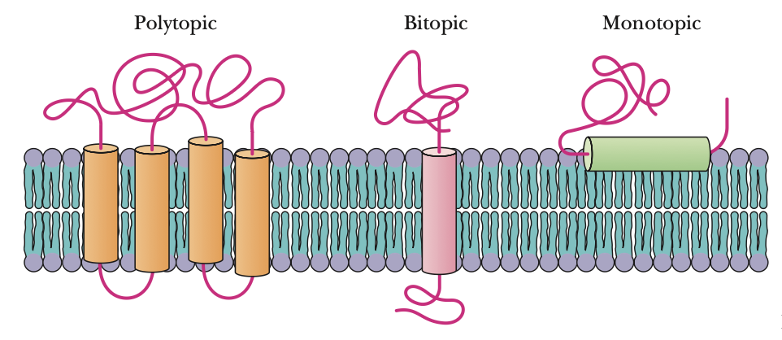
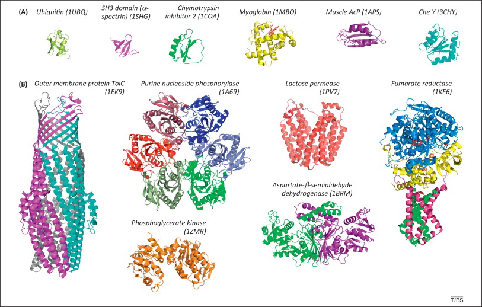

# Bits, Bytes e Biomoléculas: Introdução à Modelagem de Proteínas com Métodos Clássicos e de Aprendizado de Máquina

**Instrutor:** Madson Aragão (Estudante de PhD @ UFMG, MSc em Genética e Biologia Molecular @ UFPE)

**Monitor:** Saulo Penna (BSc em Biomedicina @ UFPE, Pesquisador no LGBV/UFPE)

**Evento:** XV Jornada PPGGBM - 19 de Novembro de 2025

**Contato:** madsondeluna@gmail.com

**Portfólio:** <a href="https://madsondeluna.github.io/" target="_blank" rel="noopener noreferrer">https://madsondeluna.github.io/</a>

**Projetos:** <a href="https://github.com/madsondeluna" target="_blank" rel="noopener noreferrer">https://github.com/madsondeluna</a>

---

Este repositório contém o material de referência completo para o curso, incluindo conceitos fundamentais, guias de ferramentas e leituras recomendadas. Qualquer sugestão ou feedback pode ser encaminhar uma mensagem para madsondeluna@gmail.com. 

Link para o na versão web: <a href="https://madsondeluna.github.io/bits_bytes_biomolecules/" target="_blank" rel="noopener noreferrer">Bits, Bytes e Biomoléculas: Introdução à Modelagem de Proteínas com Métodos Clássicos e de Aprendizado de Máquina</a>

---

## Take Home Message

*"We estimate that if a protein were to fold by randomly trying all possible conformations, it would require a time longer than the age of the universe to arrive at its correct native structure."* 
<p align="left"><strong>— Richard Lewontin (1929-2021)</strong></p>

---

## Antes de Tudo: O Dogma Central da Biologia Molecular

O Dogma Central da Biologia Molecular descreve o fluxo fundamental da informação genética: o DNA é transcrito em RNA, e o RNA é traduzido em proteína. Esse modelo, proposto por Francis Crick, estabelece a base conceitual sobre como as instruções genéticas são convertidas em função biológica. Assim, o dogma central reúne o grande conjunto de processos canônicos, replicação, transcrição e tradução, que sustentam a herança e a expressão gênica em todos os organismos vivos. No entanto, à medida que a biologia molecular avançou, tornou-se evidente que esses processos estão longe de ser lineares ou simples. Cada etapa do dogma central é regulada por uma imensa rede de mecanismos que modulam a eficiência, a precisão e o contexto da expressão gênica. Fatores como modificações epigenéticas, splicing alternativo, estruturas secundárias de RNA, metilação, interações com proteínas e a ação de pequenos RNAs adicionam camadas de controle que permitem respostas dinâmicas às condições celulares e ambientais. Portanto, embora o dogma central represente o esqueleto conceitual do fluxo de informação genética, é nas suas regulações não canônicas, sutis, versáteis e altamente específicas — que a vida adquire sua complexidade e capacidade de adaptação. 

<p align="justify">
  
</p>
<p align="justify">
  <strong>Dogma Central da Biologia Molecular.</strong> Representação expandida do Dogma Central da Biologia Molecular. O DNA é transcrito em diferentes classes de RNA, incluindo os RNAs clássicos envolvidos na tradução — como o mRNA, tRNA e rRNA —, que juntos participam da síntese proteica. No entanto, a transcrição também gera uma ampla variedade de RNAs não codificantes (ncRNAs), tanto curtos (<200 pb) quanto longos (>200 pb), que desempenham papéis fundamentais na regulação gênica, remodelamento da cromatina, splicing e degradação de RNA. Além disso, alguns vírus utilizam a transcrição reversa para converter RNA em DNA, revelando a flexibilidade e complexidade do fluxo de informação genética. Fonte: Nicolás Delgado Pease, BioRender.
</p>

---

## Os Processos Especiais, ou não Canônicos, Ajudam a Vida a Acontecer

---

## Regulando o Dogma Central

Nos modelos didáticos e nas representações clássicas da biologia molecular, a regulação do RNA costuma ser simplificada ou mesmo omitida, com o objetivo de tornar mais acessível a compreensão dos processos fundamentais da expressão gênica. No entanto, essa simplificação mascara uma complexa e fascinante camada de controle que atua além do DNA e das proteínas. O mRNA não é apenas um intermediário passivo entre o gene e o produto proteico, ele é um verdadeiro campo de regulação dinâmica, onde estruturas secundárias, modificações químicas e interações com proteínas e microRNAs determinam quando, onde e quanto de uma proteína será produzida. Compreender esses mecanismos é essencial não apenas para entender a vida em seu nível molecular mais refinado, mas também para o avanço da medicina moderna. As terapias baseadas em RNA, como as vacinas de mRNA e os silenciadores gênicos (siRNAs), só se tornaram possíveis graças ao entendimento aprofundado desses elementos regulatórios. Assim, o estudo dos processos não canônicos do RNA não é um detalhe técnico, é uma chave para decifrar a complexidade biológica e projetar intervenções terapêuticas precisas. 

### Exemplos: 

- **Internal Ribosome Entry Sites (IRES):**  
  Os IRES são estruturas de RNA localizadas principalmente na região 5’-UTR que permitem a iniciação da tradução de forma independente da estrutura de cap. Elas recrutam diretamente o ribossomo ao mRNA, um mecanismo crucial em condições de estresse celular, quando a tradução dependente do cap é inibida.

- **5’Cap *Hijacking*:**  
  Alguns vírus e elementos genéticos móveis exploram o chamado *cap hijacking*, um processo em que o sistema de tradução da célula hospedeira é sequestrado. O RNA viral utiliza ou mimetiza a estrutura de cap do mRNA eucariótico para garantir sua própria tradução, competindo eficientemente com os mRNAs celulares.


<p align="justify">
  
</p>
<p align="justify">
  <strong>Representação da topologia de um mRNA e seus elementos regulatórios.</strong> Elementos regulatórios do mRNA eucariótico. A estrutura e os elementos regulatórios dos mRNAs são essenciais para sua função na expressão gênica. Os mRNAs eucarióticos possuem uma estrutura de cap no extremo 5’, seguida por uma região não traduzida 5’ (5’-UTR), onde podem ser encontrados diversos elementos regulatórios: <strong>1.</strong> Complexo ribonucleoproteico (RNP), <strong>2.</strong> Quadros de leitura abertos a montante (uORFs), <strong>3.</strong> Alças em grampo (hairpin loops), <strong>4.</strong> Pseudonós (pseudoknots), <strong>5.</strong> Sítios internos de entrada do ribossomo (IRESs), <strong>6.</strong> Modificações de RNA, <strong>7.</strong> Sítios de ligação e <strong>8.</strong> Códons AUG a montante. A região não traduzida 3’ (3’-UTR) pode conter: <strong>9.</strong> Sinais de poliadenilação (PASs) e <strong>10.</strong> Sítios de ligação de microRNAs. Abreviações: RBP, proteína de ligação ao RNA; AUG, códon de iniciação da tradução; MET, metionina; CDS, sequência codificadora; UAA, códon de parada da tradução; siRNA, RNA de interferência pequeno; AAAA, cauda poli(A). Fonte: Vélez, D.E. et al., 2025.
</p>
<p align="justify">
  <em>Fonte: Amy McDermott, 2024.</em>
</p>

---

## Código Genético, tRNA e “Wobble”: Conceitos Não Óbvios que Regulam a Tradução

### 1) O Código Genético (O Filho Degenerado da Natureza)

<p align="center">
  
</p>
<p align="center"><em>
Leitura do mRNA (5'→3') do centro para a borda até o aminoácido correspondente. AUG codifica Met (início); UAA/UAG/UGA são códons de parada. Fonte: Christopher R. Donohue (NIH, 2025).
</em></p>

<p align="justify"><b>Por que importa:</b> a <b>degenerescência</b> do código faz com que, em <b>grande parte</b> dos conjuntos sinônimos, a <b>3ª base</b> do códon seja a mais variável (ligando com a Seção 5, “wobble”). Isso amortece mutações sinônimas e permite viés de códons que modula taxa de tradução e enovelamento co-traducional.</p>

<p align="justify"><b>Quando dá problema:</b> mutações <i>missense</i> alteram o aminoácido; mutações <i>nonsense</i> criam parada prematura e podem acionar <b>NMD</b> (nonsense-mediated decay), degradando o mRNA antes da tradução completa. Exceções importantes: AUG (Met) e UGG (Trp) têm um único códon; alguns grupos (Leu/Arg/Ser) também variam na 1ª base — portanto não é “todos os códons” com 3ª base degenerada.</p>

---

### 2) “Charging”: Aminoacilação do tRNA

<p align="justify">
  
</p>
<p align="justify"><em>
Aminoacil-tRNA sintetases ligam o aminoácido correto ao tRNA cognato usando ATP (ATP → AMP + PPi; custo ~2 ligações de alta energia) e possuem mecanismos de edição.
</em></p>

<p align="justify"><b>Por que importa:</b> define o “vocabulário” físico do código genético; a alta especificidade/edição limita a <i>mistranslation</i>, protegendo estrutura e função proteica.</p>

<p align="justify"><b>Quando dá problema:</b> defeitos em sintetases ou na edição levam a incorporação errada de aminoácidos (proteínas mal enoveladas, toxicidade); estresse pode alterar níveis de tRNA carregados e reprogramar a priorização traducional.</p>

---

### 3) Estrutura do tRNA e modificações

<p align="justify">
  
</p>
<p align="justify"><em>
O tRNA apresenta loops funcionais (D, anticódon, variável, TΨC) e numerosas modificações (Ψ, metilações, queosina, inosina etc.) distribuídas ao longo da molécula.
</em></p>

<p align="justify"><b>Por que importa:</b> modificações estabilizam a estrutura, ajustam a forma do anticódon e afinam a decodificação (eficiência/fidelidade); algumas agem como “aceleradores/freios” finos na elongação, afetando enovelamento co-traducional e montagem de domínios.</p>

<p align="justify"><b>Quando dá problema:</b> perfis de modificação disfuncionais (doença/estresse) mudam a preferência por códons, promovem pausas, <i>readthrough</i> indesejado ou erros; clivagens geram tRNA-fragments que podem <b>reprimir tradução</b>.</p>

---

### 4) Pareamento Códon–Anticódon

<p align="justify">
  
</p>
<p align="justify"><em>
O tRNA iniciador (anticódon 3'-UAC-5') se pareia antiparalelamente com AUG no sítio P na iniciação.
</em></p>

<p align="justify"><b>Por que importa:</b> o ribossomo monitora rigidamente as <b>duas primeiras bases</b> do códon (geometria Watson–Crick), ancorando a fidelidade do código. Direção de síntese: N→C.</p>

<p align="justify"><b>Quando dá problema:</b> mutações no códon de início ou no contexto Kozak (eucariontes) reduzem a eficiência de iniciação; parada prematura a montante dispara NMD; estruturas secundárias fortes próximas ao start podem bloquear o escaneamento e impedir a tradução.</p>


---

### 5) Efeito Wobble

<p align="justify">
  
</p>

<p align="justify"><em>
O pareamento entre a 3ª base do códon (mRNA) e a 1ª base do anticódon (posição 34 do tRNA) é geometricamente mais permissivo que nas duas primeiras posições.
</em></p>

<p align="justify"><b>Por que a 3ª posição é menos acurada:</b> o sítio de decodificação do ribossomo impõe checagens estéricas e de geometria Watson–Crick sobretudo nas <b>1ª e 2ª bases</b>; na <b>3ª</b>, há tolerância a pares não canônicos como <b>G•U</b> e a presença de <b>inosina (I)</b> no anticódon (hipoxantina) que amplia o reconhecimento (ver Seção 6). Essa arquitetura, e não “xantina”, explica a menor stringência na 3ª base. </p>

<p align="justify"><b>Conexão com a Figura 1:</b> a degenerescência mostrada na roda do código decorre, em grande parte, dessa tolerância no wobble — por isso a 3ª base é frequentemente a mais variável entre códons sinônimos.</p>

<p align="justify"><b>Quando dá problema:</b> alterações em modificações do anticódon (ex.: queosina/wybutosina) mudam a janela de tolerância → erros, <i>frameshifting</i> e ruído traducional; viés de códons extremo pode pausar excessivamente e prejudicar enovelamento.</p>

---

### 6) “Wobble” com inosina (exemplo mecanístico)

<p align="justify">
  
</p>
<p align="justify"><em>
A inosina (I) na posição 34 do anticódon pode parear com A, C ou U na 3ª base do códon, permitindo que um tRNA leia múltiplos códons sinônimos.
</em></p>

<p align="justify"><b>Por que importa:</b> reduz o número total de tRNAs necessários, mantém eficiência de decodificação e explica a ampla variabilidade da 3ª base na maior parte dos códons.</p>

<p align="justify"><b>Quando dá problema:</b> perda/ganho de inosina ou outras modificações altera o mapa de reconhecimento → <i>mistranslation</i>, mudança de taxa de elongação e, em casos extremos, ativação de respostas de controle de qualidade (por exemplo, ribosome-associated quality control), reduzindo a produção proteica.</p>

---

<p align="justify"><b>Correção técnica essencial:</b> a menor acurácia na 3ª posição do códon não é “por conta da xantina”. O fenômeno clássico de wobble decorre do relaxamento geométrico no sítio A do ribossomo, do pareamento <b>G•U</b> e, principalmente, da <b>inosina/hipoxantina</b> no anticódon. Xantina não é a base típica envolvida na 1ª posição do anticódon em tRNAs celulares.</p>

---

### Como Surgem as Proteínas?

<p align="justify">No contexto biológico da síntese proteica (tradução), este processo é energeticamente custoso, consumindo energia (na forma de ATP e GTP) para a ativação dos aminoácidos. Esta ativação ocorre através da ligação covalente entre cada aminoácido e seu tRNA cognato (complementar), catalisada pelas aminoacil-tRNA sintetases, enzimas altamente específicas que reconhecem tanto o aminoácido quanto seu tRNA correspondente. Uma vez formado o aminoacil-tRNA, este complexo é direcionado ao ribossomo para participar da tradução. A formação da ligação peptídica em si é catalisada pelo ribossomo, especificamente pela atividade peptidil transferase, uma função catalítica intrínseca ao RNA ribossômico (rRNA) localizado na subunidade maior. Este mecanismo transfere a cadeia polipeptídica crescente do tRNA localizado no sítio P (Peptidil) para o grupo amino do novo aminoácido que está ligado ao seu tRNA no sítio A (Aminoacil), permitindo assim a elongação da cadeia polipeptídica.</p>

<p align="justify">
  
</p>
<p align="justify">
<em>Fonte: Amy McDermott, 2024.</em>
</p>

<p align="justify">Ao abordar as interações entre aminoácidos, a ligação primordial e mais forte, que estabelece a estrutura primária de uma proteína, é a ligação peptídica. Esta ligação covalente é formada pela união do grupo α-carboxila de um aminoácido ao grupo α-amino do aminoácido subsequente, caracterizando uma reação de condensação (ou desidratação) na qual uma molécula de água (H₂O) é liberada.</p>

<p align="justify">
  
</p>
<p align="justify">
<em>Fonte: Biochemistry, Seventh Edition. Reginald H. Garrett, Charles M. Grisham.</em>
</p>

A ligação peptídica sob outra óptica. 

<p align="justify">
  
</p>
<p align="justify">
<em>Fonte: Biochemistry, Seventh Edition. Reginald H. Garrett, Charles M. Grisham.</em>
</p>

---

### Propriedades dos Aminoácidos Canônicos

<p align="justify">
  
</p>
<p align="justify">
<em>Fonte: JPT Peptide Technologies.</em>
</p>

| Aminoácido | Propriedades | Tendência Estrutural |
|:---|:---|:---|
| Alanina (Ala) | Apolar, hidrofóbico | Forte formador de α-hélice |
| Arginina (Arg) | Polar, carregado positivamente | Superfície, formação de pontes salinas |
| Glicina (Gly) | Apolar, muito flexível | Regiões de curvas (turns) e loops |
| Prolina (Pro) | Cíclico, conformacionalmente restrito | "Quebrador" de estruturas secundárias |
| Leucina (Leu), Valina (Val), Isoleucina (Ile) | Apolares, hidrofóbicos | Núcleo hidrofóbico |
| Fenilalanina (Phe), Triptófano (Trp), Tirosina (Tyr) | Aromáticos | Núcleo hidrofóbico, interações de empilhamento (pi-stacking) |

---

### Interações Intermoleculares 

<p align="justify">
  
</p>
<p align="justify">
<em>O gráfico mostra a matriz dos aminoácidos naturais: círculos azuis maiores indicam interações mais fortes. Fonte: Cambridge MedChem Consulting, 2025.</em>
</p>

<p align="justify">O PDB contém muitos exemplos de interações entre aminoácidos. Embora existam interações específicas bem documentadas (aminoácidos básicos com carga positiva se ligam a aminoácidos ácidos com carga negativa), não havia visto um estudo sistemático de todas as combinações de aminoácidos, por isso, o trabalho de [Andrew White](https://crowsandcats.blogspot.com/2012/03/amino-acid-interactions.html) é notável, pois ele contou sistematicamente o número de interações entre cada par de tipos de aminoácidos e, em seguida, converteu essas contagens em energias de interação.</p>

| Interação | Distância (Å) | Natureza da Força | Aminoácidos Frequentes |
|:---|:---:|:---|:---|
| Ponte de Hidrogênio | 2.7–3.2 | Eletrostática (dipolo-dipolo forte) | Ser, Thr, Tyr, Asn, Gln, His e esqueleto peptídico |
| Ponte Salina (Iônica) | 2.8–4.0 | Eletrostática entre cargas opostas | Arg, Lys, His (+) com Asp, Glu (-) |
| Empilhamento Pi (π-π Stacking) | 3.4–4.0 | Interação entre as nuvens de elétrons de anéis aromáticos | Phe, Tyr, Trp, His |
| Forças de van der Waals | 3.5–4.0 | Flutuações de dipolos instantâneos | Todos os resíduos, crucial no empacotamento do núcleo |
| Interação Cátion-π | 3.5–5.0 | Eletrostática entre um cátion e um anel aromático | Arg, Lys com Phe, Tyr, Trp |

[IMAGENS DE INTERACOES ENTRE AAs]

[ADICIONAR IMAGEM EXPLICATIVA AQUI]

---

## O Enovelamento de Proteínas

<p align="justify">O problema do enovelamento de proteínas, como uma cadeia polipeptídica linear atinge sua complexa e funcional estrutura tridimensional, representa um dos maiores desafios da biologia molecular contemporânea. Avanços notáveis, como o AlphaFold, forneceram soluções preditivas sem precedentes, mas a compreensão fundamental dos mecanismos de enovelamento, regidos pela termodinâmica e pela evolução, permanece um campo de intensa investigação para biólogos, físicos e químicos.</p>

---

### A Paisagem Energética: O Funil de Enovelamento

<p align="justify">
  
</p>
<p align="justify">
<em>Fonte: Macošek J, Mas G, Hiller S. Redefining Molecular Chaperones as Chaotropes. Front Mol Biosci. 2021 Jun 14;8:683132. doi: 10.3389/fmolb.2021.683132. PMID: 34195228; PMCID: PMC8237284.</em>
</p>

<p align="justify">Para visualizar a complexidade deste processo, utilizamos a metáfora do **funil de enovelamento**. Este modelo descreve a paisagem energética que uma proteína atravessa para atingir sua conformação nativa.
*   **Topo do Funil (Alta Energia, Alta Entropia):** No topo, a proteína recém-sintetizada (desenovelada) existe em um vasto número de conformações possíveis, caracterizando um estado de alta entropia conformacional e alta energia livre de Gibbs.
*   **Paisagem Rugosa (Estados Intermediários):** À medida que a proteína se enovela, ela "desce" pelo funil, restringindo seu espaço conformacional e diminuindo sua energia livre. As paredes do funil são **rugosas**, com depressões que representam **estados intermediários metaestáveis**. Alguns destes estados podem possuir atividade biológica, indicando que o processo de enovelamento pode ser funcionalmente relevante.
*   **Fundo do Funil (Mínimo de Energia Livre):** O ponto mais baixo representa o **estado nativo**: a conformação tridimensional termodinamicamente mais estável e biologicamente ativa, caracterizada por seu mínimo global de energia livre.</p>

---

### A Lógica da Energia em Bioquímica

<p align="justify">Em biologia molecular, a estabilidade de um sistema é descrita pela **energia livre de Gibbs (ΔG)**. Processos espontâneos, como o enovelamento de proteínas, ocorrem com uma diminuição da energia livre total do sistema (ΔG < 0). Portanto, um valor de **ΔG mais negativo** indica uma conformação mais estável e energeticamente favorável.</p>

<p align="justify">
  
</p>
<p align="justify">
<em>Fonte: The Gibbs free energy change (ΔG) and how it's related to reaction spontaneity and equilibrium. https://www.khanacademy.org/science/biology/energy-and-enzymes/free-energy-tutorial/a/gibbs-free-energy</em>
</p>

* **G (Energia Livre de Gibbs):** <p align="justify">A Energia Livre de Gibbs (ΔG) é um potencial termodinâmico que mede a "utilidade" ou o trabalho máximo e reversível que pode ser realizado por um sistema termodinâmico a temperatura e pressão constantes. Uma mudança negativa em G (ΔG < 0) indica que a reação é espontânea, ou seja, pode ocorrer sem a entrada contínua de energia externa. Uma mudança positiva (ΔG > 0) significa que a reação é não espontânea e requer energia para ocorrer. Se ΔG = 0, o sistema está em equilíbrio.</p>

* **H (Entalpia):** <p align="justify">A Entalpia (ΔH) representa o calor total contido em um sistema. Ela mede a mudança de calor absorvida ou liberada em uma reação química a pressão constante.</p>
* **ΔH < 0 (Exotérmica):** A reação libera calor para o ambiente.
* **ΔH > 0 (Endotérmica):** A reação absorve calor do ambiente.

<p align="justify">A relação entre G, H e S (Entropia) é dada pela equação: **ΔG = ΔH - TΔS**. A entropia (ΔS) mede o grau de aleatoriedade ou desordem de um sistema.</p>

Talvez esse exemplo ajude a pensar melhor:

<p align="justify">
  
</p>
<p align="justify">
<em>Fonte: Dong, Y., et al., 2025</em>
</p>

---

## Fundamentos da Sequência e Estrutura Proteica

### Estrutura Secundária: Os Pilares da Arquitetura Proteica

A **estrutura secundária** refere-se aos arranjos locais e regulares da cadeia polipeptídica, estabilizados por um padrão de pontes de hidrogênio entre os átomos do esqueleto peptídico (N-H e C=O).

| Estrutura | Descrição e Características |
|:---|:---|
| **α-Hélice** | Estrutura helicoidal, geralmente dextrogira. Estabilizada por pontes de hidrogênio **intracadeia** entre o resíduo *i* e o *i+4*. Contém **3.6 resíduos por volta**. |
| **Hélice 3₁₀** | Uma hélice mais "apertada", com **3 resíduos por volta** (pontes de hidrogênio *i* a *i+3*). Menos estável que a α-hélice, frequentemente encontrada em suas extremidades. |
| **Hélice π** | Hélice mais larga com **4.4 resíduos por volta** (pontes de hidrogênio *i* a *i+5*). Energeticamente menos favorável e rara. |
| **Fita-β** | Um segmento quase totalmente estendido da cadeia polipeptídica. Isolada, é instável. |
| **Folha-β** | Formada pela associação de duas ou mais **fitas-β** adjacentes, estabilizadas por pontes de hidrogênio **intercadeias**. Podem ser **paralelas** ou **antiparalelas**. |
| **Voltas e Alças** | Regiões não repetitivas que conectam elementos de estrutura secundária. **Voltas-β** são curtas (4 resíduos) e causam uma reversão de 180°. |

### Seriam as hélices fósseis ancestrais das proteínas modernas?

As hélices proteicas são estruturas secundárias onde a cadeia polipepeptídica se enrola, estabilizada por ligações de hidrogênio. A distinção entre a $3_{10}$-hélice (A), $\alpha$-hélice (B) e $\pi$-hélice (C) reside no número de resíduos por volta e no padrão de suas ligações de hidrogênio.

<p align="justify">
  
</p>
<p align="justify">
<em>Fonte: Biochemistry, Seventh Edition. Reginald H. Garrett, Charles M. Grisham.</em>
</p>

**(A) $3_{10}$-Hélice:** Mais compacta, possui 3.0 resíduos por volta. As ligações de hidrogênio são formadas entre o C=O de *n* e o N-H de *n*+3. O nome "$3_{10}$" indica 3 resíduos por volta e um anel de 10 átomos formado pela ligação de hidrogênio. É menos comum e geralmente curta.

**(B) $\alpha$-Hélice:** É a hélice mais comum e estável, com 3.6 resíduos por volta. As ligações de hidrogênio ocorrem entre o C=O de um resíduo *n* e o N-H do resíduo *n*+4. O nome "$\alpha$" a designa como a principal e primeira hélice caracterizada.

**(C) $\pi$-Hélice:** Mais "aberta", com aproximadamente 4.4 resíduos por volta. As ligações de hidrogênio ocorrem entre o C=O de *n* e o N-H de *n*+5. O nome "$\pi$" refere-se ao anel de 16 átomos formado por essa ligação ou à sua natureza mais "aberta". É a hélice menos frequente e raramente longa.

Em suma, a nomenclatura das hélices reflete diretamente suas características estruturais primárias, como o número de resíduos por volta e o padrão específico das ligações de hidrogênio intramoleculares.

<p align="justify">
  
</p>
<p align="justify">
<em>Fonte: Biochemistry, Seventh Edition. Reginald H. Garrett, Charles M. Grisham.</em>
</p>

A estrutura secundária de proteínas refere-se aos padrões regulares de dobramento local da cadeia polipeptídica, estabilizados por ligações de hidrogênio entre os átomos da cadeia principal (grupos C=O e N-H). Os elementos mais comuns incluem as **α-hélices**, estruturas helicoidais dextrogiras com 3,6 resíduos por volta e ligações de hidrogênio entre resíduos \(i\) e \(i+4\), e as **folhas-β**, formadas pela associação lateral de fitas-β estendidas que podem se arranjar de forma paralela ou antiparalela. Hélices menos frequentes como a **3₁₀** (mais compacta, com 3 resíduos por volta) e a **π** (mais larga, com 4,4 resíduos por volta) são energeticamente menos favoráveis e aparecem tipicamente em regiões de transição. As **voltas e alças** conectam esses elementos regulares, permitindo mudanças na direção da cadeia e sendo cruciais para o dobramento tridimensional da proteína.

---

### Alças 

As **alças** (loops ou turns) são regiões de estrutura secundária irregular que desempenham papel fundamental como conectores estruturais entre elementos regulares da proteína, especialmente entre α-hélices e fitas β. Ao contrário das estruturas regulares, as alças não apresentam padrões repetitivos de ligações de hidrogênio da cadeia principal, permitindo maior flexibilidade conformacional. Funcionalmente, estas regiões atuam como **linkers** (conectores) que possibilitam mudanças na direção da cadeia polipeptídica, sendo essenciais para o dobramento tridimensional da proteína e para a formação de sua arquitetura global. 

As alças são frequentemente classificadas por seu comprimento e geometria. Os **turns** (voltas) são alças curtas, tipicamente contendo 2 a 5 resíduos, sendo as mais comuns as **β-turns** (4 resíduos) e **γ-turns** (3 resíduos). As β-turns são particularmente importantes em folhas β antiparalelas, permitindo a reversão da direção da cadeia. Já os **loops** são segmentos mais longos e variáveis que conectam elementos estruturais distantes. Além de sua função estrutural, muitas alças estão localizadas na superfície das proteínas e participam ativamente do reconhecimento molecular, interações proteína-proteína e formação de sítios catalíticos. A flexibilidade conformacional destas regiões é crucial para a função biológica, permitindo ajustes induzidos pela ligação de substratos ou cofatores.

<p align="justify">
  
</p>
<p align="justify">
<em>Fonte: Biochemistry, Seventh Edition. Reginald H. Garrett, Charles M. Grisham.</em>
</p>

---

### Fitas e Folhas Beta

As **fitas β** (β-strands) representam um importante motivo de estrutura secundária, caracterizado por uma conformação mais estendida da cadeia polipeptídica em comparação com as hélices. Nesta conformação, os ângulos diedrais típicos são \(\phi\) ≈ -120° e \(\psi\) ≈ +120°, resultando em uma cadeia quase completamente esticada com aproximadamente 3,5 Å entre resíduos consecutivos. As cadeias laterais dos aminoácidos alternam-se acima e abaixo do plano da fita, criando um padrão em "zigue-zague".

Quando múltiplas fitas β se associam lateralmente através de ligações de hidrogênio intermoleculares, forma-se uma **folha β** (β-sheet). Esta estrutura pode ser organizada de duas maneiras distintas: **folha β antiparalela**, onde as fitas adjacentes correm em direções opostas (N→C de uma fita alinha-se com C→N da fita vizinha), resultando em um padrão de ligações de hidrogênio direto e mais regular; e **folha β paralela**, onde todas as fitas correm na mesma direção (N→C), criando ligações de hidrogênio mais distorcidas e geometricamente menos favoráveis, tornando esta configuração ligeiramente menos estável. As folhas β podem conter de 2 a mais de 10 fitas, e muitas estruturas proteicas apresentam folhas β mistas, contendo segmentos tanto paralelos quanto antiparalelos. A torção característica das folhas β, observada na maioria das estruturas, resulta em uma conformação levemente helicoidal que otimiza as interações de empacotamento no núcleo hidrofóbico das proteínas.

<p align="justify">
  
</p>
<p align="justify">
<em>Fonte: Biochemistry, Seventh Edition. Reginald H. Garrett, Charles M. Grisham.</em>
</p>

---

### Estruturas Helicoidais em Proteínas (Um Dobramento Primordial? Fósseis Ancestrais?)

A gênese das primeiras proteínas funcionais foi fortemente condicionada pela disponibilidade de seus monômeros constituintes. Evidências provenientes de estudos sobre sínteses químicas abióticas e de análises de meteoritos convergem para um consenso de que cerca de dez aminoácidos eram predominantes no cenário pré-biótico. Esse conjunto primordial incluía Glicina (Gly), Alanina (Ala), Valina (Val), Leucina (Leu), Isoleucina (Ile), Prolina (Pro), Serina (Ser), Treonina (Thr), Ácido Aspártico (Asp) e Ácido Glutâmico (Glu). Notavelmente, esse repertório inicial carecia de resíduos básicos, como Lisina (Lys) e Arginina (Arg), e de aminoácidos aromáticos, como Triptofano (Trp), Tirosina (Tyr) e Fenilalanina (Phe). Como consequência, os primeiros polipeptídeos eram estruturalmente simples e apresentavam caráter predominantemente ácido.

Do ponto de vista estrutural, esse conjunto pré-biótico era intrinsecamente tendencioso à formação de determinadas estruturas secundárias. Diferentes aminoácidos exibem propensões intrínsecas distintas para a formação de α-hélices, propriedade esta extensivamente quantificada em estudos experimentais e computacionais. A Alanina (Ala), um dos aminoácidos pré-bióticos mais simples e provavelmente mais abundantes, apresenta a maior propensão helicoidal, servindo como referência para a estabilidade desse tipo de estrutura. A Leucina (Leu) também demonstra elevada capacidade de estabilização de hélices α. Em contraste, a Glicina (Gly), devido à sua alta flexibilidade conformacional, e a Prolina (Pro), cuja estrutura cíclica restringe a rotação da ligação peptídica, atuam como fortes disruptores de hélices. Assim, a presença de aminoácidos formadores de hélices, como Ala e Leu, sugere que mesmo a polimerização estocástica desses monômeros possuía uma probabilidade estatisticamente significativa de originar sequências capazes de adotar conformações helicoidais estáveis.

<p align="justify">
  
</p>
<p align="justify">
<em>Fonte: Biochemistry, Seventh Edition. Reginald H. Garrett, Charles M. Grisham.</em>
</p>

---

## Motivos e Domínios Estrturais

A combinação de elementos de estrutura secundária forma **motivos secundários, terciários e quaternários**, os blocos de construção dos **domínios** proteicos (regiões que se enovelam e funcionam de forma independente).

<p align="justify">
  
</p>
<p align="justify">
<em>Fonte: Braselmann, E., et al., 2013.</em>
</p>

| Motivo | Descrição | Função/Exemplos |
|:---|:---|:---|
| **Hélice-Alça-Hélice** | Duas α-hélices conectadas por uma alça. | Comum em fatores de transcrição que se ligam ao DNA. |
| **Forquilha-β (β-hairpin)** | Duas fitas-β antiparalelas conectadas por uma volta-β curta. | Um dos motivos mais simples e comuns. |
| **Motivo β-α-β** | Duas fitas-β paralelas conectadas por uma α-hélice. | Componente central de muitas dobras, como o *Rossmann fold*. |
| **Barril-β** | Uma grande folha-β que se fecha sobre si mesma, formando um cilindro. | Característico de porinas de membrana. |

Para explorar a diversidade de dobras, utilizamos bancos de dados como o **CATH (Class, Architecture, Topology, Homologous superfamily)**. O CATH organiza as estruturas em uma hierarquia que nos ajuda a entender as relações evolutivas entre as proteínas. Fica a sugestão de **[Explorar o CATH](https://www.cathdb.info/ "Abrir em nova aba")**!

<p align="justify">
  
</p>
<p align="justify">
<em>Lau, A.M., et al., 2024.</em>
</p>

A organização hierárquica das estruturas proteicas pode ser explorada através de bases de dados como o **CATH** (Class, Architecture, Topology, Homologous superfamily), que classifica domínios proteicos em níveis que vão desde a composição de estrutura secundária (Classe: α, β ou α/β) até a topologia tridimensional e relações evolutivas. A imagem ilustra a diversidade estrutural dos domínios proteicos representados no CATH, mostrando como diferentes arranjos de α-hélices e folhas-β geram milhares de dobras únicas distribuídas entre os três domínios da vida (bactérias, eucariotos e arqueias). A análise por PCA (componentes principais) revela agrupamentos distintos baseados na composição estrutural, onde domínios predominantemente α (indicados em azul escuro), β (verde) e mistos α/β (roxo) ocupam regiões distintas do espaço conformacional, refletindo tanto restrições físico-químicas do dobramento quanto pressões evolutivas que moldaram o repertório estrutural das proteínas.

---

### O Paradoxo de Levinthal

Formulado por Cyrus Levinthal, este paradoxo destaca a impossibilidade de o enovelamento ocorrer por uma busca aleatória. Ele calculou que uma proteína levaria mais tempo que a idade do universo para testar todas as suas conformações possíveis. Isso demonstra que o enovelamento não é um processo aleatório, mas sim um processo altamente direcionado que segue "caminhos" ou "rotas" específicas, otimizadas ao longo da evolução, para atingir o estado nativo em uma escala de tempo biologicamente viável.

### O Paradoxo do Enovelamento (Levinthal)

O "problema do enovelamento de proteínas" divide-se em duas questões:
1.  **Termodinâmica (O "Porquê"):** A estrutura nativa é o estado de menor energia livre ($\Delta G < 0$).
2.  **Cinética (O "Como"):** Como a proteína encontra esse estado tão rápido?

O Paradoxo de Levinthal trata do Problema 2 (`a cinética`).

<p align="justify">
  
</p>
<p align="justify">
<em>Fonte: Richard Lewontin (1929-2021) na lousa. Explicando a interação e inseparabilidade do genótipo e do ambiente.</em>
</p>

---

#### O Problema - O Cálculo Impossível (A Busca Aleatória)

Levinthal calculou o tempo que uma proteína levaria para se enovelar se ela tentasse *aleatoriamente* todas as conformações possíveis.

- **Proteína (N):** 100 aminoácidos  
- **Estados por resíduo (k):** 2 (estimativa extremamente conservadora)  
- **Tempo de transição (τ):** 1 picossegundo = $10^{-12}\,\text{s}$ (escala de vibração molecular rápida)

##### Número de Conformações Possíveis ($C$)

$$
C = k^N = 2^{100} \approx 1.27 \times 10^{30}\ \text{conformações}
$$

##### Tempo Total de Amostragem ($T_{\text{amostragem}}$)

$$
T_{\text{amostragem}} = C \times \tau 
= \left(1.27 \times 10^{30}\right) \times \left(10^{-12}\,\text{s}\right)
\approx 1.27 \times 10^{18}\,\text{s}
$$

Convertendo para anos:

$$
T_{\text{amostragem}} \approx 10^{10}\ \text{anos}
$$

**Paradoxo de Levinthal:**  
Esse tempo estimado ($\sim 10^{10}$ anos) é maior que a idade do universo, mas proteínas reais se enovelam em escalas biológicas ($T_{\text{bio}}$) que vão de microssegundos a minutos. Ou seja: o cenário de "busca aleatória" prevê algo fisicamente impossível.

---

#### A Solução Física: O Funil de Energia (O Cálculo Real)

O modelo de Levinthal assume uma busca cega. Isso é fisicamente errado.  
Proteínas **não** fazem amostragem randômica do espaço conformacional.  
Elas "descem" um **funil de energia livre**, guiadas por interações favoráveis e pela redução progressiva de energia, e o gargalo cinético é cruzar uma barreira de energia de ativação $\Delta G^{\ddagger}$.

Esse cenário muda a forma como o tempo de enovelamento escala com o tamanho da proteína.

Em vez de depender do "volume" de todas as conformações possíveis (que cresce exponencialmente com o comprimento $L$), o tempo efetivo depende da formação de um núcleo estável. Esse núcleo escala com a **área de superfície**, proporcional a $L^{2/3}$, e não com o volume total.

O resultado é:

##### Escala de Tempo Física

$$
t \sim \tau \times \big(C \cdot L^{2/3}\big)
$$

Onde:  
- $t$ = tempo típico de enovelamento  
- $\tau$ = tempo microscópico elementar (rearranjos locais rápidos)  
- $L$ = tamanho efetivo do sistema relevante para o núcleo de enovelamento (por exemplo, número de resíduos envolvidos)  
- $C$ = constante relacionada à altura da barreira de energia $\Delta G^{\ddagger}$

Por que isso resolve o paradoxo?

- $L^{2/3}$ cresce muito mais lentamente que qualquer coisa do tipo $k^L$.  
- Para proteínas com $N < 100\text{–}200$, essa equação prevê tempos de enovelamento entre microssegundos e minutos — exatamente o que vemos experimentalmente.  
- Logo, não existe explosão combinatória real. O enovelamento é guiado, não randômico.

Resumo: o "paradoxo" é só prova de que a hipótese inicial (busca aleatória) é ruim.

---

#### A Solução Computacional: O Atalho por Simplificações Matemáticas

Modelos como AlphaFold (ex.: AF3) não "resolvem" o processo físico do enovelamento. Eles pulam todas as etapas intermediárias e entregam só o estado final.

- AlphaFold **não** simula a busca impossível de $\sim 10^{30}$ conformações (que daria $\sim 10^{10}$ anos).  
- AlphaFold **não** simula a dinâmica física guiada pelo funil energético (escala $\propto L^{2/3}$). Isso quem tenta fazer é Dinâmica Molecular.  
- AlphaFold aprende uma função estatística entre sequência e estrutura final estável, usando o histórico evolutivo embutido em bancos de dados estruturais (PDB).

Podemos escrever essa ideia como:

$$
f_{\text{AlphaFold}}(\text{sequência 1D}) \\longrightarrow\ \text{estrutura 3D prevista}
$$

Ou seja: é predição supervisionada, não simulação físico-química do caminho de enovelamento.

---

### Tabela Comparativa

| Método                           | Objetivo                                      | Escala de Tempo (Execução)           |
| :------------------------------ | :------------------------------------------- | :----------------------------------- |
| **Busca Aleatória (Levinthal)** | Testar $k^N$ estados possíveis                | $\sim 10^{10}$ anos                  |
| **Física do Enovelamento**      | Ultrapassar a barreira $\propto L^{2/3}$      | microssegundos → minutos             |
| **AlphaFold (Predição)**        | Prever diretamente o estado final 3D dobrado | segundos → minutos                   |

---

## Módulo 1: Técnicas Clássicas de Modelagem Molecular

Neste módulo, exploramos os três pilares da modelagem de proteínas pré-Deep Learning. Embora ferramentas como o AlphaFold tenham revolucionado a predição de estruturas, os métodos clássicos continuam sendo indispensáveis para cenários específicos, oferecendo controle e abordagens que ainda não são o foco principal das novas tecnologias.

### Uma Nota Crucial: Identidade vs. Similaridade de Sequência

Antes de mergulharmos nos métodos, é essencial entender a diferença entre dois termos frequentemente confundidos: **identidade** e **similaridade**. A precisão da modelagem por homologia depende diretamente desses conceitos.

*   **Identidade de Sequência:** Refere-se à porcentagem de resíduos de aminoácidos que são **exatamente os mesmos** em posições correspondentes de um alinhamento. É uma contagem direta e rigorosa.

*   **Similaridade de Sequência:** É uma medida mais abrangente. Ela inclui os resíduos idênticos **mais** aqueles que, embora não sejam iguais, compartilham **propriedades físico-químicas semelhantes** (ex: tamanho, carga, polaridade). Uma substituição de Leucina (L) por Isoleucina (I), ambos aminoácidos grandes e hidrofóbicos, é um exemplo de substituição "conservativa" que conta como similaridade. Biologicamente, essas trocas têm menor probabilidade de perturbar a estrutura e a função da proteína.

**Exemplo Prático:**

Vamos analisar o seguinte alinhamento entre duas sequências curtas:

```
V L I K G A T D
| + | + | | + +
V I I R G A W E
```

> **Identidades (`|`):** As posições com `V`, `I`, `G`, `A` são idênticas.

> **Cálculo:** 4 resíduos idênticos de um total de 8.
> **Identidade = (4 / 8) * 100 = 50%**

---

> **Similaridades (`+`):** Além das identidades, temos substituições conservativas:

> `L` e `I` (ambos hidrofóbicos).
> `K` e `R` (ambos com carga positiva).
> `D` e `E` (ambos com carga negativa).

---

> **Cálculo:** 4 resíduos idênticos + 3 resíduos similares = 7.
> **Similaridade = (7 / 8) * 100 = 87.5%**

Note que a substituição de `T` (polar) por `W` (apolar e grande) não é considerada similar neste contexto.

<p align="justify">
  
</p>
<p align="justify">
  <em>Fonte: Gráficos adaptados de estudos clássicos de Chothia e Lesk, ilustrando a relação entre a porcentagem de resíduos idênticos no núcleo proteico (eixo X) e, respectivamente, o desvio médio quadrático (RMSD) da estrutura do esqueleto (gráfico a) e a fração de resíduos no núcleo conservado (gráfico b).</em>
</p>

> **Conclusão:** A porcentagem de **similaridade** é sempre maior ou igual à de **identidade**. Para a modelagem por homologia, uma alta similaridade (>50%), mesmo com uma identidade mais baixa (~30%), já pode ser um forte indicativo de que as proteínas compartilham a mesma dobra estrutural.

---

### Ferramentas e Bancos de Dados para Análise de Sequência e Estrutura

As mais comuns são: **[UniProt](https://www.uniprot.org/ "Abrir em nova aba")**, **[PDB](https://www.rcsb.org/ "Abrir em nova aba")**, **[InterProScan](https://www.ebi.ac.uk/interpro/ "Abrir em nova aba")**, **[ExPASy ProtParam](https://web.expasy.org/protparam/ "Abrir em nova aba")**, mas não se limitam a essas.

---

### 1. Modelagem por Homologia (Modelagem Comparativa)

[ADICIONAR IMAGEM EXPLICATIVA AQUI]

A modelagem por homologia parte de um princípio evolutivo fundamental: se duas proteínas compartilham uma sequência de aminoácidos similar, elas provavelmente terão estruturas tridimensionais muito parecidas.

*   **Como Funciona:** O processo busca por proteínas homólogas com estruturas já resolvidas experimentalmente (por cristalografia de raios-X, NMR, etc.), que servirão como "moldes" ou **templates**. A sequência da sua proteína-alvo é então alinhada com a do template, e um modelo 3D é construído transferindo as coordenadas dos átomos da estrutura conhecida para a sequência alvo. As regiões que não se alinham bem, como loops, são modeladas separadamente.

| Vantagens (Prós) | Desvantagens (Contras) |
| :--- | :--- |
| Alta precisão com bons templates (>30% de identidade). | A qualidade depende totalmente da qualidade do template. |
| Rápido e computacionalmente leve. | Incapaz de prever dobras proteicas novas. |
| Excelente para modelar mutações e estudar famílias de proteínas. | Erros no template são propagados para o modelo. |

*   **Aplicação Principal:** É o método mais preciso e confiável quando existe um bom template disponível. Ideal para modelar o efeito de pequenas mutações (SNPs), gerar estruturas de proteínas de espécies próximas e estudar famílias de proteínas com um ancestral comum bem caracterizado.
*   **Servidor Principal:** **[SWISS-MODEL](https://swissmodel.expasy.org/)** é um servidor web automatizado excelente, que escolhe o melhor template, constrói o modelo e realiza uma minimização de energia para otimizar a geometria.

---

### 2. Threading (Modelagem por Encaixe de Dobras ou *Fold Recognition*)

[ADICIONAR IMAGEM EXPLICATIVA AQUI]

E se não houver um homólogo com sequência similar? O Threading entra em cena. Ele se baseia na observação de que o número total de dobras (folds) proteicos existentes na natureza é limitado. O objetivo do Threading não é alinhar sequências, mas sim verificar se uma sequência de aminoácidos é compatível com uma dobra estrutural já conhecida.

*   **Como Funciona:** O algoritmo "passa" (threads) a sequência alvo por uma biblioteca de dobras proteicas conhecidas. Para cada dobra, ele calcula uma pontuação de energia (um *score*) que avalia o quão bem a sequência "se encaixa" naquela estrutura 3D. A dobra que resultar na menor energia é a mais provável.

| Vantagens (Prós) | Desvantagens (Contras) |
| :--- | :--- |
| Pode identificar a dobra correta mesmo com baixa identidade de sequência. | Dependente de uma biblioteca de dobras conhecidas; não prevê novas. |
| Útil para detectar relações de homologia remota. | O alinhamento sequência-estrutura pode ser impreciso. |
| Mais poderoso que a homologia quando não há templates óbvios. | A qualidade do modelo final pode ser variável. |

*   **Aplicação Principal:** Útil para proteínas que não possuem homólogos de sequência detectáveis, mas que podem compartilhar uma dobra estrutural com uma proteína de função completamente diferente.
*   **Servidor Principal:** O **[I-TASSER](https://zhanggroup.org/I-TASSER/)** é um dos serviços mais famosos e bem-sucedidos. Ele é um método híbrido: primeiro, usa Threading para identificar possíveis templates e, em seguida, aplica técnicas de montagem de fragmentos para construir e refinar o modelo final.

---

### 3. Modelagem *Ab Initio*

[ADICIONAR IMAGEM EXPLICATIVA AQUI]

Este é o "Santo Graal" da modelagem clássica: prever a estrutura de uma proteína a partir unicamente de sua sequência de aminoácidos, sem usar nenhum template. A ideia é simular o processo de enovelamento físico, buscando a conformação de menor energia livre.

*   **Como Funciona:** Algoritmos como o **Rosetta** exploram o vasto espaço conformacional de uma proteína. Ele utiliza uma biblioteca de pequenos fragmentos estruturais (de 3 a 9 resíduos) retirados de proteínas conhecidas e os monta de diferentes maneiras, usando um algoritmo de busca estocástica (como o Monte Carlo) para encontrar o arranjo de menor energia.

| Vantagens (Prós) | Desvantagens (Contras) |
| :--- | :--- |
| Única abordagem clássica capaz de prever dobras totalmente novas. | Extremamente caro e lento em termos computacionais. |
| Fundamental para o design de proteínas *de novo*. | Precisão geralmente inferior aos outros métodos. |
| Não depende de nenhum template estrutural. | Limitado a proteínas relativamente pequenas (geralmente <150 resíduos). |

*   **TOP-7 e o Nobel de 2024:** O poder do Rosetta não está apenas na predição, mas no design. Em 2003, o grupo de David Baker usou o Rosetta para projetar do zero a **Top7**, uma proteína com uma dobra jamais vista na natureza. Esse feito foi um marco e uma das contribuições que levaram ao **Prêmio Nobel de Química de 2024**.
*   **Aplicação Principal:** É a única abordagem clássica para prever estruturas de proteínas com **dobras completamente novas** e para o design de novas proteínas.

---

## Módulo 2: A Revolução do Aprendizado de Máquina e a Nova Era da Biologia Estrutural

[ADICIONAR IMAGEM EXPLICATIVA AQUI]

Se os métodos clássicos foram a base da modelagem molecular por décadas, a chegada do aprendizado de máquina (Deep Learning) não foi apenas uma melhoria: foi um evento transformador que redefiniu os limites do que é possível na biologia estrutural computacional.

### Contexto Histórico: A Longa Estrada do CASP e a Promessa do AlphaFold 1

Por anos, a comunidade científica mediu o progresso na predição de estruturas através do **CASP (Critical Assessment of protein Structure Prediction)**, uma competição bienal onde grupos de pesquisa de todo o mundo tentavam prever estruturas de proteínas que haviam sido resolvidas experimentalmente, mas ainda não publicadas. Por muito tempo, o progresso foi incremental.

Em 2018, no CASP13, a DeepMind (uma subsidiária da Google) apresentou o **AlphaFold 1**. Ele superou significativamente todos os outros competidores, demonstrando que redes neurais profundas podiam analisar padrões co-evolutivos em alinhamentos de múltiplas sequências (MSAs) para prever distâncias entre resíduos com uma precisão inédita. Embora ainda não atingisse qualidade experimental, o AlphaFold 1 foi a prova de conceito fundamental: o Deep Learning era o caminho a seguir. Ele preparou o terreno para a verdadeira revolução que estava por vir.

---

### O Ponto de Inflexão: AlphaFold 2 e o "Problema Resolvido? Nem tanto"

[ADICIONAR IMAGEM EXPLICATIVA AQUI]

No CASP14 em 2020, o **AlphaFold 2** foi apresentado, e os resultados chocaram a comunidade científica. O novo modelo alcançou uma precisão mediana de GDT_TS de 92.4, um score onde 100 representa um encaixe perfeito com a estrutura experimental. Pela primeira vez, um método computacional conseguia, em muitos casos, gerar modelos com precisão comparável à de técnicas experimentais como a cristalografia de raios-X. A revista *Nature* declarou que ele havia "resolvido" o problema do enovelamento de proteínas, um desafio de 50 anos.

O impacto do AlphaFold 2 foi amplificado por uma decisão crucial da DeepMind: **tornar o código-fonte e os pesos do modelo totalmente abertos**. Isso desencadeou uma explosão de inovação. Pesquisadores de todo o mundo puderam não apenas usar a ferramenta, mas também dissecá-la, entendê-la e criar novas ferramentas inspiradas em seus módulos, como o **RoseTTAFold** e o **ESMFold**. O AlphaFold 2 democratizou a predição de alta precisão e mudou para sempre a forma como biólogos moleculares abordam seus sistemas de estudo.

---

### A Próxima Geração: AlphaFold 3 e o Paradoxo do Código Fechado 

[ADICIONAR IMAGEM EXPLICATIVA AQUI]

> Críticas científicas significativas foram direcionadas à publicação do AlphaFold 3 na revista Nature, principalmente devido à falta de transparência e ao acesso restrito ao código-fonte do modelo. Os críticos argumentam que isso viola os princípios da ciência aberta, dificultando a verificação independente, a reprodutibilidade e a realização de pesquisas em larga escala pela comunidade científica em geral. Isso levou pesquisadores a desenvolverem alternativas. <a href="https://www.science.org/content/article/limits-access-deepmind-s-new-protein-program-trigger-backlash" target="_blank">Limits on access to DeepMind’s new protein program trigger backlash.</a>

Em 2024, a DeepMind e a Isomorphic Labs lançaram o **AlphaFold 3**. A nova versão representa outro salto monumental, expandindo suas capacidades para muito além de proteínas isoladas. Suas principais melhorias incluem:
*   **Maior Acurácia:** Predições ainda mais precisas para estruturas proteicas.
*   **Modelagem de Interações Universais:** Capacidade de modelar complexos contendo **DNA, RNA, ligantes, íons e lipídios**, transformando-o de um preditor de dobras para um preditor de interações moleculares.
*   **Predição de Multímeros:** Modelagem precisa de complexos homo e hetero-multiméricos.

No entanto, a chegada do AlphaFold 3 veio com uma mudança de filosofia drástica: **ele não é open source**. Embora um servidor web permita o uso para pesquisa não-comercial, a comunidade não tem acesso ao código-fonte. Isso impede que outros grupos de pesquisa aprendam com seus avanços arquitetônicos e criem ferramentas derivadas, como aconteceu com o AlphaFold 2. Essa decisão limita o ritmo da inovação comunitária e centraliza o poder de predição em uma única ferramenta "caixa-preta", marcando um contraste acentuado com a era de colaboração aberta inaugurada por seu predecessor.

[ADICIONAR IMAGEM EXPLICATIVA AQUI]

---

### Comparativo de Ferramentas de Aprendizado de Máquina
| Ferramenta | Descrição | Aplicação Principal | Referência |
|:---|:---|:---|:---|
| **AlphaFold 2** | Modelo revolucionário que usa MSAs e uma arquitetura baseada em atenção para prever estruturas monoméricas com precisão quase experimental. **(Open Source)** | Predição de alta precisão de estruturas de proteínas monoméricas. | <a href="https://www.nature.com/articles/s41586-021-03819-2" target="_blank">Artigo Nature (2021)</a> |
| **AlphaFold-Multimer** | Extensão do AlphaFold 2, otimizada para prever a estrutura de complexos proteicos. **(Open Source)** | Predição de interações e montagem de complexos proteína-proteína. | <a href="https://www.biorxiv.org/content/10.1101/2021.10.04.463034v1" target="_blank">Preprint bioRxiv (2021)</a> |
| **AlphaFold 3** | Modelo de última geração que prevê a estrutura de complexos envolvendo proteínas, ácidos nucleicos, íons e ligantes. **(Código Fechado)** | Modelagem de sistemas biomoleculares complexos e interações. | <a href="https://www.nature.com/articles/s41586-024-07487-w" target="_blank">Artigo Nature (2024)</a> |
| **RoseTTAFold** | Desenvolvido pelo Baker Lab, foi a primeira ferramenta a "mimetizar" com sucesso a arquitetura geral do AlphaFold 2, validando seus princípios. **(Open Source)** | Predição estrutural de monômeros e multímeros. | <a href="https://robetta.bakerlab.org/" target="_blank">Servidor Robetta</a> |
| **ESMFold** | Abordagem que dispensa MSAs, usando um modelo de linguagem de proteína (ESM-2) para prever estruturas muito mais rapidamente. **(Open Source)** | Predição ultrarrápida de estruturas, ideal para metagenômica. | <a href="https://esmatlas.com/about#esmf" target="_blank">Sobre o ESMFold</a> |
| **ESM Atlas** | Vasto banco de dados com centenas de milhões de estruturas previstas pelo ESMFold, cobrindo o espaço de proteínas metagenômicas. | Exploração de estruturas em escala metagenômica e busca por homólogos estruturais. | <a href="https://esmatlas.com/" target="_blank">Site Oficial</a> |
| **ESM Cambrian** | Modelo de linguagem de próxima geração da família ESM, com maior acurácia e capacidade de generalização. **(Acesso limitado)** | Geração de modelos e predição de estruturas e interações complexas. | <a href="https://www.biorxiv.org/content/10.1101/2024.06.11.598687v1" target="_blank">Preprint bioRxiv (2024)</a> |

---

## Métodos Clássicos vs. Métodos de ML/DL? Quando usar?

[ADICIONAR IMAGEM EXPLICATIVA AQUI]

### Extra 1: Estudando a Dinâmica e Variações Estruturais

O AlphaFold é treinado para prever a conformação de mais baixa energia de uma proteína, resultando em uma estrutura estática de alta confiança. No entanto, a função biológica frequentemente reside na dinâmica e na capacidade da proteína de assumir múltiplos estados.

---

#### Extra 1.1: Modelagem de Mutações Pontuais

Se você já possui uma estrutura experimental de alta resolução (ex: PDB) e quer entender o impacto de uma pequena mutação, a **modelagem por homologia** usando a estrutura original como template é ideal. Este método preserva a integridade da estrutura experimental e foca apenas na alteração local, oferecendo um controle fino que o AlphaFold (que reconstrói tudo do zero) não fornece.

---

#### Extra 1.2: Estudo de Diferentes Estados Conformacionais

Muitas proteínas funcionam alternando entre estados (ex: um canal iônico "aberto" vs. "fechado"). Se você possui templates experimentais para esses múltiplos estados, pode usar a **modelagem por homologia** para gerar modelos da sua proteína em cada uma dessas conformações relevantes. O AlphaFold geralmente fornecerá apenas uma delas, não necessariamente a que você deseja estudar.

---

### Extra 2: Modelagem de Sítios Ativos com Ligantes e Cofatores

Historicamente, esta era uma grande vantagem dos métodos clássicos. O cenário mudou com o AlphaFold 3, mas a nuance é importante.

*   **Cenário Pré-AlphaFold 3:** Ferramentas como **SWISS-MODEL** se destacam por sua capacidade de transferir automaticamente ligantes, íons e cofatores do template para o modelo final. Isso é crucial para estudos de sítios ativos e docking molecular.

*   **Cenário Pós-AlphaFold 3:** O **AlphaFold 3** agora pode prever interações com ligantes, DNA e RNA. No entanto, a modelagem por homologia ainda é extremamente valiosa quando se parte de um template com um ligante já co-cristalizado. A transferência direta das coordenadas do ligante garante uma posição de partida quimicamente e estruturalmente validada, o que pode ser mais confiável do que uma predição *de novo*.

--- 

### Extra 3: Design de Proteínas (*De Novo*)

Aqui a distinção é fundamental: predição vs. criação.

*   **AlphaFold** é um modelo **preditivo**: ele foi treinado com milhões de exemplos da natureza para prever como uma sequência *dada* irá se enovelar.
*   **Rosetta** (base da modelagem *ab initio*) é um modelo **generativo**: ele usa princípios físicos para construir e avaliar estruturas que podem nunca ter existido na natureza. Por isso, Rosetta e ferramentas similares são o padrão-ouro para o design de novas proteínas com funções inéditas, um feito que contribuiu para o Prêmio Nobel de Química de 2024.


> Alguns autores sugerem validar os modelos teóricos (como os gerados por Rosetta e AlphaFold) comparando-os com dados experimentais. No entanto, é fundamental distinguir as diferentes escalas de validação, custo e limitações das técnicas: O Dicroísmo Circular (CD) se enquadra na validação de baixa resolução e baixo custo. Ele é usado para estimar o conteúdo de estrutura secundária (ex: o percentual de alfa-hélices e folhas-beta) e avaliar o enovelamento global ou a estabilidade térmica. O CD *não* possui uma limitação de tamanho (massa molecular) severa; é possível obter espectros de proteínas muito grandes (ex: >150 kDa), mas o sinal resultante será uma média de toda a estrutura. Em contrapartida, a Ressonância Magnética Nuclear (RMN) é um método de validação de alta resolução e alto custo, frequentemente exigindo marcação isotópica (<sup>15</sup>N, <sup>13</sup>C). Ela pode fornecer dados em nível atômico (ex: NOEs) para uma validação precisa do modelo. A RMN é *fortemente* limitada pelo tamanho da proteína; o limite prático rotineiro para a determinação estrutural ou atribuição de resíduos é de aproximadamente **30-40 kDa**. Acima desse limite, o tempo de relaxamento transversal (T<sub>2</sub>) diminui drasticamente, alargando os sinais a ponto de torná-los indetectáveis.

### Extra 4: Velocidade, Acessibilidade e Recursos Computacionais

Nem toda pergunta de pesquisa exige o poder (e o custo computacional) do AlphaFold.

*   Para uma consulta rápida, como obter um modelo de boa qualidade para uma proteína com um homólogo claro (>50% de identidade), um servidor web como o **SWISS-MODEL** é imbatível. Ele entrega um resultado em minutos e não requer nenhum hardware especializado. Em contraste, executar o AlphaFold localmente exige GPUs potentes e tempo considerável.

### Tabela Resumo: Quando Usar Qual Ferramenta?

| Cenário de Pesquisa | Método Clássico Recomendado | Método de Deep Learning Recomendado | Justificativa |
|:---|:---|:---|:---|
| **Análise de mutação pontual** (com estrutura *wild-type* conhecida) | Refinamento local / Mutagênese *in silico* (ex: FoldX, Rosetta ddG) | AlphaFold 2 (para re-predição) | Ferramentas clássicas avaliam o impacto energético ($\Delta\Delta G$); AF2 pode prever a estrutura do mutante para comparação. |
| **Predição de um novo fold** (sem homólogos) | Modelagem *Ab Initio* (Rosetta) | **AlphaFold 2/3** | AlphaFold é ordens de magnitude mais preciso; *Ab initio* é usado se o design é o objetivo. |
| **Modelagem com ligantes** (com template co-cristalizado) | Modelagem por Homologia (SWISS-MODEL) | **AlphaFold 3** | Homologia permite transferência direta e validada do ligante; AF3 prevê a interação do zero. |
| **Estudo de múltiplos estados conformacionais** | Modelagem por Homologia (com múltiplos templates) | N/A (ou amostragem de AF2) | Permite gerar modelos para cada estado funcional específico capturado nos templates. |
| **Design de proteínas *de novo*** | **Modelagem *Ab Initio* (Rosetta)** | N/A (Foco em predição) | Ferramentas como Rosetta são projetadas para criar novas estruturas, não apenas prever as existentes. |
| **Modelagem rápida e exploratória** (com bom template) | **Modelagem por Homologia (SWISS-MODEL)** | ESMFold | SWISS-MODEL é extremamente rápido e preciso neste cenário; ESMFold é a alternativa de DL mais veloz. |

> Vale ressaltar que, para qualquer modelo teórico gerado, simulações de dinâmica molecular (MD) são frequentemente recomendadas para validar a estabilidade estrutural, analisar a dinâmica e refinar as interações em solução.

---

## Módulo 3: Análise, Validação e Interpretação de Modelos Estruturais

[ADICIONAR IMAGEM EXPLICATIVA AQUI]

### Ferramentas de Visualização Molecular
*   **[PyMOL](https://pymol.org/2/ "Download PyMOL")**: Padrão para geração de figuras de alta qualidade.
*   **[VMD](https://www.ks.uiuc.edu/Research/vmd/ "Download VMD")**: Excelente para análise de trajetórias de dinâmica molecular.
*   **[ChimeraX](https://www.cgl.ucsf.edu/chimerax/ "Download ChimeraX")**: Poderoso e extensível, com ótima integração com bancos de dados.

### Análise Comparativa: RMSD e sua Importância

O **Root Mean Square Deviation (RMSD)** quantifica a diferença média entre as posições dos átomos correspondentes em duas estruturas alinhadas. A fórmula é:

$$
RMSD = \sqrt{ \frac{1}{N} \sum_{i=1}^{N} \delta_i^2 }
$$

onde $N$ é o número de átomos e $\delta_i$ é a distância entre o átomo *i* em cada estrutura.

É crucial em:
*   **Dinâmica Molecular:** Para avaliar a estabilidade de uma simulação (um RMSD baixo e estável indica que a proteína não está se "desfazendo").
*   **Docking Molecular:** Para validar um protocolo (re-docking) e avaliar a similaridade entre poses de ligantes geradas.

[ADICIONAR IMAGEM EXPLICATIVA AQUI]

---

### Servidores de Validação de Estrutura

| Servidor | Descrição Detalhada |
|:---|:---|
| **[SAVES](https://saves.mbi.ucla.edu/ "Abrir em nova aba")** | Um meta-servidor que executa um conjunto de ferramentas clássicas de validação. As principais incluem: **PROCHECK** (análise estereoquímica e Gráfico de Ramachandran), **ERRAT** (analisa estatísticas de interações atômicas não-ligadas), e **Verify3D** (avalia a compatibilidade do ambiente 3D de cada resíduo com sua sequência). |
| **[MolProbity](http://molprobity.biochem.duke.edu/ "Abrir em nova aba")** | Focado intensamente na geometria de "todos-os-átomos" (all-atom). É excelente para identificar problemas de alta resolução, como "clashes" estéricos (sobreposições), geometria incorreta de ligações/ângulos, e rotâmeros de cadeias laterais desfavoráveis (ex: "outliers" de C$\beta$ ou Ramachandran). |
| **[QMEANDisCo](https://swissmodel.expasy.org/qmean/ "Abrir em nova aba")** | Parte do pipeline SWISS-MODEL. Fornece o **QMEAN**, um "score de consenso" que avalia a qualidade global do modelo, e o **QMEANDisCo**, um score local (por resíduo) que estima a confiabilidade, indicando regiões problemáticas. |

---

### Métricas Chave de Validação Explicadas

Abaixo estão os conceitos por trás das principais métricas fornecidas por esses servidores:

#### 1. Gráfico de Ramachandran (PROCHECK / MolProbity)

[ADICIONAR IMAGEM EXPLICATIVA AQUI]

O Gráfico de Ramachandran é a ferramenta fundamental para avaliar a qualidade estereoquímica da cadeia principal (*backbone*) de uma proteína.

* **Como Funciona:** Ele plota os ângulos de torção (diedros) φ (phi) e ψ (psi) de cada resíduo da proteína. Devido a restrições estéricas (impedimento entre os átomos da cadeia principal e lateral), apenas certas combinações de φ e ψ são energeticamente favoráveis.
* **Interpretação:**
    * **Regiões "Favorecidas" (Core):** As áreas mais densamente povoadas, correspondendo a conformações estáveis (ex: centros de α-hélices e folhas-β). Um bom modelo deve ter >90% (idealmente >95%) dos resíduos aqui.
    * **Regiões "Permitidas" (Allowed):** Conformações menos ideais, mas ainda fisicamente possíveis.
    * **Regiões "Não Permitidas" (Disallowed/Outliers):** Conformações energeticamente muito desfavoráveis (causando "clashes" atômicos). Resíduos nestas regiões (exceto Glicina ou Prolina em posições específicas) são quase sempre erros de modelagem e devem ser inspecionados.

---

#### 2. Z-score (Ex: ProSA-web, parte do SAVES)

[ADICIONAR IMAGEM EXPLICATIVA AQUI]

O Z-score (neste contexto, geralmente do ProSA) mede a qualidade global do modelo em termos de energia.

* **Como Funciona:** Ele utiliza um "potencial de conhecimento" (knowledge-based potential). A energia do modelo é calculada com base nas distâncias observadas entre pares de resíduos em um banco de dados de estruturas experimentais de alta resolução. O Z-score, então, compara a energia do *seu* modelo com a distribuição de energias de proteínas nativas de tamanho similar (obtidas por X-ray ou RMN).
* **Interpretação:**
    * O servidor mostra um gráfico com as distribuições de Z-scores para proteínas de X-ray (geralmente em azul) e RMN (em verde).
    * **Z-scores Negativos:** São melhores. Um Z-score que cai *dentro* da faixa observada para proteínas nativas de tamanho similar (ex: dentro da nuvem de pontos azul) sugere que o "fold" (enovelamento) global do modelo é plausível e semelhante ao de uma proteína real.
    * **Z-scores Positivos:** Indicam um modelo problemático, cuja energia é muito menos favorável do que a média das estruturas experimentais, sugerindo um enovelamento incorreto.

---

#### 3. QMEAN (QMEANDisCo)

[ADICIONAR IMAGEM EXPLICATIVA AQUI]

O QMEAN (Quality Model Energy ANalysis) é um "score de consenso" (ou *scoring function*) que combina múltiplas métricas diferentes para gerar uma única estimativa de qualidade global.

* **Como Funciona:** Em vez de focar em apenas um aspecto (como o Ramachandran) ou na energia de pares (como o ProSA), o QMEAN combina vários descritores estruturais e estatísticos. Estes incluem:
    1.  Potenciais de interação baseados em distância (nível de C-β e "all-atom").
    2.  Potenciais de torção (φ/ψ — ângulos phi/psi).
    3.  Previsão de acessibilidade ao solvente.
* **Interpretação:**
    * **Global (QMEAN Score):** O score é normalizado para variar entre 0 e 1. Quanto mais próximo de 1, maior a qualidade e mais o modelo se assemelha a uma estrutura experimental de alta resolução. Um score > 0.6 ou 0.7 é geralmente considerado bom.
    * **Local (QMEANDisCo Score):** O servidor também fornece um gráfico que colore o modelo por resíduo, mostrando a "confiança" local (também de 0 a 1). Isso é extremamente útil para identificar quais partes específicas do modelo (ex: loops, ou um domínio) são menos confiáveis que o restante.

---

## Módulo 4: Da Estrutura à Função: Aplicações Práticas de Modelos Validados

Um modelo tridimensional de alta qualidade, devidamente validado, não é o objetivo final da pesquisa; é a ferramenta inicial para formular hipóteses biológicas precisas. A seguir, exploramos como esses modelos são aplicados para decifrar a biologia e impulsionar a biotecnologia.

### 1. Entendimento de Processos Biológicos e Descrição de Fenômenos

[ADICIONAR IMAGEM EXPLICATIVA AQUI]

Um modelo 3D transforma uma sequência linear em um mapa funcional, permitindo-nos "ver" a biologia em ação.

* **Exemplo Prático:** Ao modelar uma enzima desconhecida, podemos identificar um "bolsão" (pocket) na superfície com resíduos (Ser, His, Asp) que formam uma tríade catalítica. Isso permite propor, com alta confiança, qual é o mecanismo de reação daquela enzima e quais substratos ela pode processar. Da mesma forma, podemos mapear resíduos conservados na superfície do modelo para prever onde outras proteínas (parceiros de interação) se ligam.

---

### 2. Estudo de Doenças (Biologia Estrutural de Patologias)

[ADICIONAR IMAGEM EXPLICATIVA AQUI]

Modelos estruturais são essenciais para entender como mutações genéticas causam doenças em nível molecular.

* **Exemplo Prático:** Um paciente possui uma mutação de ponto (SNP) em um gene de reparo de DNA. Ao mapear essa mutação no modelo 3D da proteína, podemos descobrir que ela troca um resíduo carregado por um hidrofóbico em uma interface de interação proteína-proteína, explicando por que o complexo de reparo não consegue se formar, levando à doença.

---

### 3. Desenvolvimento de Fármacos (Triagem Virtual e Design Racional)

[ADICIONAR IMAGEM EXPLICATIVA AQUI]

Esta é uma das aplicações mais diretas. A estrutura de uma proteína-alvo é usada como um "molde" para encontrar moléculas que se liguem a ela.

* **Exemplo Prático:** Utilizando um modelo validado da protease principal de um vírus (ex: SARS-CoV-2), pode-se realizar um *docking molecular* (triagem virtual) de bibliotecas com milhões de compostos. Os compostos com melhor pontuação (energia de ligação) são selecionados como "hits" promissores para testes *in vitro*, acelerando drasticamente a descoberta de novos inibidores.

---

### 4. Desenvolvimento de Plataformas de Diagnóstico e Engenharia de Proteínas

[ADICIONAR IMAGEM EXPLICATIVA AQUI]

O conhecimento estrutural permite o design racional de novas ferramentas biotecnológicas.

* **Exemplo Prático (Diagnóstico):** Ao modelar a interação entre um antígeno viral e um anticorpo, podemos identificar os epítopos-chave. Isso permite o design de peptídeos sintéticos que imitam esse epítopo para criar testes de diagnóstico (ELISA) mais baratos e específicos.
* **Exemplo Prático (Biotecnologia):** Para criar uma enzima industrial mais resistente ao calor, pode-se usar o modelo para introduzir pontes de dissulfeto em locais estratégicos, "grampeando" a estrutura para aumentar sua termoestabilidade.

---

> **Nota Final:**
> É fundamental ressaltar que um modelo computacional é, por definição, uma predição. A verdadeira força da biologia estrutural moderna reside na união desses dois mundos. Sempre que há uma validação experimental de um modelo teórico, unimos o melhor do mundo computacional (velocidade e escala) com o melhor da biologia molecular (a prova funcional). Usamos o modelo para guiar o experimento (ex: qual mutação fazer) e usamos o experimento (ex: um ensaio de atividade) para validar o modelo.

## Referências e Leituras Recomendadas

<sub>Pauling, L., Corey, R. B., & Branson, H. R. (1951). [The structure of proteins: Two hydrogen-bonded helical configurations of the polypeptide chain](https://www.pnas.org/doi/10.1073/pnas.37.4.205). *Proceedings of the National Academy of Sciences, 37(4)*, 205–211.</sub>

<sub>Miller, S. L. (1953). [A Production of Amino Acids Under Possible Primitive Earth Conditions](https://www.science.org/doi/10.1126/science.117.3046.528). *Science, 117(3046)*, 528–529.</sub>

<sub>Ramachandran, G. N., Ramakrishnan, C., & Sasisekharan, V. (1963). [Stereochemistry of polypeptide chain configurations](https://doi.org/10.1016/S0022-2836(63)80023-6). *Journal of Molecular Biology, 7*, 95–99.</sub>
<sub>Anfinsen, C. B. (1973). [Principles that govern the- folding of protein chains](https://www.science.org/doi/10.1126/science.181.4096.223). *Science, 181(4096)*, 223–230.</sub>

<sub>Šali, A., & Blundell, T. L. (1993). [Comparative protein modelling by satisfaction of spatial restraints](https://doi.org/10.1016/0022-2836(93)90134-Y). *Journal of Molecular Biology, 234(3)*, 779–815.</sub>

<sub>Kuhlman, B., Dantas, G., et al. (2003). [Design of a novel globular protein fold with atomic-level accuracy](https://www.science.org/doi/10.1126/science.1089427). *Science, 302(5649)*, 1364–1368.</sub>

<sub>Chen, V. B., Arendall, W. B., et al. (2010). [MolProbity: all-atom structure validation for macromolecular crystallography](https://doi.org/10.1107/S0907444909042073). *Acta Crystallographica Section D, 66(1)*, 12–21.</sub>
<sub>Dill, K. A., & MacCallum, J. L. (2012). [The Protein-Folding Problem, 50 Years On](https://www.science.org/doi/10.1126/science.1219021). *Science, 338(6110)*, 1042–1046.</sub>

<sub>[Nobel Prize in Chemistry 2013 - Popular Information](https://www.nobelprize.org/prizes/chemistry/2013/popular-information/) (Fundamentos da modelagem multiescala / Dinâmica Molecular)</sub>

<sub>Yang, J., et al. (2015). [The I-TASSER Suite: protein structure and function prediction](https://doi.org/10.1038/nmeth.3213). *Nature Methods, 12(1)*, 7–8.</sub>

<sub>Jumper, J. et al. (2021). [Highly accurate protein structure prediction with AlphaFold](https://doi.org/10.1038/s41586-021-03819-2). *Nature, 596(7873)*, 583–589.</sub>

<sub>Baek, M., DiMaio, F., et al. (2021). [Accurate prediction of protein structures and interactions using a three-track neural network](https://www.science.org/doi/10.1126/science.abj8754). *Science, 373(6557)*, 871–876.</sub>

<sub>[Nobel Prize in Chemistry 2024 - Popular Information](https://www.nobelprize.org/prizes/chemistry/2024/popular-information/) (Design computacional e predição de estrutura)</sub>
